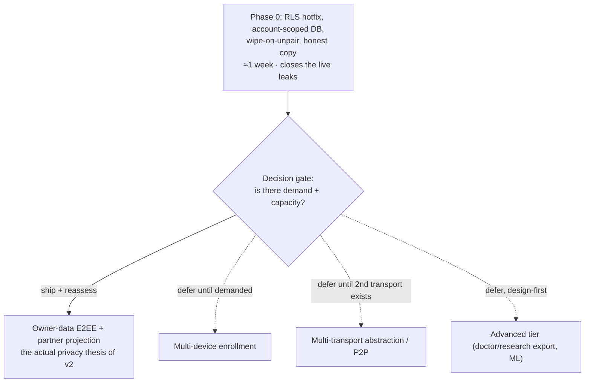

# Rhea v2 — Formal Architecture Critique

> 🧊 **Planning artifact — implementation status frozen at the 2026-07-15 planning state.** The v2 branch has since merged to `main` and deployed; for current state see the root `README.md` and [IMPLEMENTATION_STATUS.md](IMPLEMENTATION_STATUS.md). Migration numbers `0004`+ here predate the shipped `0004` pairing fix — the E2EE sequence has shifted to `0005`+.

> **Mandate.** Assume every architectural decision is wrong until proven
> otherwise; improve the design *before* implementation; challenge unnecessary
> abstraction and overengineering; prefer the simplest design that provides the
> same guarantees. For each issue: why it is a problem, its severity, one or more
> alternatives, and a recommendation.
>
> **Documents reviewed.**
> [Rhea_v2_Architecture_Proposal.md](Rhea_v2_Architecture_Proposal.md) (the
> vision), [RHEA_V2_TECHNICAL_SPEC.md](RHEA_V2_TECHNICAL_SPEC.md) (the design),
> [V2_IMPLEMENTATION_PLAN.md](V2_IMPLEMENTATION_PLAN.md) (the migration), and
> [V2_TASKS.md](V2_TASKS.md) (the backlog), against the current `src/` (~6k lines).
>
> **No source code was modified. No changes were implemented.**

---

## 1. Method, and a disclosure that shapes how to read this

**Disclosure.** Three of the four documents under review were authored in this
same engagement. A self-review is worth little, so this critique was **not**
written by re-reading my own work approvingly. It was produced by:

1. **Five independent adversarial reviewers**, each given a distinct cluster of
   the 26 dimensions and told to assume every decision is wrong, read the
   documents cold, and ground every finding in an exact citation. They produced
   **48 findings**.
2. **A 48-way verification pass** — one skeptic per finding, instructed to
   *refute* it against the actual document text and to check whether it is
   already resolved elsewhere (notably Chapter 0 §0.10, the authoritative
   "resolved decisions" table the reviewers might have skimmed). Each returned
   **CONFIRMED / PARTIAL / REJECTED**, a recalibrated severity, and a quoted
   evidence string.

The verification pass materially changed the picture: of 48 raw findings, **4
survived at High, ~12 at Medium, and 4 were rejected outright**; 24 were found to
be partly addressed elsewhere in the documents. Where the reviewers overstated,
this critique says so. That is the point of the exercise — several decisions were
*proven otherwise*, and they are recorded in §7.

**Severity is calibrated on one axis: "must this change before implementation?"**

| Severity | Meaning |
|---|---|
| **High** | A correctness/security/data-loss defect or a named-in-scope threat with no design response. Fix or design-memo before the relevant code ships. |
| **Medium** | A real gap or self-contradiction that will bite, but is bounded, mitigated, or a scoped planning decision. Resolve before the affected milestone. |
| **Low** | Doc-hygiene, polish, judgment/taste, or a consciously-accepted disclosed tradeoff. Worth a note; not a blocker. |

---

## 2. Headline verdict

**The design's *guarantees* are sound; its *machinery* is heavy; and the highest-leverage improvement is scope, not structure.**

- The load-bearing privacy and correctness ideas are right and mostly survive
  scrutiny: local-first with `DailyLog` as the single source of truth,
  payload-only zero-knowledge, an outbox + tombstones + hint-only realtime sync
  that fixes real current bugs, per-relationship `K_pair` forward secrecy, random
  XChaCha20 nonces, and an unusually **honest** residual-exposure disclosure.
- The genuine defects are concentrated and few (§4): an in-person pairing
  shortcut that voids the MITM defense; a disaster-recovery path that restores
  nothing for the default single-device user; a partner-sharing feature that is a
  named abuse vector with no safety design; and an at-rest data model that three
  chapters describe three different ways.
- The **overengineering** the mandate asks about is real but smaller than it
  looks (§5). The layered structure and DI seams are more justified than a first
  read suggests (four real platform seams, a genuine local-only product mode, a
  purity boundary worth enforcing). The removable ceremony is modest. **The
  bigger lever is not deleting layers — it is not committing to the scope.** Most
  of the cost and risk lives in features that are optional and secondary
  (multi-device, the multi-transport abstraction, the advanced tier), and the plan
  already has a natural stop point after Phase 0/1 that should be treated as a
  decision gate rather than a waypoint.

### 2.1 The single most important recommendation

Everything expensive in v2 — E2EE, the sync engine, HLC, `K_pair`, recovery
phrases, the transport seam — exists to serve **two optional, secondary
features: multi-device and partner sharing.** For the majority solo, single-device
user, none of it is needed, and one part of it (the recovery phrase) is a net
*new* data-loss risk they would not otherwise have.

Ship **Phase 0** (it closes the live security holes and delivers most of the
privacy outcome for ~1 week of work), do **owner-data E2EE + the encrypted partner
projection** well because that is v2's real thesis, and treat **multi-device, the
transport abstraction, and the advanced tier as deferred-until-demanded** rather
than a committed serial pipeline. This is not a redesign; the plan's own phasing,
flags, and "Phase 4 only if justified" already permit it. The recommendation is to
*use* those gates.

---

## 3. Dimension coverage map

Every mandated dimension, its verdict, and where it is treated below.

| Dimension | Verdict | Findings |
|---|---|---|
| Overall architecture | Heavy but defensible; scope is the lever | §2.1, ARCH-3/4 |
| Local-first data model | **Sound** | §7; SYNC-1 (granularity, Low) |
| Privacy model | Mostly sound; one metadata leak | CRYP-1 (M), ARCH-2 (Low) |
| End-to-end encryption | Sound primitives; one derivation contradiction | CRYP-2 (M), CRYP-7 (Low) |
| Sync architecture | Sound core; one recovery bug | SYNC-2 (High), SYNC-4/5 (M) |
| Transport abstraction | Minor hygiene; justified by test + local-only mode | SYNC-7 / ARCH-11 (Low) |
| Peer-to-peer sync | Correct to defer | SYNC-7 (Low) |
| Relay synchronization | Works; scaling caveat missing | SYNC-9 / PLAT-2 (Low) |
| Conflict resolution | Convergent; coarse granularity is a known tradeoff | SYNC-1, SYNC-6 (Low) |
| Offline behavior | Sound | §7; SYNC-2 (High) |
| Data consistency | One cutover-window divergence | SYNC-4 (M); SYNC-3 (rejected) |
| Scalability | Adequate for scale; caveat missing | PLAT-2 / SYNC-9 (Low) |
| Performance | Budget rests on an undecided at-rest model | PLAT-1 (High); PLAT-8 (rejected) |
| Battery usage | Persistent socket + heartbeat questionable | PLAT-2 (Low) |
| iOS limitations | Well-handled; residual web-eviction risk | PLAT-6 (Low) |
| Android limitations | Well-handled; validate Argon2id RAM | PLAT-4 (Low) |
| Security | One real MITM hole | CRYP-3 (High), CRYP-1/9 (M) |
| Cryptography | Correct libsodium use; one contradiction | CRYP-2 (M), CRYP-7 (Low) |
| Threat model | Coercion under-designed | COMP-1 (High), CRYP-4/COMP-2 (M) |
| Recovery after device loss | Sound crypto; UX risk; **see the resync bug** | CRYP-5 (mostly rejected), SYNC-2 (High) |
| Multi-device support | Revocation is inert; cutover divergence | CRYP-9 (M), SYNC-4 (M) |
| Future maintainability | Spec needs a consistency pass | ARCH-1 (M) |
| Developer experience | On the heavy side | ARCH-3/5/6/9 (Low) |
| Testing strategy | Sound; one process assumption | ARCH-8 (Low) |
| Accessibility | Not designed in | COMP-5 (M) |
| Internationalization | Not designed in (may be acceptable non-goal) | COMP-4 (Low) |
| Regulatory & privacy | Posture undocumented; store blockers | COMP-6/7/9/3 (M) |

---

## 4. High-severity findings (fix or design-memo before implementation)

### H1 — In-person QR pairing auto-confirm voids the MITM defense (was CRYP-3)

- **Severity: High.** Verdict: **CONFIRMED**. This is the one finding that breaks
  a stated confidentiality guarantee with a concrete attack.
- **Why it's a problem.** Spec §6.3 lets in-person QR pairing **auto-confirm** —
  skip the SAS — "because the visual channel is already authenticated." But the QR
  carries only the *owner's* public key to the partner's camera; the *partner's*
  key returns to the owner over Supabase Realtime / `partner_links` (§6.2), which
  the threat model itself treats as untrusted. Only one direction is visually
  authenticated. A malicious or compelled server (explicitly in scope) substitutes
  the partner's X25519 key in the row echoed to the owner; the owner derives
  `K_pair` against the attacker's key and encrypts the projection to the attacker.
  The SAS is exactly what would catch this (§6.2 line 1696: "Defeated by the SAS")
  — and auto-confirm throws it away. The attack is bounded (the real partner's
  sync then breaks, making it eventually detectable, and the leak is the minimized
  projection, not raw logs), but it defeats the ceremony's whole purpose for the
  *default in-person* path.
- **Alternatives.** (a) Remove auto-confirm; always require the SAS tap on both
  screens. (b) Make pairing a **bidirectional** QR exchange (partner also displays
  a QR the owner scans) so both keys cross the authenticated visual channel — then
  auto-confirm is sound.
- **Recommendation.** **(a)** for v2 — always require the SAS; a six-tap
  confirmation is trivial insurance on the trust root for all sharing. Adopt (b)
  later only if ceremony friction is measured to matter.

### H2 — `resync()` restores nothing for a single-device owner (was SYNC-2)

> **RESOLVED 2026-07-15.** The recommended option (b) is implemented in
> `src/domain/merge.ts` (`decideMerge`): self-authored rows are **no longer
> dropped before the LWW compare** — "echo" is now only the skip-reason label
> when a self-authored row ties or is older than local; a strictly-newer or
> locally-missing self-authored row **applies** (the restore/rollback path).
> Regression tests: `tests/unit/domain/merge.spec.ts` (H2 cases),
> `tests/unit/sync/reconcile.spec.ts` ("H2 fix" case), and
> `tests/unit/sync/syncEngine.spec.ts` ("resync() restores a SINGLE-device
> owner's own rows"). Note the fix landed *after* M1.9 shipped — the "ship it
> with the resync path" deadline below was missed, and the gap was closed at
> the Phase-2 documentation audit. Implementation detail: `SyncEngine.resync()`
> resets the pull cursor only (it does not clear the local scope), which the
> fixed merge rule makes safe.

- **Severity: High.** Verdict: **CONFIRMED**; not addressed anywhere. *(Historical verdict — see resolution note above.)*
- **Why it's a problem.** `resync()` clears the local scope and re-pulls from
  epoch-0 (§1.3 / §6.3). But echo suppression (§4.2) drops every row whose
  `deviceId == self` **before** the LWW compare, and `deviceId` lives in the
  `meta` store, which `resync` does not clear. So a same-device resync re-adopts
  **none** of the rows it originally authored — for a single-device owner (the
  documented default, RHEA-081) that is **100% of their data**, dropped
  permanently, even though it is intact on the server. The full-pull-vs-incremental
  distinction was clearly considered (there is a tombstone carve-out in §4.4) but
  was omitted for echoes. It is reachable via >365-day offline, a tombstone-GC
  cursor gap, or any server-cursor-format change on an app update (§8 §11).
- **Alternatives.** (a) Skip echo suppression during a full/epoch-0 pull (the
  local store is known-empty). (b) Suppress only when a local row already exists
  *and* local HLC ≥ remote (a genuine already-applied self-write). (c) Regenerate/
  ignore `deviceId` on resync.
- **Recommendation.** **(b)** — gate suppression on "local row exists and is ≥
  remote." It preserves the wake→pull→re-render loop echo suppression was built
  for while letting resync/recovery re-adopt self-authored rows. One-line fix;
  ship it with the resync path, not after.

### H3 — Partner sharing is a named abuse vector with no safety design (was COMP-1)

- **Severity: High.** Verdict: **PARTIAL** — the "zero affordances" framing is
  overstated (a biometric lock and per-gate consent do blunt a phone-grabbing
  partner), but the coercion/signaling gap is real and unaddressed.
- **Why it's a problem.** Ch11 §6.2 names the "nosy / abusive partner" as an
  in-scope threat, yet no panic/hide/decoy/duress/silent-unpair design exists in
  any document. Worse, current choices **signal resistance to the abuser**: quiet
  windows render an explicit "Sharing paused" screen on the partner's device (Ch4
  §6) and unpair makes the projection visibly vanish (Ch5 §6.4). In an
  intimate-partner-coercion scenario — the modal risk for this product class — a
  user forced to hand over her phone has no safe exit that looks normal. The
  *technical* half (gate-before-encrypt + RLS so a modified partner client can't
  un-gate data it was never sent) is correctly designed; the *human* half is
  missing.
- **Alternatives.** (a) **Non-signaling by default**: quiet windows and unpair
  degrade to "no new data / looks stale-but-normal" rather than a "paused/gone"
  banner — the staleness/TTL model (Ch4 §4.3) already makes "paused" and "hasn't
  logged lately" indistinguishable, so this is largely a copy/state change, not new
  crypto. (b) A duress/panic gesture that opens a decoy or locks. (c) A
  PIN/passphrase lock option (see M-CRYP-4) so the unlock factor can be *refused*.
- **Recommendation.** Write a **coercion & plausible-deniability design memo**
  before partner sharing ships, and make **non-signaling the default** for quiet
  windows and unpair (a). This is the cheapest high-impact fix and it matches the
  threat the product says it exists to defend.

### H4 — The at-rest data model is specified three different ways (was PLAT-1)

- **Severity: High.** Verdict: **PARTIAL** — the store-*count* discrepancy is
  actually resolved by §0.10.B (canonical eight stores; `StorageDriver` supersedes
  the Mobile chapter's `StoragePlatform`), which the reviewer missed. But the
  **value-representation** contradiction is real and §0.10 does not touch it.
- **Why it's a problem.** Ch6 §1/§3 describes the native `logs` table as
  **plaintext relational columns** protected by SQLCipher, while Ch12 §12 + Ch13
  §1 + the web threat model describe every record as an **already-sealed
  `CipherEnvelope`** decrypted on boot ("an IndexedDB dump is useless"). These are
  incompatible: (a) taking Ch6 literally invalidates Ch12's "< 300 ms working-set
  decrypt" budget and the web "dump is useless" guarantee (the columns would be
  plaintext-under-SQLCipher, a weaker and platform-divergent posture); (b) taking
  Ch13 literally means every native record is **double-encrypted** (SQLCipher AES
  page cipher *and* XChaCha20 envelope) with both keys in the same Keychain,
  doubling per-record boot cost on exactly the low-end devices the perf chapter
  worries about. You cannot cost or build storage against an undecided
  representation.
- **Alternatives.** (a) Store opaque `CipherEnvelope` blobs in a KV shape and
  **drop SQLCipher** (payloads are already DEK-sealed; keys are hashed and the HLC
  is non-sensitive, so SQLCipher's marginal benefit is small and its cost on
  constrained devices is real). (b) Store plaintext relational columns and rely
  solely on SQLCipher at rest (simpler queries, single decrypt, but weaker and
  divergent from web).
- **Recommendation.** **(a)** — one representation, ciphertext KV, no SQLCipher —
  and make Ch6, Ch12, and Ch13 state it identically before any storage code ships.
  It removes the double-encryption cost and makes the web and native security
  postures match.

---

## 5. The overengineering question (the mandate's central ask)

The reviewers came in hot on this; the verification pass cooled most of it down.
Here is the honest, calibrated result.

### 5.1 What is genuinely justified (do not delete)

The verifiers pushed back — correctly — on several "cargo-cult" charges:

- **The DI seams are load-bearing, not ceremony.** There are **four** platform
  seams (`StorageDriver`, `SecureStore`, `NotificationScheduler`, `Filesystem`),
  each with a real web-vs-Capacitor split, plus `Transport`. `MemoryDriver` /
  `NullTransport` are not merely test doubles — `NullTransport` *is* the shipping
  **local-only product mode** ("cloud is optional"). The "4 folders + 2 lint rules
  give the same guarantees" claim is false: it would lose the platform
  polymorphism the mobile build requires.
- **The `privacy/` layer is not "one publisher."** It hosts three impure
  consumers (`ProjectionPublisher`, `NotesGateway`, `AuditLog`) plus an
  orchestrator that encrypts and publishes — none of which can live in a
  kernel-only pure layer. (This finding was **rejected**.)
- **The new stores and repositories are inherent to the feature set.** `outbox`,
  `tombstones`, `sync_cursors`, and `keyring` exist *because* you added offline
  sync and E2EE; the repositories are the sole `StorageDriver` callers doing
  atomic HLC-stamp-plus-outbox-enqueue. The baseline is **141 lines**, not the
  "80/2,500" the reviewers cited.
- **HLC is the minimal correct primitive, not overkill** — see §6 (SYNC-6): the
  proposed "server-order LWW" alternative would *reintroduce* the stale-offline-edit
  clobber bug v2 is fixing.

### 5.2 What is real ceremony (Low severity, worth trimming)

- **Inconsistent `Result<T,E>`.** `StorageDriver` and crypto **throw**, while
  `Transport`/`SecureStore`/`Filesystem` return `Result` — and decrypt failure is
  documented *both* as a thrown `AeadOpenError` (§T-3) and as
  `Result.err(DECRYPT_FAILED)` (§10). Pick one: low-level seams throw typed
  `RheaError`; convert to `Result` at the app boundary. Drop the `map/flatMap`
  combinator kernel unless it earns its keep. *(ARCH-5)* — *Status: resolved by
  convention in Phase 1 — layers throw typed `RheaError` subclasses;
  `kernel/result.ts` combinators exist but are not yet load-bearing in
  production paths.*
- **Branded primitives** (`Uid`/`DeviceId`/`KeyId`/`Hlc`/`Iso8601`/`DateKey`) are
  a taste call; the verifier noted they *do* guard the string-vs-string confusion
  class in AAD/HLC/merge assembly, so this is defensible — keep or downgrade to
  documentation aliases, but don't spend more than the "S"-sized task on it.
  *(ARCH-6)*
- **`kernel`-as-a-layer and `sync/transports` as a sub-layer** add a little
  altitude for a ~6k-line app. Harmless; note it and move on. *(ARCH-3)*

### 5.3 The scope lever (the real overengineering, framed correctly)

The reviewers' "it's a rewrite framed as migration" charge (ARCH-4) was
**deflated**: Phase 1 is a shim-based reorganization with unchanged behavior
reusing the domain/cycle/import code, and "~90% of the privacy outcome" means
"stop the active bleeding," not "90% of total product value." Fair.

But the *underlying* instinct survives and is the most valuable thing in this
review: the cost/risk is dominated by **optional, secondary features**, and the
plan should treat its Phase 0/1 boundary as a **decision gate** (§2.1), not a
runway. That is a scope discipline, not a structural change — and it is the single
change most likely to keep a small effort from stalling on months of
critical-path crypto for a multi-device feature nobody has asked for yet.

---

## 6. Medium-severity findings (resolve before the affected milestone)

### M-CRYP-1 — Plaintext `share_gates` contradicts the zero-knowledge claim
**CONFIRMED.** §5 §10 (line 1676) claims the server sees "a projection exists,"
not "mood sharing is on" — but §0.7, the Ch6 §4 DDL/ER diagram, and the A6/relay-
breach rows all define a **plaintext** per-key `share_gates` table (owner rw,
partner read). A breach/subpoena reads, in the clear, that a given owner has
fertility or mood sharing on/off — probative metadata in the 2026 U.S. context.
The gates are *already* resolved owner-side and shipped encrypted inside the
projection, so the plaintext table is **redundant**. **Recommend:** delete
`share_gates` server-side (or fold it into the encrypted owner-meta blob) and make
§10's claim true — zero functional cost, removes a real leak. If it must stay,
soften §10.

### M-CRYP-2 — `K_pair` derivation is specified two incompatible ways
**CONFIRMED.** §0.10.L canonicalizes on the server-session `rx` (= libsodium
`hash[32:64]`), while the §6.2 sequence derives from server `.tx` / client `.rx`
(= `hash[0:32]`) — genuinely different 32-byte keys — and RHEA-066 cites §0.10.L
as authoritative. A single shared `kdf.ts` implemented one way still works at
runtime, so this bites only if the owner and partner branches are coded from
different sections — but the trust root for *all* sharing must not be ambiguous.
**Recommend:** state one derivation once; better, replace `crypto_kx`
(directional by design, then hashed away) with `crypto_scalarmult(sk, peer_pk)` →
`BLAKE2b(dh ‖ linkId ‖ "rhea-kpair-v1")`, which is symmetric by construction and
has no rx/tx choice to get wrong.

### M-CRYP-4 — Coercion is a first-class threat with a thin design response
**PARTIAL** (the "biometric-only" framing is wrong — device-PIN and recovery-
phrase fallbacks exist, and a manual `Keyring.wipe()` panic path exists). What
survives: no duress/decoy/plausible-deniability design, and the recovery phrase is
a single point of total unlock. **Recommend:** offer a **PIN/passphrase app-lock
as the coercion-sensitive default** (the `interactive` Argon2id profile is already
reserved), add a duress-wipe code, and keep the honest in-app statement that no
client can protect a compelled user. Pairs with H3.

### M-CRYP-9 — `device_keys.revoked` is inert; no lost-device rekey cascade
**CONFIRMED.** The column exists (default false) but has no consumer; enrollment
distributes the single account DEK to every device; DEK rotation is "manual only";
and no "device lost → `rotateDEK` + re-enroll survivors + re-wrap `recovery_blob`"
flow is specified (it is punted to speculative Phase-4 M4.2). So revoking a lost
device does nothing — it still holds the DEK. **Recommend:** either specify the
rotate-and-re-enroll cascade (and confirm `rotateDEK`'s "re-seal all owner records"
contract also re-wraps `recovery_blob`) as the defined revocation flow, or mark
the `revoked` column explicitly inert until M2.6/M4.2 so it is not mistaken for a
working control.

### M-SYNC-4 — E2EE cutover changes key-shape and payload-shape together
**PARTIAL** (bounded: M2.4 is single-device + recovery-phrase; the window closes
when the lagging device upgrades, not at M2.13). Still real: at M2.4 the wire key
changes from the plaintext date to a keyed hash **and** the payload becomes
ciphertext simultaneously; a client-side flag + service-worker cache skew means
two devices of one account can write disjoint-PK rows (date-keyed plaintext vs.
hash-keyed ciphertext) that never meet in LWW. A web user with two browsers (both
holding the DEK via the phrase) can hit it. **Recommend:** never change key-shape
and payload-shape in the same expand→migrate→contract window — introduce the
hashed wire key in its own earlier additive step (from a rotation-stable naming
key, see below), flip only the payload at M2.4, and make `e2eeOwner` a
per-account server-gated flag, not a client bundle flag.

### M-SYNC-5 — Wire-key hashing has no rotation-stable naming key
**PARTIAL** (unpair/re-pair is fine — projections are `link_id`-keyed with
wipe-on-unpair; the real gap is owner-scope DEK rotation). `recordKeyHashKey` is
derived from the epoch-versioned DEK, so a `rotateDEK` changes every wire key:
historical rows orphan, and a new-epoch tombstone for a date lands on a different
PK than the old-epoch live row it must shadow → the deleted day can **resurrect**
on peers. **Recommend:** derive `recordKeyHashKey` from a dedicated
**rotation-independent naming key** seeded once at account creation (never bumped
on DEK rotation), and add a test that rotation preserves wire keys so tombstones
still shadow. Close this before `rotateDEK` ships.

### M-COMP-2 — The immutable local audit log is a duress liability
**PARTIAL** (overstated: device seizure *is* in the Ch11 adversary set, and a full
`eraseAllData` wipe can clear the whole store — "immutable" only bars per-entry
deletion). What survives: an on-device log of `data.exported` / `data.erased` /
`recovery.used` / `partner.unpaired` is a record of exactly the actions an at-risk
user most needs to deny, and no doc analyzes it as a coercion/deniability surface.
**Recommend:** exclude the sensitive actions from the persisted audit (keep only
crypto-lifecycle events if any), or make it ephemeral/user-clearable, and add the
device-holding adversary to the audit's threat note. A privacy-first app should
not retain a confession log by design.

### M-COMP-3 — No age-gating / minors handling (COPPA, GDPR Art. 8)
**PARTIAL** (bounded by the optional-cloud + minimal-PII architecture — local-only
mode collects nothing, and the only child-relevant PII is email + metadata). But
menarche-adjacent users skew minor, the cloud opt-in collects email with no age
check, and store Families policies apply. **Recommend:** a cheap self-declared age
gate at **cloud opt-in** that blocks under-13 account creation, plus a documented
statement that local-only mode is not "an online service collecting personal
information from a child." A pre-ship decision, not an architecture change.

### M-COMP-5 — Accessibility is not designed in
**CONFIRMED.** No WCAG target, no a11y acceptance criterion on any task, no
`prefers-reduced-motion`/contrast/`sr-only`/`aria-live` requirement, and Ch12 has
latency budgets but no a11y budget. For a health PWA also shipping to the app
stores, a11y retrofit is far costlier than prevention. **Recommend:** add a WCAG
2.2 AA acceptance criterion to every UI task and an **axe-core CI gate** in the
existing harness. Cheap now; expensive later.

### M-COMP-7 — Erasure claims are corrected in copy but not in substance
**CONFIRMED.** RHEA-016 fixes the false "we wipe their copy" / "one-tap erase"
strings (good), and §6.5 TM-R3 admits PITR/backups retain plaintext — but no task
defines a **backup-retention window**, a positive GDPR Art. 17 erasure mechanism,
or the app-store-required in-app **account deletion** (see M-COMP-9). **Recommend:**
pair the copy fix with a stated retention horizon ("server backups purge deleted
data within N days") and a real erasure/account-delete path.

### M-COMP-9 — Store compliance lacks the hard-blocker checklist
**CONFIRMED.** Plan M3.6 scopes store work to the Data-safety form + privacy
labels, but omits the **hard rejection blockers** — chiefly Apple Guideline
5.1.1(v) **in-app account deletion** (a server-side account-delete endpoint,
distinct from local `eraseAllData` and the passive FK cascade), plus Play's
sensitive-health-data / content-rating declarations. **Recommend:** expand M3.6
into a policy-clause checklist and design the account-deletion endpoint now (it
also satisfies M-COMP-7); these surface at submission otherwise, after all of
Phase 3.

### M-ARCH-1 — The spec relies on an errata table instead of internal consistency
**PARTIAL** (overstated as "Critical": the security-critical values are
authoritatively pinned to the *strong* construction in §0.10 **and** re-stated in
the build tickets RHEA-009/061 and the plan, so an implementer following the tasks
ships the strong form; Ch4 §4 also shows the correct 4-field AAD). What survives is
genuine **doc hygiene**: ~21 shared values are pinned differently across chapters
and reconciled only in the §0.9/§0.10 tables, with no inline forward-pointers, so a
reader who consults a chapter in isolation can miss the override. *(Correction to
the reviewer: §0.10.J's invite hash is **unkeyed** `crypto_generichash`, not the
"keyed BLAKE2b" the finding named.)* **Recommend:** a consistency pass that folds
each §0.10 override back into its chapter and deletes the errata tables — a
self-consistent spec needs no tie-breaker. Not a blocker; do it before Phase 2.

---

## 7. Low-severity findings (note; not blockers)

Grouped; each is real but is doc-hygiene, polish, taste, or a consciously-disclosed
tradeoff. Recommendation in brackets.

**Crypto / privacy**
- **CRYP-6** — Write-timing jitter is deferred to "future" while dates are hashed;
  timing is the channel most correlated with reproductive events. The spec never
  *promises* to hide timing (§6.4 scopes zero-knowledge to payload content and
  discloses timing leakage), and outbox coalescing already blunts it. [Bring
  jittered/batched flush into v2 scope — it is a small SyncEngine change — or keep
  positioning honest about timing.]
- **CRYP-7** — `canonicalJSON` AAD and record-key hashing. The "encoder drift →
  mass decrypt failure" fear is **refuted** (identical libsodium-in-webview runs on
  both targets; flat all-ASCII object; KATs freeze it), and `scope` in the AAD is
  cheap belt-and-suspenders (owner and meta share the DEK, so `keyId` alone does
  not separate them). [Optional: pin the exact byte canonicalization, or use a
  length-prefixed concat, to remove all doubt.]
- **CRYP-8** — Gate-off is server-honored, not crypto-enforced, and a fresh restore
  has no freshness anchor. Bounded: the partner already holds `K_pair` and is
  entitled to the anchors, so a withheld gate-off leaks only stale data it already
  had (T-4 accepts server withholding as confidentiality-preserving). [One-line
  carve-out to T-1's "rollback detected by HLC monotonicity" claim, which is untrue
  on a baseline-less restore; optionally a monotonic counter inside the sealed
  projection.]

**Sync**
- **SYNC-1** — Whole-record LWW drops a concurrent same-day field edit from a
  second owner device. This is a **documented, accepted** convergence-first tradeoff
  (per-day granularity is the chosen ADR; field-level merge is noted as future).
  [If multi-device owner becomes common, adopt per-field record keys
  (`log:DATE#symptoms`) — it reuses the exact LWW pipeline.]
- **SYNC-6** — HLC vs. wall-clock. **Refuted as "overkill":** the proposed
  server-order/wall-clock alternatives reintroduce the stale-offline-edit clobber
  bug, and `observe()` gives real cross-device skew defeat; a server-poisoned HLC is
  already neutralized by binding `updatedAt` into the AAD. [Keep HLC. Optionally
  drop the unimplementable all-devices-ack GC optimization — see SYNC-8.]
- **SYNC-8** — Tombstone GC condition (2) ("all devices acked") has no cursor-
  publishing mechanism, so GC reduces to the age horizon — which is safe and
  backstopped by resync. The prose ("longer governs" vs. "whichever satisfied") is
  awkward, not contradictory. [Drop condition (2) or name the ack channel; reword.]
- **SYNC-9 / PLAT-2** — Persistent `postgres_changes` + 30 s heartbeat for
  ~daily-changing data: `postgres_changes` is the least-scalable Realtime mode and
  its connection cost/scaling caveat is undocumented. But Realtime is already
  hint-only with authoritative pull, the heartbeat is a correctness safety-net (and
  foreground-only over an open socket), and the `Transport` seam already permits
  swapping to Broadcast. [Add a scaling/connection-cost note to Ch12 and name
  Broadcast as the seam's future option; consider pull-on-foreground + long
  heartbeat as a simplification since pull is authoritative.]
- **SYNC-7 / ARCH-11** — The `Transport` interface leaks a few Supabase-flavored
  strings (`rls-denied`, channel `state` enums, `serverTime`) into the abstract
  contract, and Ch14 gestures at it as the P2P extension point. But the cursor is an
  opaque string, Ch14 explicitly keeps relay as the mandatory baseline and gates
  P2P behind a research spike, and `NullTransport` is a real product mode. [Rename
  the Supabase-flavored enums/fields; drop any "drop-in P2P" implication.]

**Platform**
- **PLAT-4** — Argon2id at 256 MiB. The main-thread-ANR fear is largely **refuted**
  (§ directs libsodium init into the crypto worker), but RHEA-066/§8 never
  explicitly bind `deriveKek` to the worker and 256 MiB is unvalidated on 2–3 GB
  Android. [Bind the KDF to the worker explicitly and KAT the 256 MiB allocation on
  a low-RAM reference device before committing it — lowering to 128 MiB is not free
  because the profile is frozen/versioned.]
- **PLAT-5** — RHEA-115's "copy IndexedDB into SQLite" wording implies an
  impossible same-origin copy; Ch6 §3 correctly documents it as a one-way seam with
  an export/import bridge and an explicit "Import your previous data" prompt (so not
  silent). [One-line cross-reference from RHEA-115 to the §3 bridge so an
  implementer doesn't build a naive copy.]
- **PLAT-6** — iOS-web storage eviction is guarded by a banner **plus** a
  `persist()` attempt, an install/grant-persistence prompt, and an export offer (not
  "only a banner"); web notifications fall back to in-app reminders (not a silent
  no-op). Residual local-only-web loss risk is an accepted, disclosed tradeoff of
  local-first-on-web. [Consider gating local-only accumulation on
  persistence-or-backup for the highest-risk users; otherwise acceptable.]
- **PLAT-7** — The M2.4 re-encryption backfill has no explicit Wi-Fi/charging gate,
  but batched upserts with backoff **already exist**, so it is not a raw per-row
  burst; ~3,650 tiny padded envelopes is a few MB, one-time. [Add a network/power
  gate on native as cheap polish.]

**Architecture / DX / testing / i18n**
- **ARCH-3 / ARCH-9 / ARCH-10** — Layering altitude, the `di/` composition root,
  and class-vs-function repositories are heavy-ish but defensible (see §5.1); the
  docs specify "thin repositories," not a class pattern, and the Phase-3-only seams
  are already sequenced to Phase 3. [Taste; trim `kernel`-as-layer if desired.]
- **ARCH-8** — The "human security-review gate on every crypto PR" assumes an
  independent reviewer the team may not have; but the docs never state team size and
  back it with KATs, property tests, a negative "partner-cannot-decrypt" test, and
  pgTAP. [Add a budgeted **point-in-time external audit** at the two irreversible
  cutovers (M2.4, M2.13) as the honest substitute for a standing gate; keep 95% on
  pure `domain/`, relax stateful `sync`/`migrations` to ~80%.]
- **COMP-4 / COMP-10** — i18n is absent and the pronoun copy is a bespoke
  substitution scheme; owner UI is second-person ("you") so mostly ungendered, and
  the she/her default has a per-owner override. Multi-locale is not a stated v2 goal.
  [Declare i18n an explicit non-goal for v2 *or* centralize strings + `Intl` dates
  now; fix the one gendered share-option string ("she may want space"); capture the
  §7 pronoun fix as a task — it currently exists only in the spec, not in the
  backlog.]
- **COMP-6** — The regulatory posture (GDPR controller/processor, Art. 9,
  lawful basis, residency) is undocumented even though the *technical* privacy
  advantages are thorough. [Write a one-page "regulatory posture": local mode =
  no processing; cloud mode = controller of ciphertext + metadata only, Art. 9
  largely mooted by E2EE; exports gated behind a DPIA. Mostly documentation, and it
  converts the architecture's strength into a defensible legal position.]

---

## 8. Considered and dismissed (proven otherwise)

The mandate was to assume every decision is wrong until proven otherwise. These
were challenged and **survived** — recording them is part of an honest review.

- **REJECTED · `privacy/` is a needless layer (ARCH-7).** It hosts three impure
  consumers plus an orchestrator that imports data/crypto/sync; it cannot collapse
  into the pure `domain/` layer.
- **REJECTED · Import interop is vaporware (COMP-8).** RHEA-043 explicitly ports the
  Clue/Flo/Apple Health/generic parsers and RHEA-045 mandates fixture-backed bug
  fixes; the Rhea-JSON export is a deliberate data-sovereignty escape hatch.
- **REJECTED · The web master-wrapping key is oversold (CRYP-10).** Every mention
  caveats it as "best-effort" and explicitly admits zero XSS protection; a
  non-extractable key still defeats logical DB/profile exports. Honest, not oversold.
- **REJECTED · "Single-writer" is a false invariant (SYNC-3).** The finding
  truncated the quote — §0.1(4) exempts the two-way notes channel in the same
  sentence, and multi-device owner concurrency is explicitly resolved by LWW+HLC.
- **MOSTLY REJECTED · The 24-word recovery phrase is crypto-overkill (CRYP-5).** 24
  words matches the 256-bit DEK; dropping to 12 would push recovery *below* DEK
  strength. The 3-of-24 verification is a UX confirmation backstopped by reminders
  and a plaintext-export escape hatch. The only surviving grain is that recovery is
  an adoption/lost-data risk — which the spec already discloses.
- **REFUTED · Padding buckets are unspecified (PLAT-8).** §10 gives concrete
  low-overhead schemes (padmé ≤ ~12%, or 256-byte multiples); `sodium.pad/unpad`
  recovers the true length regardless. No 10–20× inflation.

---

## 9. Decisions that are sound (keep verbatim)

Consolidated across all five reviewers and confirmed by verification:

- **Local-first, single `DailyLog` as source of truth, derive-everything in
  memory** — correct, matches the current app, preserve it.
- **Unifying the three phase engines into one oracle** — a real, well-diagnosed bug
  fix, valuable independently of the rest of v2.
- **Realtime as a wake-up hint with `pull` authoritative** — decouples correctness
  from unreliable event delivery; the right way to survive iOS suspension / Android
  Doze, and it fixes the current save-on-event anti-pattern.
- **Two cursor spaces — edit-time clock for *merge*, `server_updated_at` keyset for
  *paging*** — correct and necessary; client timestamps can't be trusted for arrival
  order.
- **Durable outbox + idempotent upsert-by-key + atomic domain-write-and-enqueue;
  tombstones with rebirth-by-higher-timestamp + trigger-set `server_updated_at`** —
  a solid at-least-once local-first design that fixes the current
  delete-resurrection and `updated_at` clobber bugs.
- **`K_pair` independent of the DEK, rotated on re-pair; random 24-byte
  XChaCha20-Poly1305 nonces; gate-before-encrypt so a hostile partner client can't
  un-gate data it never received.**
- **Reschedule-on-write, content-free local notifications; native SQLite in
  `NoCloud` as the mobile source of truth.**
- **The RHEA-016 forbidden-claim CI guard and the honest residual-exposure
  disclosure** ("metadata is not encrypted; revocation is forward-only; key loss =
  data loss") — rare intellectual honesty; keep it, and extend the same candor to
  the gaps in §6.

---

## 10. Prioritized punch list

**Before writing Phase-2 crypto:**
1. H1 — Remove pairing auto-confirm; always require SAS. *(CRYP-3)*
2. H4 — Pin one at-rest representation (recommend ciphertext-KV, drop SQLCipher);
   reconcile Ch6/12/13. *(PLAT-1)*
3. M-CRYP-2 — Fix / simplify `K_pair` derivation (one statement; consider
   `crypto_scalarmult`). *(CRYP-2)*
4. M-ARCH-1 — Spec consistency pass; fold §0.10 overrides inline. *(ARCH-1)*

**Before the sync cutover (M1.9 / M2.4):**
5. ~~H2 — Fix echo suppression so `resync()` re-adopts self-authored rows.~~
   **RESOLVED 2026-07-15** in `src/domain/merge.ts` with regression tests in
   `tests/unit/domain/merge.spec.ts`, `tests/unit/sync/reconcile.spec.ts`, and
   `tests/unit/sync/syncEngine.spec.ts` (single-device resync). Landed after
   M1.9 shipped — the deadline was missed, then closed at the Phase-2 doc
   audit. *(SYNC-2)*
6. M-SYNC-4 — Don't change key-shape and payload-shape together; per-account flag.
7. M-SYNC-5 — Rotation-stable naming key before `rotateDEK` ships.

**Before partner sharing ships:**
8. H3 — Coercion / plausible-deniability design memo; non-signaling unpair + quiet
   windows by default. *(COMP-1)*
9. M-CRYP-1 — Delete/encrypt the plaintext `share_gates` table. *(CRYP-1)*
10. M-CRYP-4 — PIN/passphrase app-lock default + duress code. *(CRYP-4)*
11. M-COMP-2 — Stop persisting sensitive actions in the local audit log. *(COMP-2)*

**Scope & policy decisions (make explicitly, don't drift into):**
12. Treat the Phase 0/1 boundary as a **decision gate**; defer multi-device, the
    transport abstraction, and the advanced tier until demanded. *(§2.1, §5.3)*
13. M-CRYP-9 — Define the lost-device rekey cascade, or mark `revoked` inert.
14. M-COMP-3/5/7/9 — Age gate at cloud opt-in; WCAG AA + axe CI gate; erasure
    retention window + in-app account deletion; store-policy checklist.
15. COMP-6 — Write the one-page regulatory posture.

**Cheap polish (Low):** the §7 items — Transport naming hygiene, GC condition
wording, Argon2id worker binding + RAM validation, RHEA-115 cross-reference, i18n
non-goal declaration, the one gendered string, and a Ch12 Realtime scaling note.

---

*Prepared by five independent adversarial reviewers and a 48-way verification pass.
Findings that failed verification (§8) were dropped or downgraded rather than
retained. No source code was modified; no changes were implemented.*
