# Rhea v2 — Technical Specification & Implementation Plan

> **Audience:** the engineer(s) implementing Rhea v2. This document is written to
> be **buildable without further questions**: it names every module, interface
> method, table, column, error case, state transition, and the order to build
> them in.
>
> **Companion documents.** The *why* lives in
> [Rhea_v2_Architecture_Proposal.md](Rhea_v2_Architecture_Proposal.md) (the vision)
> and [V2_ARCHITECTURE_REVIEW.md](V2_ARCHITECTURE_REVIEW.md) (the compatibility
> critique of the current code). This document is the *how*. Where the proposal
> and the current implementation disagree, the resolutions are recorded here.
>
> **Design only.** No implementation code (no function bodies). Interface and
> type **declarations** are design contracts and appear throughout. Mermaid
> diagrams are normative where they define flows/state.

---

## How to read this document

- **Chapter 0** pins the cross-cutting contracts (envelope, sync record, key
  ids, clock, table names, storage seam). **Chapter 0 is authoritative**: where a
  later chapter shows a minor naming variant, Chapter 0's canonical form governs
  (see the normalization table in §0.8).
- Each subsequent chapter is self-contained and owns one subsystem. **Inside a
  chapter, a bare `§N` reference is local to that chapter** unless it names
  another chapter explicitly.
- Interface declarations are the contract; a method's semantics are given in its
  doc-comment and the surrounding prose, not left implicit.

### Document map — required topic → chapter

| Required topic | Chapter |
|---|---|
| Folder structure | 2 |
| Module boundaries | 3 |
| Interfaces | 3 (seams) + each subsystem chapter |
| Domain models | 4 |
| Privacy engine | 4 |
| Partner projection | 4 |
| Encryption architecture | 5 |
| Local storage | 6 |
| Database design | 6 |
| Versioning | 7 (index) → 6 & 8 |
| Sync engine | 8 |
| Transport abstraction | 8 |
| Conflict resolution | 8 |
| Offline behavior | 8 |
| Event flow | 1 (master map) + 8 (detailed) |
| Error handling | 9 |
| Testing strategy | 10 |
| Threat model | 5 (crypto) + 11 (product) |
| Performance considerations | 12 |
| Mobile considerations | 13 |
| Capacitor integration | 13 |
| Future extensions | 14 |
| Estimated implementation order | 15 |

---

## Chapter 0 — Canonical contracts & conventions (authoritative)

This chapter fixes the artifacts and names that every subsystem shares. It is the
single source of truth; subsystem chapters conform to it.

### 0.1 The fixed architectural decisions (recap)

1. **Privacy-first, local-first, zero-knowledge.** The on-device store is the
   source of truth. Cloud is optional. The server stores only ciphertext plus
   minimal plaintext routing metadata and can never read health data.
2. **Account model = Option A.** Supabase Auth (email/password; optional passkey
   later) is kept purely as **identity + a zero-knowledge mailbox**. `auth.uid()`
   owns ciphertext rows. Row-Level Security (RLS) is a *coarse envelope ACL*
   (who may fetch a blob), never a confidentiality boundary. A password reset does
   **not** recover keys — the recovery phrase (§4) is the only key-recovery path.
3. **Transport baseline = E2EE over the existing Supabase Realtime.** Ciphertext
   rows in Postgres, fanned out over `postgres_changes` used purely as a
   **wake-up** signal. No new transport service. Bluetooth/LAN/WebRTC/Nearby are
   out of scope for v2 (future `Transport` implementations only).
4. **Single-writer per dataset.** Only the owner writes logs and the projection;
   the partner is read-only (RLS-enforced) except for the two-way shared-notes
   channel. Merge is Last-Writer-Wins over a Hybrid Logical Clock; deletes
   propagate as tombstones.
5. **Derived data is never persisted in the owner store.** The *only* persisted
   derived artifact is the encrypted `PartnerProjection`, because the partner
   lacks the raw logs to derive it (the single, explicit exception — §3).
6. **Crypto = libsodium only.** No custom cryptography.

### 0.2 Canonical envelope & sync record

These two types cross every module boundary. They are declared **once here**;
subsystem chapters reference them and never redefine their fields.

```ts
/** The sealed unit. Produced/consumed only by src/crypto (aead.ts). */
interface CipherEnvelope {
  v: number;                    // envelope format version (starts at 1); unknown v ⇒ quarantine
  alg: 'xchacha20poly1305';     // the only value in v2
  keyId: string;                // which symmetric key opens this — grammar in §0.4
  nonce: string;                // base64, 24 random bytes (fresh per message)
  ct: string;                   // base64, XChaCha20-Poly1305 ciphertext || 16-byte tag
  aad?: string;                 // base64, canonical AAD (§0.3)
}

/** The row that crosses the wire and the outbox. Health payload lives only in `payload`. */
interface SyncRecord {
  key: string;                  // logical record key (hashed for privacy — §0.6)
  scope: 'owner' | 'projection' | 'note' | 'meta';
  payload: CipherEnvelope | null; // null === tombstone
  updatedAt: string;            // HLC, stamped at EDIT time (§0.5), NOT server-receive time
  deviceId: string;             // authoring device (echo-suppression + LWW tiebreak)
  deleted: boolean;             // true === tombstone
}
```

Shipped interim state (M1.5→M2.4): payloads travel as a PlainEnvelope
`{v:1, alg:'none', keyId:'plain', ct:base64(JSON)}` passthrough defined in
`src/data/envelope.ts`; `'xchacha20poly1305'` becomes the only wire value at the
M2.4 cutover.

### 0.3 AAD binding (mandatory)

Every seal binds the ciphertext to its logical slot so the server or a malicious
peer cannot transplant a valid ciphertext into another record or timestamp:

```
AAD = canonicalJSON({ keyId, recordKey: SyncRecord.key, scope, updatedAt })
```

`canonicalJSON` = lexicographically-sorted keys, no whitespace, UTF-8. `open()`
recomputes the AAD from the surrounding `SyncRecord` and requires an exact match;
a mismatch is an authentication failure (quarantine, never silent-accept).

### 0.4 `keyId` grammar (authoritative)

| Form | Resolves to | Notes |
|---|---|---|
| `dek:<epoch>` | the account Data Encryption Key at that epoch | `epoch` is an integer ≥ 1; bumped only on manual DEK rotation |
| `kpair:<linkId>:<version>` | the per-partner-link key at that version | `version` bumped on unpair/re-pair |

> **Normalization:** the Encryption chapter writes `dek.<epoch>` /
> `kpair.<linkId>.<version>` (dot) and the Sync chapter writes `dek:<uuid>` /
> `kpair:<linkId>`; both mean the colon-separated, epoch/version-qualified form
> above, which is canonical.

### 0.5 Hybrid Logical Clock (authoritative format)

```
HLC  = "<pt>:<c>:<deviceId>"
  pt        = physical ms since epoch, 48-bit, zero-padded lowercase hex (12 chars)
  c         = logical counter, 16-bit, zero-padded lowercase hex (4 chars)
  deviceId  = stable per-device id (assigned on first run — Chapter 5 §2 device identity, Chapter 8 §3.1), tiebreak only
```

Lexicographic string order equals causal order on `(pt, c)`, with `deviceId` as a
deterministic total-order tiebreak. **Epoch-0 sentinel** (used to backfill
pre-v2 rows so they never win a merge): `"000000000000:0000:<deviceId>"`. (Where
the Local Storage chapter shows an ISO-style epoch-0 example, it denotes this
"lowest possible HLC".)

### 0.6 Server-visible metadata & record-key hashing

The relay is a zero-knowledge mailbox but unavoidably sees: account identities
(`auth.uid()`, email), the pairing graph, write timing/frequency, `scope`, and
ciphertext length. Minimization is mandatory:

- **Record keys are hashed.** `SyncRecord.key` is not a plaintext date. It is
  `base64(BLAKE2b-keyed(recordKeyHashKey, plainKey))`, where `recordKeyHashKey`
  is derived from the DEK (owner scope) or `K_pair` (projection/note scope). The
  server sees opaque, per-account-unlinkable tokens, never `2026-07-15`.
- **Payloads are length-padded** (`sodium.pad` to fixed buckets) before sealing,
  so a long-notes day is indistinguishable from a short one within a bucket.

This residual metadata is disclosed to the user (§10.4); it is not eliminable
while Supabase is the relay.

### 0.7 Server schema — canonical table names

The authoritative server schema is defined in Chapter 5. Canonical table names,
referenced everywhere:

| Table | Holds |
|---|---|
| `daily_logs` | owner's own ciphertext blobs (multi-device replica; `scope='owner'`/`'meta'`) |
| `partner_projections` | owner→partner encrypted `PartnerProjection` (`K_pair`) |
| `shared_notes` | two-way encrypted notes (`K_pair`) |
| `quiet_windows` | encrypted quiet ranges (`K_pair`) |
| `partner_links` | the pairing (ids + `kpair_epoch`) — routing metadata |
| `invites` | hashed, TTL'd, revocable pairing codes (no `owner_id` leak) |
| `device_keys` | device public keys (enrollment + pairing) |
| `pairing_sessions` | ephemeral QR/SAS handshake rendezvous |
| `share_gates` | per-share consent booleans (non-health) |
| `profiles` | display name (routing metadata) |

> **Normalization:** the Sync chapter's `owner_records` **is** `daily_logs`. The
> server-side `audit_log` table is **removed** — auditing moves on-device
> (`privacy/consumers/AuditLog`, §3 / §8).

### 0.8 Local persistence seam & logical stores (authoritative)

- The persistence contract is **`data/drivers/StorageDriver`** (declared in
  Chapter 3 §3.2 as a seam and fully in Chapter 6 §1; **the Chapter 6 §1
  signature is canonical** — see §0.10.A), implemented by `IndexedDbDriver`
  (web), `SqliteDriver` (Capacitor/SQLCipher), and `MemoryDriver` (tests). This
  is the seam repositories talk to.
- The platform layer (`platform/web/WebStorage.ts`,
  `platform/capacitor/CapStorage.ts`) **constructs** the concrete driver. The
  Mobile chapter's `StoragePlatform` interface (Chapter 13) is **superseded by
  `StorageDriver`**; its 4-store model (`records`/`keys_wrapped`) is non-canonical
  — see §0.10.B.
- **Canonical logical stores (eight):** `logs`, `meta`, `outbox`, `keyring`,
  `projections`, `tombstones`, `sync_cursors`, `audit`. (Shared-note caches use
  the same enveloped-record mechanism as `projections`; `sync_cursors` holds the
  per-scope pull cursor; `audit` holds the local `AuditEvent[]`.)

### 0.9 Normalization table (quick reference)

| Appears in a chapter as | Canonical form (§ ref) |
|---|---|
| `owner_records` (Sync) | `daily_logs` (§0.7) |
| `dek.<epoch>` / `dek:<uuid>` | `dek:<epoch>` (§0.4) |
| `kpair.<linkId>.<v>` / `kpair:<linkId>` | `kpair:<linkId>:<version>` (§0.4) |
| `StoragePlatform` (Mobile) | `data/drivers/StorageDriver` (§0.8, §0.10.B) |
| HLC ISO epoch-0 example | `000000000000:0000:<deviceId>` (§0.5) |
| server `audit_log` table | removed; local `AuditLog` in `audit` store (§0.7, §0.8) |
| `server_seq bigint` (Ch6) | `server_updated_at timestamptz` (§0.10.C) |
| `daily_logs` PK `(owner_id,key)` w/ constant scope (Ch6) | PK `(owner_id, scope, key)`, scope ∈ {`owner`,`meta`} (§0.10.D) |
| projection key `proj:<linkId>` (Ch4) | `projection:current` (§0.10.E) |
| `PartnerProjection.version = 1` (Ch6 §7) | `2` (§0.10.F) |
| 2-field AAD `key\|updatedAt` (Ch4/Ch8/Ch11) | 4-field `{keyId,recordKey,scope,updatedAt}` (§0.3, §0.10.G) |
| invite `code_hash = SHA-256(code+salt)` / `invite_hash = BLAKE2b(inviteSecret)` | `code_hash = sha256-hex(server-minted secret)`, no salt (§0.10.J, shipped in 0002) |

### 0.10 Resolved cross-chapter decisions (authoritative)

The parallel subsystem chapters occasionally pinned a shared value differently.
This table is the **single tie-breaker**; where a chapter disagrees, the value
here governs and the chapter is to be read as if it stated this.

**A. `StorageDriver` signature.** Chapter 6 §1's declaration is canonical:
`ready()`, primitive `get/getAll/put/delete/clear/count`, `getByIndexSince(...)`,
`transaction(opts, work)`, `close()`, `destroy()`, `onBlocked/onBlocking/onVersionChange`,
and `identity`. Chapter 3 §3.2's shorter sketch (`open/tx/clearAll/schemaVersion`)
is an abbreviation: read `tx` as `transaction`, `clearAll` as `destroy`,
`open(accountScope)` as constructing the driver for `StorageIdentity.dbName`, and
`schemaVersion` as a read-only field alongside `identity`.

**B. One persistence model.** The canonical store set is the **eight logical
stores in §0.8**, addressed through `StorageDriver`. The Mobile chapter's
`StoragePlatform` (4 stores: `records`/`outbox`/`meta`/`keys_wrapped`) is
**non-canonical and superseded**: its single `records` store is split into the
canonical `logs`, `projections`, and `tombstones`; `keys_wrapped` → `keyring`.
`StoragePlatform.iterate(...)` maps to `StorageDriver.getByIndexSince(...)`. The
platform layer only *constructs* the concrete `IndexedDbDriver`/`SqliteDriver`;
it does not define a competing store API.

**C. Server ordering column.** `daily_logs`, `partner_projections`,
`shared_notes`, and `quiet_windows` each carry **`server_updated_at timestamptz`**
(trigger-set on every insert/update; clients never write it). The pull cursor is
the keyset `(server_updated_at, key)` (Chapter 8 §2.5). Chapter 6's `server_seq
bigint` is **replaced** by `server_updated_at`; there is no `server_seq`.

**D. `daily_logs` primary key & scope.** Canonical PK = **`(owner_id, scope,
key)`**; the push upsert `onConflict` target is exactly `owner_id,scope,key`
(Chapter 8 §2.3). `scope ∈ {'owner','meta'}` — **both owner logs and owner meta
records sync in `daily_logs`** (MetaRepository enqueues `scope:'meta'`). Chapter
6 §4's `(owner_id, key)` + constant-`'owner'` scope is read as this. The `'note'`
value never appears in `daily_logs` scope (notes live in `shared_notes`);
Chapter 8 §2.4's `owner_records` scope annotation is corrected to `{'owner','meta'}`.

**E. Projection record identity.** `partner_projections` holds **one row per
link**, PK `link_id`. Its `SyncRecord.key` (pre-hash logical key) is
**`projection:current`** (Chapter 8). Chapter 4's `proj:${linkId}` is read as
this; `linkId` is already the table/row key, so the logical key is the constant
`projection:current`. Tombstoning sets `deleted=true` / `payload=null` on that
one row.

**F. `PartnerProjection.version = 2`.** `PROJECTION_VERSION = 2`,
`PROJECTION_MIN_SUPPORTED = 2` (Chapter 4 §4.1, Chapter 7 axis 5). Chapter 6 §7's
"`1`" is stale and reads as `2`.

**G. AAD is the 4-field form.** Every seal binds
`AAD = canonicalJSON({keyId, recordKey, scope, updatedAt})` (§0.3). The 2-field
`key|updatedAt` phrasing in Chapters 4 §4.1, 8 §1.2, and 11 §6.2 is an
abbreviation of this 4-field binding; implementers MUST bind all four (the
`keyId` + `scope` binding is what blocks cross-scope ciphertext transplant).

**H. Wire key vs local key (record-key hashing).** The `log:YYYY-MM-DD`,
`meta:excludedCycles`, `projection:current`, `note:<ulid>` strings shown in DDL
and table comments are the **plaintext *logical* keys**, shown for readability.
The value actually written to `SyncRecord.key` (and stored server-side) is the
**keyed BLAKE2b hash** of the logical key (§0.6) — the server never sees
`2026-07-15`. **Local↔wire mapping:** the local `logs` store stays keyed by the
plaintext `date` (never transmitted). On push, `LogRepository` computes
`wireKey = base64(BLAKE2b-keyed(recordKeyHashKey, logicalKey))`. For reconcile to
match an incoming hashed `r.key` back to a local row, the repository maintains a
`wireKey → logicalKey` index in the `meta` store (rebuilt deterministically from
the DEK), or equivalently re-hashes each local key on lookup. Chapter 6's
"key = the log date, opaque to server" reads as "logical key = the date; the
*wire* key is its keyed hash."

**I. `sync_cursors` and `audit` are first-class stores.** Both are in the
canonical eight (§0.8). Chapter 8's `SyncCursor` persists in `sync_cursors`
(not folded into `meta`); Chapter 4 §1.6's `AuditEvent[]` persists in `audit`.
Chapter 6 §2's "cursor state in `meta`" and §4's "audit as a view over meta" read
as these dedicated stores.

**J. Invite hashing.** As shipped (migration `0002_secure_invite_redemption.sql`):
the server mints a ~120-bit URL-safe secret in `create_invite()` and stores
`code_hash = sha256-hex` of it (pgcrypto `digest`) with a `used` boolean and a
30-minute TTL — Postgres lacks BLAKE2b, and redemption hashing happens
server-side inside the `SECURITY DEFINER` `redeem_invite()` RPC. The M2.5 QR
pairing keeps server-side sha256 for `invite_hash` (the 32-byte `inviteSecret`
makes sha256 preimage resistance ample); BLAKE2b remains the *client-side* hash
for SAS/record-keys. The comparison inside the RPC must remain constant-time.
Chapter 6 §4's earlier `SHA-256(code + salt)` sketch reads as this
sha256-over-server-minted-secret scheme (no salt column).

**K. `deviceId` encoding.** A `deviceId` is a **128-bit random value, base64url**
(Chapter 5 `DeviceIdentity`), assigned on first run. It populates
`SyncRecord.deviceId` and the HLC tiebreak field verbatim. Chapter 8 §3.1's
"ULID" reads as this 128-bit base64url id.

**L. `K_pair` derivation.** `crypto_kx` yields an `{rx, tx}` pair per side (owner
= server session, partner = client session). Canonical derivation:
`K_pair = BLAKE2b( kx_shared || linkId || "rhea-kpair-v1" )` where
`kx_shared = rx` on the side that treats the peer as sender (both sides agree on
the same 32 bytes because owner-`tx` == partner-`rx` and vice-versa; use the
**server-session `rx`** as `kx_shared` on both sides by construction). Both sides
`memzero` the raw kx bytes immediately (Chapter 5 §6.2).

**M. Partner re-derivation with partial anchors.** `projectionBuilder` ships an
anchor **only if an enabled gate needs it** (Chapter 4 §3.2 gating table), so the
partner may receive an incomplete anchor set. The partner re-derives
**per-gate**, and renders a derived element only when *all* inputs it needs are
present:

| Gate on | Anchors required | If required anchor absent |
|---|---|---|
| `phase` | `currentCycleStart`, `avgCycleLength`, `avgPeriodLength`, `lutealLength` | omit hero/phase + full-cycle sections |
| `headsup` | `currentCycleStart`, `avgCycleLength`, `stdDev`, `cycleCount` | omit "What's Coming Next" (no predictions/fertile) |
| `mood` | `moodFlag` | omit mood block |
| `tips` | (none — static copy) | always renderable when gate on |

`computeFertileWindow`/`predictFutureCycles` run **only** under the `headsup`
gate (they need `stdDev`+`cycleCount`); phase math runs only under the `phase`
gate. A mixed set (e.g. only `mood_signal` on) renders just that block and
nothing cycle-derived — extending the `currentCycleStart == null` empty-state
rule (Chapter 4 §4.4) to every missing-input case.

---


# 1. System Overview & Master Event Flow


Every other diagram in this spec is a zoom-in on one edge of this one. Owner-side plaintext never crosses the trust boundary at the bottom; only `CipherEnvelope` blobs plus plaintext routing metadata (`updatedAt`, `deviceId`, `keyId`, `scope`, owner/partner ids) do.

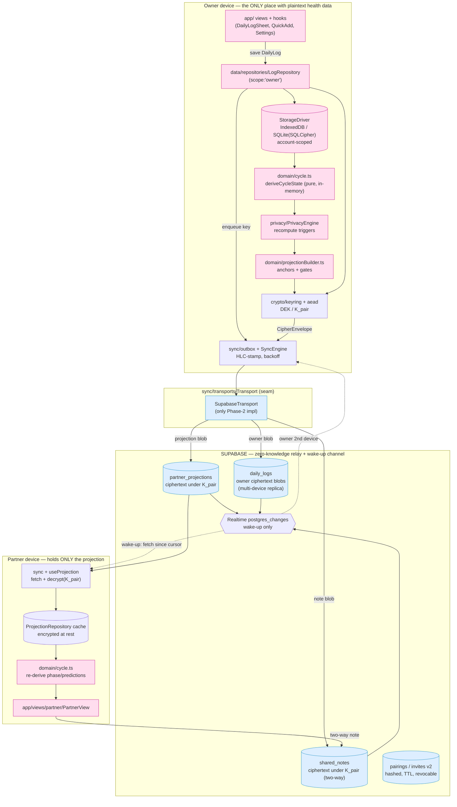

**Reading the map.** Four recompute triggers fire `PrivacyEngine.publish()` (log save, share-toggle change, quiet-window change, excluded-cycle/override change — see the Privacy Engine section). Owner writes flow left→down→relay as owner-scope ciphertext for the owner's *own* multi-device replica **and** (when a partner is linked and gates permit) as a projection-scope blob under `K_pair`. The partner never receives owner-scope blobs (RLS-enforced); it receives only `partner_projections` rows, decrypts locally, and re-derives phase/predictions with the *same* `domain/cycle.ts` pure functions the owner used. This is the key that makes "never persist derived data in the owner store" and "partner works offline" both true: the persisted-derived data lives **only** on the partner side, encrypted.

---


---


# 2. Folder Structure


This is the single source of truth for where code lives in v2. Every file is named with its one-line responsibility. The reorganization is layered strictly (§3). The current `src/lib/*` grab-bag is dissolved into `domain/`, `data/`, `crypto/`, `sync/`, `privacy/`, and `platform/`.

```text
rhea/
├── src/
│   ├── kernel/                     # zero-dependency leaf; the ONE package every layer may import
│   │   ├── result.ts               # Result<T,E>, ok(), err(), map/flatMap/unwrapOr
│   │   ├── errors.ts               # RheaError base, ErrorCode enum, factories, isRetryable()
│   │   ├── logger.ts               # Logger interface + redaction rules (no health data)
│   │   ├── brand.ts                # branded primitives: Uid, DeviceId, KeyId, Hlc, Iso8601, DateKey
│   │   └── assert.ts               # invariant()/assertNever() (dev-only, throws RheaError INVARIANT)
│   │
│   ├── domain/                     # PURE. imports: kernel only. no I/O, no framework, no crypto libs
│   │   ├── types.ts                # DailyLog, CycleState, Period, Cycle, PartnerProjection, Gates
│   │   ├── cycle.ts                # deriveCycleState + all prediction fns (moved from lib/cycle.ts, unchanged logic)
│   │   ├── phases.ts               # PHASES content; day-ranges DERIVED from engine, not hardcoded
│   │   ├── projectionBuilder.ts    # CycleState -> PartnerProjection (anchors + gates + computedAt)
│   │   ├── privacyPolicy.ts        # pure rules: shareable-field allowlist, gate resolution, quiet-window eval
│   │   ├── hlc.ts                  # Hybrid Logical Clock: now(), receive(remote), compare()
│   │   ├── merge.ts                # LWW-per-key resolution; tombstone competition; echo detection
│   │   └── index.ts
│   │
│   ├── data/                       # imports: kernel, domain, crypto (envelope only). NO platform, NO sync
│   │   ├── envelope.ts             # CipherEnvelope + SyncRecord (de)serialize, AAD assembly, version guard
│   │   ├── schema.ts               # IndexedDB store defs + DB_VERSION; SQLite DDL + SCHEMA_VERSION
│   │   ├── drivers/
│   │   │   ├── StorageDriver.ts     # SEAM interface (see §3)
│   │   │   ├── IndexedDbDriver.ts   # web impl over `idb`; blocked/blocking handlers; persist()
│   │   │   ├── SqliteDriver.ts      # Capacitor impl over @capacitor-community/sqlite (SQLCipher)
│   │   │   └── MemoryDriver.ts      # in-memory impl for unit tests
│   │   ├── repositories/
│   │   │   ├── LogRepository.ts     # owner DailyLog CRUD -> SyncRecord scope:'owner'; enqueues outbox
│   │   │   ├── ProjectionRepository.ts # partner projection read/write; scope:'projection'
│   │   │   ├── NoteRepository.ts    # shared notes; scope:'note'
│   │   │   ├── MetaRepository.ts    # override, excludedCycles, cursors, HLC state; scope:'meta'
│   │   │   └── OutboxRepository.ts  # durable outbox rows (key, attempts, nextAttemptAt)
│   │   ├── migrations/
│   │   │   ├── indexeddb/
│   │   │   │   ├── v1_to_v2.ts       # account-scope by DB name, add envelope/updatedAt/deviceId/deleted, backfill epoch-0
│   │   │   │   └── index.ts          # ordered registry + runner (idempotent)
│   │   │   └── sqlite/
│   │   │       ├── 0001_init.ts
│   │   │       └── index.ts
│   │   ├── exporter.ts             # ExportData v2 build (versioned) + downloadJSON
│   │   ├── importer.ts             # Clue/Flo/AppleHealth/generic parsers -> DailyLog (fixed CSV/date bugs)
│   │   └── index.ts
│   │
│   ├── crypto/                     # imports: kernel + libsodium.js ONLY. owned by crypto section
│   │   ├── sodium.ts               # libsodium ready() singleton
│   │   ├── keyring.ts              # device identity keypairs; DEK custody; keyId -> key lookup
│   │   ├── kdf.ts                  # Argon2id recovery-KEK; crypto_kx pair-key derivation
│   │   ├── aead.ts                 # XChaCha20-Poly1305 seal/open producing/consuming CipherEnvelope
│   │   ├── pairing.ts              # X25519 pairing, SAS verify, K_pair derive, rotation
│   │   ├── recovery.ts             # BIP39 phrase <-> recovery-KEK; wrap/unwrap DEK
│   │   ├── enrollment.ts           # multi-device DEK distribution (QR + kx, SAS)
│   │   └── index.ts
│   │
│   ├── sync/                       # imports: kernel, domain, data, crypto, transports
│   │   ├── SyncEngine.ts           # orchestrates outbox+cursor+reconcile; lifecycle start()/stop()
│   │   ├── outbox.ts               # drain w/ exponential backoff+jitter over OutboxRepository
│   │   ├── reconcile.ts            # pull-since-cursor -> decrypt -> merge.applyRemote (non-enqueueing)
│   │   ├── cursor.ts               # per-(scope,peer) cursor persistence via MetaRepository
│   │   ├── transports/
│   │   │   ├── Transport.ts         # SEAM interface (see §3)
│   │   │   ├── SupabaseTransport.ts # ONLY Phase-2 impl: ciphertext rows + realtime wake-up
│   │   │   └── NullTransport.ts     # local-only mode + tests (no network)
│   │   └── index.ts
│   │
│   ├── privacy/                    # imports: kernel, domain, data, crypto, sync
│   │   ├── PrivacyEngine.ts        # derive -> projectionBuilder -> encrypt -> publish; owns recompute triggers
│   │   ├── consumers/
│   │   │   ├── ProjectionPublisher.ts # writes projection SyncRecord on triggers; TTL/staleness stamp
│   │   │   ├── NotesGateway.ts      # two-way encrypted notes under K_pair
│   │   │   └── AuditLog.ts          # LOCAL append-only audit (pair/unpair/export/erase/import/share)
│   │   └── index.ts
│   │
│   ├── app/                        # UI. imports inward ONLY through di/ + hooks/. no direct driver/transport
│   │   ├── di/
│   │   │   ├── Container.ts         # builds + wires platform adapters, drivers, engines (composition root)
│   │   │   ├── Providers.tsx        # React context providers
│   │   │   └── context.ts           # useContainer(), typed accessor hooks
│   │   ├── hooks/
│   │   │   ├── useAuth.ts           # session + role (N-link safe, persisted role)
│   │   │   ├── useCycleData.ts      # owner derived CycleState
│   │   │   ├── useLogger.ts         # edit one DailyLog (single write path incl. QuickAdd + Overview symptoms)
│   │   │   ├── useProjection.ts     # partner-side projection subscribe + re-derive
│   │   │   ├── usePairing.ts        # QR pairing + SAS ceremony state
│   │   │   ├── useSharing.ts        # share toggles + quiet windows
│   │   │   ├── useSyncStatus.ts     # SyncEngine state: idle|syncing|offline|error|stale
│   │   │   └── useToast.ts          # error/status surface bridge
│   │   ├── views/
│   │   │   ├── auth/                # AuthScreen, RoleSelect, RecoveryPhraseSetup, RecoveryRestore
│   │   │   ├── tracker/             # Onboarding, DailyLogSheet, QuickAddPeriod, Overview/Calendar/History/Predictions
│   │   │   ├── partner/             # PartnerView (consumes PartnerProjection)
│   │   │   └── settings/            # SettingsView, PairingSection, SharingControls, PrivacyPolicy, SourcesView, DevicesSection
│   │   ├── components/
│   │   │   ├── ErrorBoundary.tsx    # typed error surface + reset; renders RheaError.userMessage
│   │   │   ├── StatusBar.tsx        # sync/offline/stale banner from useSyncStatus
│   │   │   ├── toast/               # Toast host + primitives
│   │   │   ├── layout/              # Header, TabNav, UserMenu
│   │   │   └── shared/              # PhaseHero, PhaseProgressBar, EnergyBar
│   │   ├── App.tsx                  # composition of gates/views (no sync/crypto logic)
│   │   └── main.tsx                 # mount; SW registration gated to web (§3)
│   │
│   ├── platform/                   # adapters injected at the composition root
│   │   ├── Platform.ts             # Platform aggregate: capabilities flags (isNative, hasSecureEnclave, ...)
│   │   ├── seams/
│   │   │   ├── SecureStore.ts       # SEAM interface (key material custody)
│   │   │   ├── NotificationScheduler.ts # SEAM interface (local-only notifications)
│   │   │   └── Filesystem.ts        # SEAM interface (export/share)
│   │   ├── web/
│   │   │   ├── WebStorage.ts        # provides IndexedDbDriver + navigator.storage.persist()
│   │   │   ├── WebSecureStore.ts    # non-extractable/wrapped key material in IndexedDB (best effort)
│   │   │   ├── WebNotifications.ts  # best-effort/no-op (content policy: no health text)
│   │   │   ├── WebFilesystem.ts     # Blob download export
│   │   │   └── registerSw.ts        # Workbox precache + navigation fallback (web only)
│   │   └── capacitor/
│   │       ├── CapStorage.ts        # provides SqliteDriver (SQLCipher)
│   │       ├── CapSecureStore.ts    # Android Keystore / iOS Keychain+Secure Enclave, biometric-gated
│   │       ├── CapNotifications.ts  # local-only scheduled notifications (reschedule-on-write)
│   │       └── CapFilesystem.ts     # Filesystem + Share sheet
│   │
│   └── styles/                     # unchanged (fonts.css, index.css, tailwind.css, theme.css)
│
├── tests/
│   ├── unit/
│   │   ├── domain/                 # cycle.spec, hlc.spec, merge.spec, projectionBuilder.spec, privacyPolicy.spec, phases.spec
│   │   ├── data/                   # envelope.spec, migrations.v1_to_v2.spec, repositories.spec, importer.spec
│   │   ├── crypto/                 # aead.vectors.spec, kdf.vectors.spec, pairing.spec, recovery.spec,
│   │   │                           #   negative.partner-cannot-decrypt.spec
│   │   ├── sync/                   # outbox.spec, reconcile.spec, syncEngine.spec
│   │   └── privacy/                # privacyEngine.spec, projectionPublisher.spec
│   ├── integration/
│   │   ├── rls/                    # owner.spec, partner.spec, unlinked.spec, pairing-hijack.spec (vs local Supabase)
│   │   └── indexeddb/              # migration.spec (fake-indexeddb)
│   ├── e2e/                        # Playwright: pairing, sharing, unpair, offline, recovery, multidevice
│   ├── fixtures/                   # logs.ts, projections.ts, vectors/ (crypto KAT JSON)
│   ├── helpers/                    # makeContainer.ts, fakeTransport.ts, fakeClock.ts, supabaseTestClient.ts
│   └── setup.ts                    # vitest global setup (sodium ready, fake-indexeddb, matchers)
│
├── supabase/
│   ├── config.toml                 # Supabase CLI project (replaces hand-run scripts)
│   ├── migration*.sql               # legacy hand-run scripts — kept as history only, superseded by 0001
│   ├── migrations/                  # shipped (authored; not yet executed — no local Postgres):
│   │   ├── 0001_baseline.sql        # faithful capture of the hand-run schema (migration.sql + phase-c + phase-e)
│   │   ├── 0002_secure_invite_redemption.sql # drops world-readable invite policy; sha256-hex code_hash of a ~120-bit server-minted secret, used boolean, 30-min TTL, create_invite()/redeem_invite() SECURITY DEFINER RPCs
│   │   ├── 0003_owner_sync_metadata.sql # daily_logs gains updated_hlc text (edit-time HLC — legacy updated_at timestamptz already existed), device_id, deleted, trigger-set server_updated_at, medication/intimacy jsonb, keyset index, and a stale-write trigger that SILENTLY SKIPS (RETURN NULL) writes with updated_hlc <= stored
│   │   │                            # planned Phase-2 set (renumbered):
│   │   ├── 0004_owner_ciphertext.sql       # owner ciphertext columns (M2.4)
│   │   ├── 0005_device_keys_pairing.sql    # device_keys + pairing_sessions (M2.5)
│   │   ├── 0006_partner_projections.sql    # partner_projections (M2.8)
│   │   ├── 0007_e2ee_shared_notes.sql      # E2EE shared notes (M2.10)
│   │   ├── 0008_quiet_windows.sql          # quiet windows (M2.11)
│   │   ├── 0009_retire_server_audit.sql    # retire server audit_log → local (M2.12)
│   │   └── 0010_drop_partner_plaintext.sql # drop partner plaintext ACL + plaintext columns (M2.13)
│   ├── tests/                      # pgTAP RLS assertions (authored; not yet wired into CI)
│   │   ├── rls_invite.sql
│   │   └── rls_owner_sync.sql
│   └── seed.sql
│
├── .github/workflows/ci.yml        # tsc + vitest + eslint + RLS tests + build (§5 gate)
├── playwright.config.ts
├── vitest.config.ts                # @ alias, jsdom/node envs, coverage thresholds
├── eslint.config.js                # flat config; import/no-restricted-paths enforces §3 boundaries
├── tsconfig.json                   # strict; `tsc --noEmit` wired into build
├── capacitor.config.ts             # Phase 3
├── vite.config.ts
└── package.json                    # scripts: dev/build(+tsc)/preview/test/test:e2e/lint/typecheck
```

---


---


# 3. Module Boundaries & Interfaces


**Dependency direction is acyclic and inward.** The only universally-importable package is `kernel/` (a zero-dependency leaf — this is the single, deliberate exception to "crypto imports nothing," analogous to importing a language primitive).

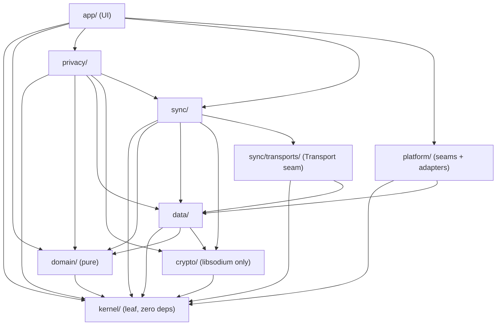

### 3.1 Layer rules (enforced by ESLint `import/no-restricted-paths`)

| Layer | MAY import | MUST NOT import | Rationale |
|---|---|---|---|
| `kernel/` | (nothing) | everything | Foundational leaf; keeps `domain` and `crypto` pure yet sharing `Result`/`RheaError`. |
| `domain/` | `kernel` | `data`, `crypto`, `sync`, `privacy`, `platform`, `app`, React, libsodium | Pure functions; must run in Node with no I/O for property tests. |
| `crypto/` | `kernel`, `libsodium.js` | `domain`, `data`, `sync`, `app`, React | Audited-lib-only; testable with KATs in isolation. |
| `data/` | `kernel`, `domain`, `crypto` (for `envelope`/AEAD types) | `sync`, `privacy`, `platform`, `app` | Repositories speak `SyncRecord`/`CipherEnvelope`; know nothing about *how* bytes move. |
| `sync/transports/` | `kernel`, `data` (types) | `domain`, `privacy`, `app` | A transport only moves opaque `SyncRecord`s. |
| `sync/` | `kernel`, `domain` (`hlc`,`merge`), `data`, `crypto`, `transports` | `privacy`, `app`, `platform` | Owns outbox/cursor/reconcile; injected a `Transport`. |
| `privacy/` | `kernel`, `domain`, `data`, `crypto`, `sync` | `platform`, `app` | Orchestrates the projection pipeline; not UI-aware. |
| `platform/` | `kernel`, `data` (`StorageDriver`) | `domain`, `sync`, `privacy`, `app` | Adapters implement seams; injected upward, never call up. |
| `app/` | everything **only via** `di/` + `hooks/` | direct `IndexedDbDriver`, `SupabaseTransport`, `aead`, etc. | UI must not instantiate drivers/transports/crypto directly. |

### 3.2 Dependency-inversion seams (the injected interfaces)

The composition root (`app/di/Container.ts`) is the only place that names concrete adapters; it picks web vs Capacitor from `Platform` capabilities and injects downward. Four seams:

```ts
// data/drivers/StorageDriver.ts — persistence engine (IndexedDB | SQLite | Memory)
export interface StorageDriver {
  open(accountScope: string): Promise<void>;        // e.g. "rhea-<uid>" | "rhea-local"
  get<T>(store: StoreName, key: string): Promise<T | undefined>;
  getAll<T>(store: StoreName): Promise<T[]>;
  put<T>(store: StoreName, key: string, value: T): Promise<void>;
  delete(store: StoreName, key: string): Promise<void>;
  tx<T>(stores: StoreName[], mode: 'r' | 'rw', fn: (t: StorageTx) => Promise<T>): Promise<T>;
  clearAll(): Promise<void>;                          // sign-out / unpair wipe
  close(): void;                                       // reset on account switch
  readonly schemaVersion: number;
}

// sync/transports/Transport.ts — the ONLY thing that moves bytes (SupabaseTransport = only Phase-2 impl)
export interface Transport {
  push(scope: SyncScope, records: SyncRecord[]): Promise<Result<void, RheaError>>;
  pull(scope: SyncScope, since: Cursor | null): Promise<Result<{ records: SyncRecord[]; cursor: Cursor }, RheaError>>;
  subscribe(scope: SyncScope, onWake: () => void): () => void;  // realtime wake-up; returns unsubscribe
  readonly protocolVersion: number;
}

// platform/seams/SecureStore.ts — key-material custody (WebSecureStore | CapSecureStore)
export interface SecureStore {
  readonly custody: 'software-idb' | 'keystore' | 'secure-enclave';
  readonly biometricGated: boolean;
  wrap(keyId: KeyId, material: Uint8Array): Promise<Result<void, RheaError>>;
  unwrap(keyId: KeyId): Promise<Result<Uint8Array, RheaError>>;   // may prompt biometrics
  remove(keyId: KeyId): Promise<void>;
  supportsHardwareBacking(): boolean;
}

// platform/seams/NotificationScheduler.ts + Filesystem.ts
export interface NotificationScheduler {
  schedule(local: LocalNotification): Promise<void>;   // content policy: NO health text on web push
  cancelAll(): Promise<void>;
}
export interface Filesystem {
  writeExport(name: string, bytes: Uint8Array): Promise<Result<void, RheaError>>; // download | Share sheet
}
```

`SyncRecord`/`CipherEnvelope` are the canonical cross-cutting artifacts (declared in the crypto/envelope section); every seam above is agnostic to their *contents*.

---


---


# 4. Domain Models, Privacy Engine & Partner Projection


> Scope: `src/domain` (pure), `src/privacy` (PrivacyEngine + consumers), and the domain-model contracts consumed by `src/data`, `src/sync`, `src/crypto`, `src/app`, `src/platform`. This section defines every type, the single phase oracle, the projection pipeline, and the layering rules. Cryptographic envelope/transport wire formats are owned by the crypto/sync sections and are referenced here only as coherence assumptions.

---

## 1. Domain models

### 1.1 Data-classification rule (resolves the "never persist derived" contradiction — §5)

Three classes, enforced at the type level and by module boundaries:

- **Stored (facts):** captured by the owner, the source of truth, persisted in the owner store. Only `DailyLog` + a handful of small meta scalars.
- **Derived (in-memory):** computed each session by `src/domain` pure functions from stored facts. **Never persisted in the owner store.**
- **Transient (UI):** exists only in React state (e.g. `localSymptoms` in `App.tsx:63`).

**The invariant (state this verbatim in the spec):**

> Derived data is persisted **only** when it crosses a trust boundary to a party that lacks the inputs to derive it.
> `persist(derived) ⇔ recipient ∉ owners(rawLogs)`.

The owner has the raw logs, so the owner store persists **zero** derived data (no `CycleState`, `Period[]`, `Cycle[]`, `predictions`, `fertileWindow`, or `phase`). The **only** derived artifact that is persisted is `PartnerProjection`, because the partner has no access to raw logs (the `daily_logs` partner-read RLS at `migration.sql:56-62` is being DROPPED and `initialSync(linkedOwnerId)` at `App.tsx:70` / `sync.ts:79-89` is being removed). The projection is persisted **encrypted** (under `K_pair`) server-side as ciphertext and cached on the partner device. It is **versioned** so the partner can reject shapes it cannot interpret. This is not a contradiction of "never persist derived" — it is the single, explicitly-carved exception the rule permits.

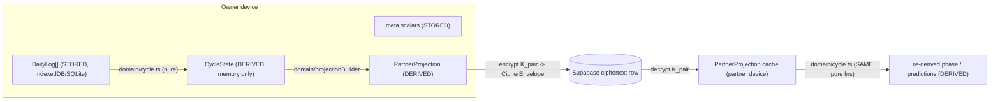

### 1.2 Stored types

`DailyLog` keeps its v1 shape (`src/types/index.ts:30-37`) and gains **additive optional** fields so old payloads decode unchanged (`CipherEnvelope.v` and payload `schemaHint` disambiguate).

```ts
// src/domain/models.ts
export type FlowLevel = "none" | "spotting" | "light" | "medium" | "heavy";

export interface MedicationEntry {
  name: string;        // free text or ALL_SYMPTOMS-style enum later
  dose?: string;       // "200mg" — optional
  takenAt?: string;    // "HH:mm" local, optional
}

export interface IntimacyEntry {
  occurred: boolean;
  protected?: boolean; // optional; omit = unknown
}

export interface DailyLog {
  date: string;                    // "YYYY-MM-DD" — LOGICAL KEY (SyncRecord.key)
  flow: FlowLevel;
  symptoms: string[];
  mood: string | null;             // one of MOOD_OPTIONS or null
  energy: string | null;           // "low" | "medium" | "high" | null
  notes: string;
  // ── v2 additive (all optional → v1 payloads remain valid) ──
  medication?: MedicationEntry[];
  intimacy?: IntimacyEntry | null;
  schemaHint?: 2;                  // payload-shape marker inside the plaintext (pre-encryption)
}
```

Meta scalars (owner store `meta` object store, `db.ts:69-79`): `cycleLengthOverride: number | null`, `excludedCycles: string[]`, `shareSettings: ShareSettings`, `quietWindows: QuietWindow[]`, `pronouns: PronounSettings`, `dbVersion` marker. **`ShareSettings` and `QuietWindow` move from Supabase tables (`sharing.ts:50-70, 134-163`) into owner-local meta** — they are owner-only consent config and are re-materialized into the projection, so no server-side plaintext table is needed for them.

### 1.3 Derived types (in-memory only; reuse existing shapes)

`Period`, `Cycle`, `FertileWindow`, `PredictedCycle`, `CycleState` are reused **unchanged** from `src/types/index.ts:41-83`, moved to `src/domain/models.ts`. `SymptomPattern` (`cycle.ts:303-308`) also moves. None are ever written to storage on the owner side.

```ts
export interface Period { startDate: string; endDate: string; length: number; }

export interface Cycle {
  periodStart: string; periodEnd: string; periodLength: number;
  cycleLength: number | null;   // null for the latest/open cycle
  excluded: boolean;
}

export interface FertileWindow { start: Date; end: Date; ovulationDate: Date; confidence: number; }

export interface PredictedCycle { cycleNumber: number; start: Date; end: Date; uncertainty: number; }

export interface CycleState {
  cycles: Cycle[];
  currentCycleStart: string | null;
  cycleDay: number;
  phase: PhaseName;
  avgCycleLength: number;
  avgPeriodLength: number;
  stdDev: number;
  daysUntilPeriod: number;
  nextPeriodDate: Date | null;
  confidence: "early" | "building" | "good";
  isLate: boolean;
  predictions: PredictedCycle[];
  fertileWindow: FertileWindow | null;
}
```

### 1.4 Sharing / consent types (reuse `sharing.ts`)

```ts
export type ShareKey =
  | "cycle_headsup" | "todays_phase" | "mood_signal" | "care_nudges" | "shared_notes"; // sharing.ts:3-8
export type ShareSettings = Record<ShareKey, boolean>;                                  // sharing.ts:38

export interface QuietWindow {            // sharing.ts:127-132, owner_id dropped (now local)
  id: string;
  startDate: string;   // "YYYY-MM-DD" inclusive
  endDate: string;     // "YYYY-MM-DD" inclusive
}

export type MoodFlag = "rough" | "okay" | "good";  // the mood_signal payload

export interface PronounSettings {        // §9 gendered-copy fix
  subject: string;      // "she" | "they" | ...
  object: string;       // "her" | "them"
  possessive: string;   // "her" | "their"
  displayName?: string; // "Maya" — when set, headings use the name instead of a pronoun
}
export const DEFAULT_PRONOUNS: PronounSettings = { subject: "she", object: "her", possessive: "her" };
```

`ShareKey` is a stored `keyId`-independent consent flag. `K_pair` is the encryption key; the `ShareKey`/gate decides which anchors are *placed inside* the ciphertext.

### 1.5 Shared notes & audit (redefined for E2EE / local)

`SharedNote` (`sharing.ts:91-97`) becomes an E2EE two-way record encrypted under `K_pair` (`scope:'note'`); the server stores ciphertext only. `AuditEntry` (`audit.ts:3-9`) becomes a **local, owner-device** `AuditEvent` (the `audit_log` server table is removed — audit is private history).

```ts
export interface SharedNote {
  id: string;                        // uuid
  linkId: string;                    // partner-link id (routing metadata, plaintext)
  authorRole: "owner" | "partner";
  authorDeviceId: string;
  body: string;                      // plaintext in memory; encrypted on the wire
  createdAt: string;                 // HLC
  deleted?: boolean;                 // tombstone
}

export type AuditAction =
  | "share.toggle_on" | "share.toggle_off"
  | "partner.paired"  | "partner.unpaired"
  | "quiet.added"     | "quiet.removed"
  | "data.exported"   | "data.erased" | "data.imported"
  | "projection.published"                                   // NEW: every republish
  | "device.enrolled" | "recovery.used" | "keys.rotated";    // NEW: crypto lifecycle

export interface AuditEvent {
  id: string;
  action: AuditAction;
  target?: string | null;    // e.g. the ShareKey toggled, or QuietWindow id
  actorDeviceId: string;
  at: string;                // HLC
}
```

### 1.6 Storage-classification matrix

| Type | Class | Where it lives |
|---|---|---|
| `DailyLog` | Stored | owner store `logs` (encrypted under DEK when synced) |
| `ShareSettings`, `QuietWindow[]`, `PronounSettings`, `cycleLengthOverride`, `excludedCycles` | Stored | owner store `meta` |
| `AuditEvent[]` | Stored | owner store `audit` (local) |
| `Period`, `Cycle`, `CycleState`, `FertileWindow`, `PredictedCycle`, `SymptomPattern`, resolved `PhaseName` | Derived | memory only, owner side |
| `PartnerProjection` | Derived **but persisted** (the exception) | encrypted server row + partner device cache |
| `SharedNote` | Stored (E2EE, two-way) | encrypted server row + both device caches |
| `localSymptoms`, active `DailyLog` draft | Transient | React state |

---

## 2. The single phase oracle (§6 — unify the three conflicting engines)

### 2.1 The conflict (verified)

| Engine | Location | Behaviour | Verdict |
|---|---|---|---|
| `utils.getPhase(day, cycleLength=28)` | `utils.ts:32-37` | Hardcoded thresholds 5/13/16; **ignores the `cycleLength` argument entirely** | **DELETE** |
| `utils.getPhaseLengths(avgLength)` | `utils.ts:39-46` | Hardcoded `menstrual:5, follicular:8, ovulation:3`, `luteal:avgLength-16` — inconsistent with the dynamic engine and used by `PartnerView.tsx:41,184-201` for the segment bar | **DELETE** |
| `cycle.getCurrentPhase(cycleDay, avgCycleLength, avgPeriodLength)` | `cycle.ts:127-147` | Dynamic: menstrual = `1..avgPeriodLength`; ovulation anchored at `avgCycleLength - DEFAULT_LUTEAL_LENGTH`; fertile start = `ovulation-5` | **PROMOTE — canonical** |

`PhaseData` in `phases.ts:33-34,65-66,102-103,140-141` also carries baked `cycleStart`/`cycleEnd` day numbers and a baked `range: "Days 1–5"` string (`phases.ts:6,39,...`). These are a fourth source of truth for the same numbers.

### 2.2 The oracle

Single module `src/domain/phases.ts`. Everything else calls it. `PhaseData` **loses `cycleStart`, `cycleEnd`, and `range`** (all three become derived); the remaining `PhaseData` is pure copy/color content renamed conceptually to "phase copy".

```ts
// src/domain/phases.ts
export type PhaseName = "menstrual" | "follicular" | "ovulation" | "luteal";

export interface PhaseAnchors {
  avgCycleLength: number;
  avgPeriodLength: number;
  lutealLength: number;   // = DEFAULT_LUTEAL_LENGTH (constants.ts:46), injected not hardcoded
}

export interface PhaseBoundary { startDay: number; endDay: number; } // 1-indexed, inclusive
export type PhaseBoundaries = Record<PhaseName, PhaseBoundary>;

// THE ONE algorithm. Mirrors cycle.ts:127-147 exactly.
export function getPhaseBoundaries(a: PhaseAnchors): PhaseBoundaries;
export function getPhaseForDay(cycleDay: number, a: PhaseAnchors): PhaseName;
export function getPhaseLengths(a: PhaseAnchors): Record<PhaseName, number>; // = boundary widths
export function getPhaseRangeLabel(p: PhaseName, a: PhaseAnchors): string;   // "Days 1–5" derived

// PhaseData: cycleStart/cycleEnd/range REMOVED.
export interface PhaseData {
  name: string; shortName: string; color: string; bg: string; text: string; border: string;
  emoji: string; tagline: string; description: string; partnerDesc: string;
  energy: number; mood: string; symptoms: string[]; tips: string[]; partnerTips: string[];
}
```

Boundary derivation (single definition, both owner and partner call it): `ovulationDay = avgCycleLength - lutealLength`; `fertileStart = ovulationDay - 5`; then sequential clamped cut points `mEnd = avgPeriodLength`, `fEnd = max(fertileStart, mEnd)`, `oEnd = max(ovulationDay+1, fEnd)` give `menstrual = [1, mEnd]`; `follicular = [mEnd+1, fEnd]`; `ovulation = [fEnd+1, oEnd]`; `luteal = [oEnd+1, avgCycleLength]`. *(Corrected during M1.3 implementation: an earlier draft placed `ovulation` starting **at** `fertileStart`, which contradicted this section's own "identical branching" requirement — the branching resolves `day == fertileStart` to follicular. The clamped form also keeps phases ordered and widths summing to `avgCycleLength` for degenerate short cycles, e.g. cycle 24 / period 6. See IMPLEMENTATION_JOURNAL.md S2.3.)* `getPhaseForDay` is a thin wrapper (identical branching to `cycle.ts:133-146`); `cycle.getCurrentPhase` delegates to `getPhaseForDay`. `getPhaseLengths` returns each boundary width so the `PartnerView` segment bar (`PartnerView.tsx:184-201`) and the owner hero share **one** set of widths — the `utils.getPhaseLengths` mismatch disappears.

Migration note: every caller of `utils.getPhase`/`utils.getPhaseLengths` and every read of `PhaseData.cycleStart/cycleEnd/range` must be repointed to the oracle (`PartnerView.tsx:41` and the `range` reads at `PartnerView.tsx:405`).

---

## 3. PrivacyEngine (§2)

`src/privacy/privacyEngine.ts` — a **pure** function (no I/O, no `Date.now()` inside; `now` is injected). It is the single fan-out point that turns owner-derived state + consent into every consumer artifact.

```ts
// src/privacy/privacyEngine.ts
export interface PrivacyEngineInput {
  cycleState: CycleState;          // owner-derived, from domain/cycle.ts
  logs: DailyLog[];                // needed for doctor/backup consumers + today's mood
  shareSettings: ShareSettings;
  quietWindows: QuietWindow[];
  pronouns: PronounSettings;
  now: Date;
  emit: { partner: boolean; doctor?: boolean; backup?: boolean };
}

export interface OwnerView { cycleState: CycleState; }   // identity: the FULL state, ungated

export interface PrivacyEngineOutput {
  ownerView: OwnerView;                       // always present
  partnerProjection: PartnerProjection | null;// null iff emit.partner=false OR no gate enabled
  doctorExport?: DoctorExport;
  backupExport?: BackupExport;
}

export function privacyEngine(input: PrivacyEngineInput): PrivacyEngineOutput;
```

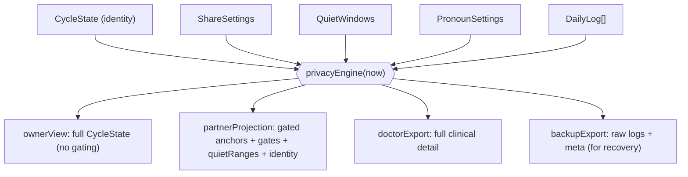

### 3.1 Consumer output shapes

```ts
// Doctor export — full clinical fidelity, plaintext file the owner downloads/shares out-of-band.
export interface DoctorExport {
  version: 1;
  generatedAt: string;
  patientPronouns: PronounSettings;
  cycles: Cycle[];
  averages: { avgCycleLength: number; avgPeriodLength: number; stdDev: number };
  symptomPatterns: SymptomPattern[];        // cycle.ts:310
  logs: DailyLog[];                         // includes medication[] / intimacy
}

// Backup export — superset of db.ts:83-88 ExportData; the recovery-phrase restore target.
export interface BackupExport {
  version: 2;                               // ExportData.version axis, bumped from 1 (db.ts:84)
  exportedAt: string;
  logs: DailyLog[];
  meta: Record<string, unknown>;            // shareSettings, quietWindows, override, excluded, pronouns
}
```

`ownerView` = **identity**: `privacyEngine` passes `cycleState` through untouched — the owner sees everything.

### 3.2 The gating table (share key → projection fields)

| `ShareKey` (`sharing.ts:3-8`) | Projection gate | Anchors/fields unlocked | PartnerView region (cite) |
|---|---|---|---|
| `todays_phase` | `phase` | `currentCycleStart`, `avgCycleLength`, `avgPeriodLength`, `lutealLength` | Hero + "What's Happening" + "Full Cycle" (`PartnerView.tsx:144, 207, 369`) |
| `cycle_headsup` | `headsup` | `currentCycleStart`, `avgCycleLength`, `stdDev`, `cycleCount` | "What's Coming Next" (`PartnerView.tsx:267`) |
| `mood_signal` | `mood` | `moodFlag` (+ Mood Tendencies block) | `PartnerView.tsx:227` |
| `care_nudges` | `tips` | (no anchors; unlocks `partnerTips` copy) | "How You Can Help" (`PartnerView.tsx:242`) |
| `shared_notes` | `notes` | (separate `scope:'note'` stream, not anchors) | "Notes" (`PartnerView.tsx:313`) |

Data-minimization rule: `projectionBuilder` populates an anchor field **only if at least one enabled gate needs it**. If only `mood_signal` is on, the projection ships `moodFlag` and empty anchors — nothing about the cycle leaks.

---

## 4. Partner projection (§2, §4)

### 4.1 The type

```ts
// src/domain/projectionBuilder.ts
export const PROJECTION_VERSION = 2;                 // PartnerProjection.version axis
export const PROJECTION_MIN_SUPPORTED = 2;           // partner refuses anything below this

export interface ProjectionAnchors {                 // all optional → data minimization
  currentCycleStart?: string | null;  // "YYYY-MM-DD"
  avgCycleLength?: number;
  avgPeriodLength?: number;
  lutealLength?: number;
  stdDev?: number;
  cycleCount?: number;                 // completed, non-excluded (cycle.ts:274)
  moodFlag?: MoodFlag | null;
}

export type ProjectionGates = { phase: boolean; headsup: boolean; mood: boolean; tips: boolean; notes: boolean; };

export interface QuietRange { startDate: string; endDate: string; } // shipped, evaluated partner-side (§8)

export interface PartnerProjection {
  version: number;        // PROJECTION_VERSION
  computedAt: string;     // HLC — publish/edit time (feeds SyncRecord.updatedAt)
  asOfDate: string;       // "YYYY-MM-DD" the anchors are valid as-of (owner's local day)
  ttlHours: number;       // staleness contract (default 36)
  anchors: ProjectionAnchors;
  gates: ProjectionGates;
  quietRanges: QuietRange[];   // encrypted inside the payload; partner evaluates locally
  identity: PronounSettings;   // §9 — partner renders with the owner's chosen pronouns/name
}

export function buildPartnerProjection(
  cycleState: CycleState, shareSettings: ShareSettings,
  quietWindows: QuietWindow[], pronouns: PronounSettings, now: Date
): PartnerProjection | null;   // null when no gate enabled
```

Wire binding (coherence with sync/crypto sections): the projection is serialized to JSON, encrypted under `K_pair` into a `CipherEnvelope` (`keyId = K_pair id`, `aad = key + updatedAt`), and shipped as a `SyncRecord { key: \`proj:${linkId}\`, scope: 'projection', payload, updatedAt: computedAt, deviceId: <owner device>, deleted: false }`. Unpair emits a tombstone (`payload:null`).

### 4.2 Partner-side re-derivation (SAME pure functions)

The partner never receives raw logs. It reconstructs everything from anchors by calling the **identical** `src/domain` pure functions the owner used — this is why anchors (not baked strings) are shipped.

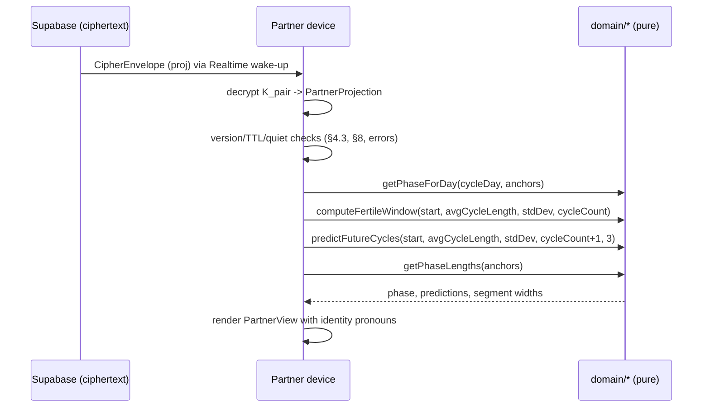

Reconstruction steps (partner side, `src/app` partner hook, all math delegated to `src/domain`):

1. `cycleDay = diffDays(now, parseDate(anchors.currentCycleStart)) + 1` (mirrors `cycle.ts:258`).
2. `phase = getPhaseForDay(cycleDay, anchors)` — feeds the hero + "Now" badge (`PartnerView.tsx:394`).
3. `fertileWindow = computeFertileWindow(currentCycleStart, avgCycleLength, stdDev, cycleCount)` (`cycle.ts:162`).
4. `predictions = predictFutureCycles(currentCycleStart, avgCycleLength, stdDev, cycleCount+1, 3)` (`cycle.ts:201`) — feeds "What's Coming Next" (`PartnerView.tsx:273`).
5. `phaseLengths = getPhaseLengths(anchors)` — replaces `getPhaseLengths(state.avgCycleLength)` at `PartnerView.tsx:41`.

The partner builds a **synthetic partial `CycleState`** from these so `PartnerView` needs minimal changes: `{ phase, avgCycleLength, avgPeriodLength, predictions, fertileWindow, cycleDay }`. Fields the partner is not entitled to (`cycles[]`, raw `logs`, `notes`) are absent — `PartnerView` must never read them (it currently reads only `state.avgCycleLength`, `state.predictions`, `state.phase`, so this is compatible).

### 4.3 Staleness contract

- `computedAt` and `asOfDate` are surfaced in the UI ("Updated 2 days ago").
- `age = diffDays(now, parseDate(asOfDate))`. When `age * 24 > ttlHours` → **TTL banner** ("This may be out of date — she hasn't synced recently") but the last-known projection is **still rendered** (predictions naturally drift; do not hard-blank).
- **Post-unpair cache wipe:** on unpair, the crypto layer rotates/destroys `K_pair` and the partner app **purges** the cached `PartnerProjection` and note cache; `PartnerView` falls back to the "Nothing shared yet" empty state (`PartnerView.tsx:124-139`). The projection tombstone (`payload:null`) confirms removal.

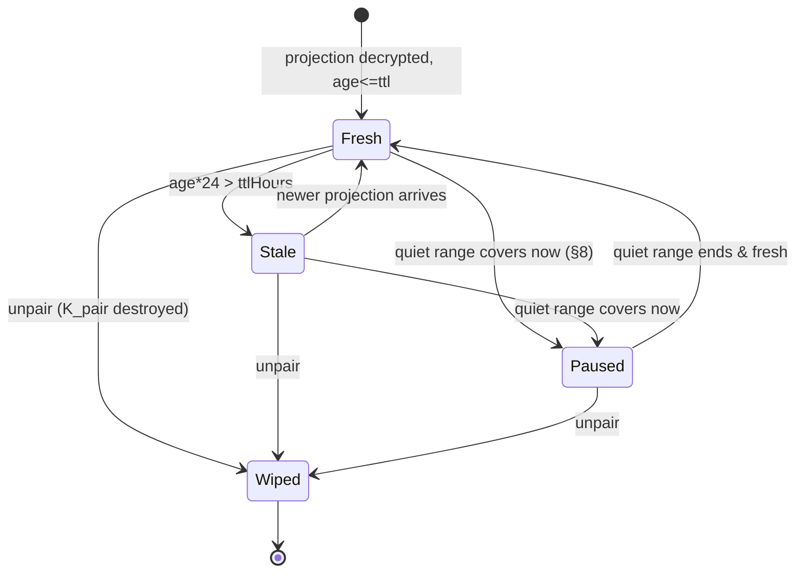

### 4.4 Error cases (partner side)

| Condition | Detection | Behaviour |
|---|---|---|
| **Projection with no data** | `anchors.currentCycleStart == null` (owner has no logged periods; `cycle.ts:238-254` defaults) | Render "Nothing shared yet" empty state (`PartnerView.tsx:124-139`); no predictions/phase math (avoids `NaN` days). |
| **Stale past TTL** | `age*24 > ttlHours` | Show amber TTL banner, still render last-known derivation (§4.3). |
| **Unknown newer `version`** | `projection.version > PROJECTION_VERSION` | Do **not** attempt to render derived data. Show "Update Rhea to see the latest" banner; keep any prior compatible cached projection read-only. |
| **Too-old `version`** | `projection.version < PROJECTION_MIN_SUPPORTED` | Treat as no-data empty state; log `AuditEvent`? (owner side only) — partner shows empty. |
| **Nothing shared** | `buildPartnerProjection` returned `null` / all `gates` false | "Nothing shared yet" (`PartnerView.tsx:96,124`). |

---

## 5. The four recompute-and-republish triggers (§3)

Any mutation that changes owner-derived state **or** consent must (1) re-run `domain/cycle.ts` → `CycleState`, (2) re-run `privacyEngine`, (3) if a projection results, enqueue it on the sync **outbox** for encrypted publish. This replaces the removed `pushLog`-only path.

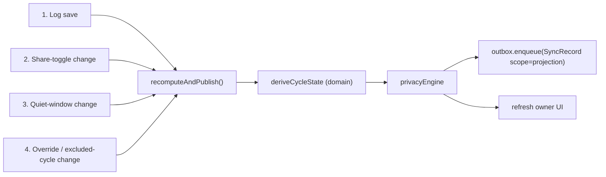

| # | Trigger | Current call site | v2 action |
|---|---|---|---|
| 1 | **Log save** | `useLogger` `onSave` → `pushLog` (`App.tsx:54-61`) | After the log write, run `recomputeAndPublish()` (not just `pushLog`). |
| 2 | **Share-toggle change** | `setShareSetting` (`sharing.ts:74`), invoked from Settings; audit `share.toggle_on/off` (`audit.ts:38-39`) | Persist toggle to local meta, then `recomputeAndPublish()` so `gates` update. |
| 3 | **Quiet-window change** | `addQuietWindow`/`removeQuietWindow` (`sharing.ts:146-163`); audit `quiet.added/removed` (`audit.ts:41-42`) | Persist to local meta, then `recomputeAndPublish()` so `quietRanges` update. |
| 4 | **Override / excluded change** | `handleCycleLengthOverrideChange` (`App.tsx:109-116`) and `handleToggleExcluded` (`App.tsx:122-134`) | Both already `setMeta(...); refresh()`; add `recomputeAndPublish()` — they change `avgCycleLength`/anchors. |

`recomputeAndPublish` is debounced (coalesce rapid edits) and writes an `AuditEvent { action: 'projection.published' }`. Publish failures fall through to the outbox + exponential backoff (owned by the sync section).

---

## 6. Quiet windows under the projection model (§8)

**Decision: ship quiet ranges inside the encrypted projection; the partner evaluates them against its local clock** (`quietRanges` field, §4.1). Reuse the existing predicate `isInQuietWindow(quietRanges, now)` (`sharing.ts:165-171`), moved to `src/domain/privacyPolicy.ts`. Share-toggle gates, by contrast, stay **owner-resolved** (baked into `gates`) because they are explicit consent actions that change rarely and republish on change (trigger #2).

**Justification (offline-correctness):** a quiet window is a time-bounded pause whose activation/deactivation boundary can fall while the **owner's device is offline** (e.g. "pause July 20–25" set on the 18th, phone dead on the 20th). If quiet were resolved owner-side at publish time, the pause would silently fail to activate at the boundary. Evaluating `quietRanges` on the **partner's** local clock guarantees the pause flips exactly at the date boundary with no owner online-ness required. This does not weaken the crypto model: the partner already holds `K_pair` and can decrypt the projection regardless, so quiet windows are a **consent/rendering** boundary, not a confidentiality boundary. When `isInQuietWindow` is true the partner overrides all gates to hidden and renders the "Sharing paused" screen (`PartnerView.tsx:107-121`). (The stronger confidentiality option — omitting anchors entirely during quiet — is rejected precisely because it depends on the owner being online at the boundary.)

---

## 7. Gendered-copy debt (§9)

`PartnerView` and `phases.ts` hardcode feminine copy: "She's in her … Phase" (`PartnerView.tsx:171-177`), "What's Happening in **Her** Body" (`PartnerView.tsx:209`), "She's taken a quiet moment" (`PartnerView.tsx:116`), and every `PhaseData.partnerDesc`/`partnerTips` string (`phases.ts:16-17,48-49,...`).

Fix: `PronounSettings` (§1.4) is owner-stored, shipped in `PartnerProjection.identity`, and consumed via a pure formatter.

```ts
// src/domain/copy.ts
export function renderCopy(template: string, p: PronounSettings): string;
// templates use {Subject}/{subject}/{object}/{possessive}/{Possessive}/{name}
// e.g. "{Subject}'s in {possessive} {phase} phase" + displayName override for the heading.
```

`phases.ts` `partnerDesc`/`partnerTips` are rewritten as templates with `{subject}`/`{possessive}` placeholders; `PartnerView` renders `renderCopy(phaseData.partnerDesc, projection.identity)`. Default remains `she/her` (`DEFAULT_PRONOUNS`) so existing behaviour is preserved when the owner sets nothing. Pronoun changes are **not** a projection trigger by themselves for anchors, but they do bump `identity`, so they piggyback on the next republish (or force one via trigger #2's path).

---


---


# 5. Encryption Architecture & Cryptographic Threat Model


> Scope: this section specifies the complete client-side cryptographic system for Rhea v2 — the key hierarchy, the libsodium primitives bound to each operation, the `Keyring` and `SecureStore` module contracts, the pairing / device-enrollment / recovery protocols, shared-notes encryption, and the plaintext metadata the server unavoidably sees. It is the authority for everything under `src/crypto/`. The crypto-relevant portions of the Threat Model follow in the final subsection.
>
> Non-goals: transport/outbox mechanics (owned by `src/sync/`), the derived cycle engine (`src/lib/cycle.ts`, reused as-is), and the shape of the `PartnerProjection` payload (owned by `src/domain/projectionBuilder`). This section only defines how those payloads are sealed and how keys are distributed.

## 0. Fixed inputs this section builds on

- **Canonical envelope** (cross-cutting, defined by the spec, not re-litigated here):
  ```ts
  interface CipherEnvelope {
    v: number;                          // envelope schema version, starts at 1
    alg: 'xchacha20poly1305';           // only value in v2
    keyId: string;                      // which symmetric key opens this (grammar in §3.4)
    nonce: string;                      // base64, 24 random bytes
    ct: string;                         // base64, XChaCha20-Poly1305 ciphertext||tag
    aad?: string;                       // base64, canonicalized AAD (see §4)
  }
  interface SyncRecord {
    key: string;                        // logical record key (see §8 for hashing)
    scope: 'owner' | 'projection' | 'note' | 'meta';
    payload: CipherEnvelope | null;     // null = tombstone
    updatedAt: string;                  // HLC, edit-time
    deviceId: string;
    deleted: boolean;
  }
  ```
- **Crypto library**: `libsodium-wrappers-sumo` (sumo build required for `crypto_pwhash` Argon2id and `crypto_kx`). No custom crypto. All calls go through the thin wrappers in `src/crypto/aead.ts` and `src/crypto/kdf.ts`; no other module calls libsodium directly.
- **Account model**: Supabase Auth is identity + zero-knowledge mailbox only; `auth.uid()` owns ciphertext rows. RLS is an envelope ACL, never a confidentiality boundary.

---

## 1. Key hierarchy

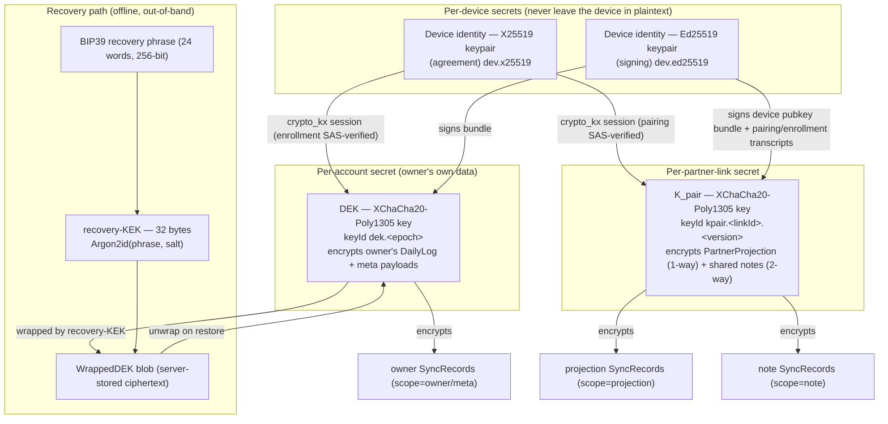

**Reading the hierarchy:** the DEK is the root of the owner's *own* data confidentiality; it is distributed to additional owner devices via enrollment and backed up only via the recovery phrase. K_pair is an independent per-link secret derived fresh at each pairing and never derivable from the DEK — a compromised link never exposes owner history. Device identity keys authenticate the humans/devices doing pairing and enrollment (they close the MITM window) but never directly encrypt stored data.

---

## 2. Key catalog (name · lifetime · storage · rotation)

| Key | Type / algorithm | Cardinality | Generated | Lifetime | Storage (web) | Storage (Capacitor) | Rotation trigger |
|---|---|---|---|---|---|---|---|
| `dev.x25519` (device agreement) | X25519 keypair | 1 per **device** | first app run (`initDevice`) | life of the device install | private wrapped by MWK in IndexedDB (`crypto` store); public in `device_keys` table | private sealed in Keystore/Keychain (biometric-gated); public in `device_keys` | device wipe/reinstall; explicit `rotateDeviceIdentity` on suspected compromise |
| `dev.ed25519` (device signing) | Ed25519 keypair | 1 per **device** | first app run | life of device install | same as above | same as above | same as `dev.x25519` (rotated together) |
| `DEK` | XChaCha20-Poly1305 symmetric, 32 B | 1 per **account** | once, on the first device (`generateDEK`) | life of the account (survives password reset) | wrapped by MWK in IndexedDB (`crypto` store, id `dek.<epoch>`) | sealed in Keystore/Keychain | **manual only** (compromise/export-leak): new epoch, re-encrypt all owner records; NOT rotated on password reset |
| `K_pair` | XChaCha20-Poly1305 symmetric, 32 B | 1 per **partner link**, per version | at pairing, via `crypto_kx` from both devices' X25519 keys + `linkId` | life of the link version | wrapped by MWK in IndexedDB (id `kpair.<linkId>.<v>`) | sealed in Keystore/Keychain | **unpair/re-pair** (version bump); optional periodic re-pair |
| MWK (master wrapping key) | AES-256-GCM, WebCrypto `CryptoKey`, **non-extractable** | 1 per **device** (web only) | first run | life of device install | stored as a `CryptoKey` handle in IndexedDB (`keys` store); raw bytes never in JS | n/a (Keystore/Keychain replaces it) | device wipe |
| `recovery-KEK` | 32 B, derived | ephemeral (never persisted) | on backup and on restore, from the phrase | held in memory only for the wrap/unwrap call, then zeroed | never stored | never stored | re-derived whenever the phrase is entered |
| BIP39 recovery phrase | 24 words / 256-bit entropy | 1 per **account** | at account setup (or first cloud opt-in) | until user regenerates | **not stored by the app** — shown once, user saves it | same | user-initiated regenerate (invalidates old `WrappedDEK`) |
| Enrollment/pairing session keys (`rx`,`tx`) | 32 B each, from `crypto_kx` | ephemeral per handshake | during pairing/enrollment | seconds (handshake only), then zeroed | memory only | memory only | n/a |

> **MWK rationale (web):** libsodium operates on raw key bytes, but the Web Crypto API can hold a truly non-extractable `CryptoKey`. We therefore keep all libsodium secrets *wrapped* under a non-extractable AES-GCM MWK and unwrap them into transient memory only for the duration of a `seal`/`open`. This is the honest "best-effort" at-rest protection for the web target: a stolen IndexedDB export is useless without the MWK handle, but a live-DOM XSS can still coerce an unwrap. Capacitor upgrades this to hardware-backed sealing.

---

## 3. Modules under `src/crypto/`

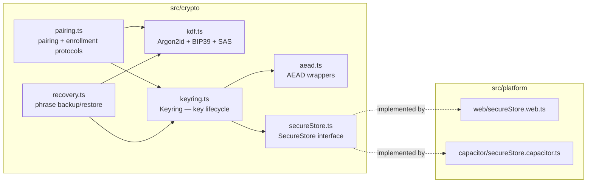

### 3.1 `aead.ts` — AEAD primitive wrappers

```ts
/** All AEAD is XChaCha20-Poly1305-IETF with a fresh 24-byte random nonce per message. */
export interface AeadModule {
  /** Seal plaintext under a raw 32-byte key, binding `aad`. Returns a CipherEnvelope. */
  seal(rawKey: Uint8Array, keyId: string, plaintext: Uint8Array, aad: Uint8Array): Promise<CipherEnvelope>;

  /** Open an envelope with a raw key. Throws AeadOpenError on any auth failure (§ Threat Model T-3). */
  open(rawKey: Uint8Array, env: CipherEnvelope, aad: Uint8Array): Promise<Uint8Array>;

  /** Generate a fresh 32-byte symmetric key (crypto_aead_xchacha20poly1305_ietf_keygen). */
  generateKey(): Uint8Array;

  /** Constant-time equality (sodium.memcmp) for SAS / tag comparisons. */
  equal(a: Uint8Array, b: Uint8Array): boolean;

  /** Best-effort zeroing of key material (sodium.memzero). */
  zero(buf: Uint8Array): void;
}
```

### 3.2 `kdf.ts` — key derivation, phrases, safety numbers

```ts
export type ArgonProfile = 'interactive' | 'recovery';

export interface KdfModule {
  /** Argon2id via crypto_pwhash. Profiles defined in §5. */
  deriveKek(phraseBytes: Uint8Array, salt: Uint8Array, profile: ArgonProfile): Promise<Uint8Array /*32B*/>;

  /** BIP39: generate a 24-word (256-bit) mnemonic and its raw entropy. */
  generateMnemonic(): { phrase: string; entropy: Uint8Array };
  /** Validate + normalize a user-entered phrase (NFKD, whitespace, checksum). Throws MnemonicError. */
  mnemonicToEntropy(phrase: string): Uint8Array;

  /** crypto_kx client/server session keys from a completed X25519 handshake. */
  kxClientSession(myX25519: KeyPair, peerX25519Pub: Uint8Array): SessionKeys;
  kxServerSession(myX25519: KeyPair, peerX25519Pub: Uint8Array): SessionKeys;

  /** Short Authentication String / safety number. See §6.3. */
  safetyNumber(input: SasInput): string; // e.g. "48291 05737 21160 88402 39115 66208"
}

export interface KeyPair { publicKey: Uint8Array; privateKey: Uint8Array; keyType: 'x25519' | 'ed25519'; }
export interface SessionKeys { rx: Uint8Array; tx: Uint8Array; } // 32B each; zero after use
export interface SasInput {
  context: 'rhea-pair-v1' | 'rhea-enroll-v1';
  a: Uint8Array;   // one party's X25519 public
  b: Uint8Array;   // other party's X25519 public
  bindId: string;  // linkId (pairing) or enrollmentId (enrollment)
}
```

### 3.3 `secureStore.ts` — platform secret storage abstraction

```ts
export interface SecretOpts {
  /** Require a biometric/user-presence unlock before this secret can be read (Capacitor honors it; web ignores). */
  biometricGate?: boolean;
  /** 'device-identity' secrets should never be exportable even to enrollment; 'sync-key' may be re-wrapped. */
  class: 'device-identity' | 'sync-key';
}

/** An opaque handle to sealed material. On web this is {wrapped bytes}; on Capacitor a native ref.
 *  Callers never see raw private bytes except transiently inside Keyring.open/seal. */
export type SealedRef = { store: 'web'; iv: Uint8Array; wrapped: Uint8Array }
                      | { store: 'capacitor'; nativeKey: string };

export interface SecureStore {
  readonly kind: 'web' | 'capacitor';
  /** Wrap+persist raw secret bytes under this id (overwrites). */
  putSecret(id: string, material: Uint8Array, opts: SecretOpts): Promise<void>;
  /** Unwrap into transient memory. Returns null if absent. May prompt biometrics on Capacitor. */
  getSecret(id: string): Promise<Uint8Array | null>;
  deleteSecret(id: string): Promise<void>;
  listSecretIds(prefix?: string): Promise<string[]>;
  isBiometricAvailable(): Promise<boolean>;
  /** Panic wipe: destroy MWK/Keystore entry and all wrapped secrets. Irreversible. */
  wipeAll(): Promise<void>;
}
```

- **`secureStore.web.ts`**: on first run generates the MWK via `crypto.subtle.generateKey({name:'AES-GCM',length:256}, /*extractable*/ false, ['wrapKey','unwrapKey','encrypt','decrypt'])` and stores the `CryptoKey` handle in an IndexedDB `keys` store (structured-clone persists the handle; raw bytes never enter JS). `putSecret` = `AES-GCM encrypt(material)` with a random 12-byte IV; `getSecret` = decrypt. Wrapped blobs live in the `crypto` object store of the account-scoped DB (see §7 DB versioning note).
- **`secureStore.capacitor.ts`**: delegates to a native plugin. Android: keys in the **AndroidKeystore** (`AES/GCM`, `setUserAuthenticationRequired(true)` when `biometricGate`). iOS: **Keychain** items with `kSecAttrAccessibleWhenUnlockedThisDeviceOnly` and, for `device-identity`, Secure-Enclave-backed access control (`.biometryCurrentSet`). The webview receives unwrapped bytes only for the duration of one `Keyring` operation. **Documented limitation:** because libsodium runs in the webview, plaintext key bytes transit JS memory during use; hardware sealing protects at-rest and enforces presence, not in-use isolation.

### 3.4 `keyring.ts` — the key-lifecycle contract

`keyId` grammar (the string that appears in `CipherEnvelope.keyId` and resolves to a raw key):

| Prefix | Form | Resolves to |
|---|---|---|
| `dek` | `dek.<epoch>` where epoch ∈ ℕ (starts `1`) | account DEK for that epoch |
| `kpair` | `kpair.<linkId>.<version>` | K_pair for that link + version |

```ts
export type RotateReason = 'compromise' | 'reinstall' | 'user-request';

export interface DeviceIdentity {
  deviceId: string;      // 128-bit random, base64url
  x25519Pub: Uint8Array;
  ed25519Pub: Uint8Array;
  createdAt: string;     // ISO
}
export interface DevicePublicBundle {
  deviceId: string;
  x25519Pub: Uint8Array;
  ed25519Pub: Uint8Array;
  /** Ed25519 self-signature over (deviceId || x25519Pub || ed25519Pub || createdAt). */
  sig: Uint8Array;
  createdAt: string;
}
export interface SymmetricKeyRef { keyId: string; scope: 'owner' | 'pair'; createdAt: string; state: 'active' | 'retired'; }
export interface WrappedKey { alg: 'xchacha20poly1305'; keyId: string; nonce: Uint8Array; ct: Uint8Array; wrapContext: string; }

export interface Keyring {
  // ── Device identity ───────────────────────────────────────────────────────
  initDevice(opts?: { biometricGate?: boolean }): Promise<DeviceIdentity>;   // idempotent; no-op if present
  loadDevice(): Promise<DeviceIdentity | null>;
  getDevicePublicBundle(): Promise<DevicePublicBundle>;                       // publishable, self-signed
  signWithDevice(msg: Uint8Array): Promise<Uint8Array>;                       // Ed25519 detached sig
  verifyDeviceSig(ed25519Pub: Uint8Array, msg: Uint8Array, sig: Uint8Array): boolean;
  rotateDeviceIdentity(reason: RotateReason): Promise<DeviceIdentity>;        // requires re-pair + re-enroll

  // ── DEK (account data key) ─────────────────────────────────────────────────
  generateDEK(): Promise<SymmetricKeyRef>;         // only on the first device; throws if a DEK already exists
  hasDEK(): Promise<boolean>;
  getActiveDekId(): Promise<string | null>;
  rotateDEK(reason: RotateReason): Promise<SymmetricKeyRef>; // new epoch; caller re-seals all owner records

  // ── AEAD by handle (keys never returned to callers) ────────────────────────
  seal(keyId: string, plaintext: Uint8Array, aad: Uint8Array): Promise<CipherEnvelope>;
  open(env: CipherEnvelope, aad: Uint8Array): Promise<Uint8Array>;  // resolves env.keyId → raw key internally

  // ── DEK distribution: enrollment (device→device) & recovery (phrase) ───────
  wrapDekForPeer(peerX25519Pub: Uint8Array, session: SessionKeys): Promise<WrappedKey>;
  importWrappedDek(w: WrappedKey, session: SessionKeys): Promise<SymmetricKeyRef>;
  wrapDekWithKek(kek: Uint8Array): Promise<WrappedKey>;
  unwrapDekWithKek(w: WrappedKey, kek: Uint8Array): Promise<SymmetricKeyRef>;

  // ── K_pair (per link) ───────────────────────────────────────────────────────
  deriveKPair(role: 'owner' | 'partner', peerX25519Pub: Uint8Array, linkId: string): Promise<SymmetricKeyRef>;
  getActiveKPairId(linkId: string): Promise<string | null>;
  retireKPair(linkId: string): Promise<void>;   // on unpair: mark retired, keep for historic decrypt window
  destroyKPair(linkId: string): Promise<void>;  // hard delete key material

  // ── Lifecycle ────────────────────────────────────────────────────────────────
  wipe(): Promise<void>;   // panic / sign-out-with-forget / eraseAllData → SecureStore.wipeAll()
}
```

---

## 4. AEAD construction & AAD binding

Every stored payload is sealed with `crypto_aead_xchacha20poly1305_ietf_encrypt`. The **AAD is not optional** and binds the ciphertext to its logical slot so the server (or a malicious partner) cannot transplant a valid ciphertext into a different record or timestamp:

```
AAD = canonicalJSON({
  keyId:     env.keyId,        // which key sealed it
  recordKey: syncRecord.key,   // the (hashed) logical key — see §8
  scope:     syncRecord.scope, // owner | projection | note | meta
  updatedAt: syncRecord.updatedAt // HLC edit-time
})
```

`canonicalJSON` = keys sorted lexicographically, no whitespace, UTF-8. `aead.seal` writes `base64(AAD)` into `CipherEnvelope.aad`; `open` recomputes the AAD from the surrounding `SyncRecord` and requires an exact match — a mismatch is an authentication failure (T-3). Nonce = 24 random bytes from `randombytes_buf`, fresh per message; never a counter (random nonces are collision-safe at XChaCha's 192-bit width).

---

## 5. libsodium primitives per operation

| Operation | libsodium primitive | Notes |
|---|---|---|
| Seal/open DailyLog, meta, projection, notes | `crypto_aead_xchacha20poly1305_ietf_encrypt/_decrypt` | 24-byte random nonce; AAD per §4; 16-byte Poly1305 tag |
| Generate DEK / K_pair | `crypto_aead_xchacha20poly1305_ietf_keygen` | 32 B |
| Device agreement key | `crypto_kx_keypair` (X25519) | used in pairing + enrollment |
| Device signing key | `crypto_sign_keypair` (Ed25519) | signs bundles + handshake transcripts |
| Sign / verify bundle & transcript | `crypto_sign_detached` / `crypto_sign_verify_detached` | authenticates devices, closes MITM with SAS |
| Derive pairing/enrollment session keys | `crypto_kx_client_session_keys` / `crypto_kx_server_session_keys` | yields `{rx,tx}`; owner is server, joiner is client (fixed roles → deterministic) |
| Wrap DEK for a peer (enrollment) | `crypto_aead_xchacha20poly1305_ietf_encrypt` under `session.tx` | short-lived; AAD = `enrollmentId` |
| Wrap DEK under recovery-KEK | `crypto_aead_xchacha20poly1305_ietf_encrypt` under KEK | AAD = `"rhea-recovery-v1"` \|\| accountId |
| Recovery-KEK derivation | `crypto_pwhash` (Argon2id, `crypto_pwhash_ALG_ARGON2ID13`) | params in table below |
| Recovery phrase | BIP39 (24 words) via `@scure/bip39` wordlist; entropy from `randombytes_buf(32)` | libsodium provides RNG; BIP39 encoding is deterministic, not "crypto" |
| Safety number (SAS) | `crypto_generichash` (BLAKE2b) over sorted pubkeys + context + bindId, truncated | deterministic on both sides → compared by humans |
| Hash sync record keys | `crypto_generichash` **keyed** (BLAKE2b, key = per-account `recordKeyHashKey` derived from DEK) | §8 metadata minimization |
| Constant-time compare | `sodium.memcmp` | SAS, tags |
| Zeroization | `sodium.memzero` | after every transient key use |

### Argon2id parameters (`crypto_pwhash`)

| Profile | opslimit | memlimit | Use | Rationale |
|---|---|---|---|---|
| `interactive` | `crypto_pwhash_OPSLIMIT_INTERACTIVE` (2) | `crypto_pwhash_MEMLIMIT_INTERACTIVE` (64 MiB) | *not used for recovery* — reserved for any future app-unlock PIN | fast enough for a foreground UX |
| `recovery` (Rhea-defined) | **4** | **256 MiB** (`256 * 1024 * 1024`) | recovery-KEK from the BIP39 phrase | The phrase already carries 256 bits of entropy, so we do not need `SENSITIVE`-tier (1 GiB) cost to resist brute force; 256 MiB keeps mobile webviews within budget while forcing meaningful memory-hardness on any offline attacker who obtains the `WrappedDEK`. Salt = 16 random bytes stored beside the wrapped blob. **This value is frozen as `recovery-argon2id-v1`; any change bumps the wrap version and requires a re-backup.** |

---

## 6. Pairing protocol (owner ↔ partner)

**Goal:** establish `K_pair` between the owner's device and the partner's device with an authenticated X25519 exchange, using a Short Authentication String to close the MITM window. Two channels exist: the *out-of-band* channel (QR shown in person, or an invite code typed) and the *server* channel (Supabase rows). The QR carries the owner's public key material so the server never sees a secret; the SAS defends the case where the two people are remote and typing a code.

### 6.1 QR / invite payload

```ts
interface PairInviteQR {
  proto: 'rhea-pair-v1';       // pairing protocol version
  linkId: string;              // uuid, the future partner_links.link_id
  ownerX25519Pub: string;      // base64 — owner device agreement pubkey
  ownerEd25519Pub: string;     // base64 — owner device signing pubkey
  inviteSecret: string;        // base64, 32 random bytes — proves possession of the QR
  ownerBundleSig: string;      // base64 — Ed25519 self-sig over the bundle
  expiresAt: string;           // ISO, short TTL (default 15 min)
}
```
The server stores only `invite_hash = BLAKE2b(inviteSecret)`; it never stores `inviteSecret`. This closes the `"anyone read unused invites"` enumeration/hijack hole (`supabase/migration.sql:84-86`): the partner must present the secret from the QR, and redemption is a `SECURITY DEFINER` RPC that compares hashes in constant time. Typed-code fallback: the 8-char code (cf. `pairing.ts:8`) becomes only a *lookup handle*; the `inviteSecret` still gates redemption, and remote pairing REQUIRES SAS confirmation.

### 6.2 Sequence

```mermaid
sequenceDiagram
  participant O as Owner device
  participant SB as Supabase (relay)
  participant P as Partner device

  Note over O: initDevice() done; DEK exists
  O->>O: create linkId, inviteSecret (32B), ownerBundle (X25519+Ed25519, self-signed)
  O->>SB: INSERT pair_invites{linkId, owner_id, invite_hash=H(inviteSecret),<br/>owner_x25519_pub, owner_ed25519_pub, expires_at}
  O-->>P: QR / code (out-of-band): PairInviteQR
  Note over P: initDevice() done
  P->>P: verify ownerBundleSig (Ed25519); generate partner X25519+Ed25519 if absent
  P->>SB: RPC redeem_pair_invite(linkId, inviteSecret, partner_x25519_pub, partner_ed25519_pub, partner_bundle_sig)
  SB->>SB: check H(inviteSecret)==invite_hash (memcmp), not expired, not consumed
  SB->>SB: INSERT partner_links{link_id, owner_id, partner_id=auth.uid(),<br/>owner_x25519_pub, partner_x25519_pub, kpair_version=1};<br/>mark invite consumed
  SB-->>P: ok (owner pubkeys echoed back, signed)
  P->>P: K_pair = kx_client_session(partnerX25519, ownerX25519Pub).rx-derived
  O->>SB: realtime postgres_changes on partner_links → owner learns partner_x25519_pub
  O->>O: K_pair = kx_server_session(ownerX25519, partnerX25519Pub).tx-derived
  par SAS verification (mandatory before any projection is trusted)
    O->>O: sas = safetyNumber({context:'rhea-pair-v1', a:ownerX25519, b:partnerX25519, bindId:linkId})
    P->>P: sas = safetyNumber(same inputs)
    O-->>P: humans compare the 6-group number (aloud / same screen)
  end
  Note over O,P: On SAS match → mark link verified=true locally, begin sharing.<br/>On mismatch → destroyKPair, DELETE partner_links, abort (T-3 SAS mismatch)
```

`crypto_kx` role assignment is fixed by role: **owner = server session, partner = client session**, so both derive the *same* shared secret deterministically. `K_pair = BLAKE2b(kx_shared || linkId || "rhea-kpair-v1")` (we hash the kx output with the linkId so re-pairs with the same devices still yield distinct keys). Both sides `memzero` the raw kx bytes immediately.

### 6.3 Safety number (SAS)

`safetyNumber` = `crypto_generichash(sortLex(a,b) || context || bindId, outlen=16)` reduced to its low **100 bits**, rendered as **6 groups of 5 decimal digits** (30 digits, zero-padded) — the same 30-digit shape as the `SasInput` example above. (100 bits ≈ 30 decimal digits; the digest width, reduction width, and rendered digit count agree.) In-person QR pairing may auto-confirm (the visual channel is already authenticated); remote/typed pairing MUST show the number on both screens and require an explicit "these match" tap on each device before `verified` flips true. Until verified, `PartnerProjection` records are queued but not consumed on the partner side.

### 6.4 Re-pair and rotation-on-unpair

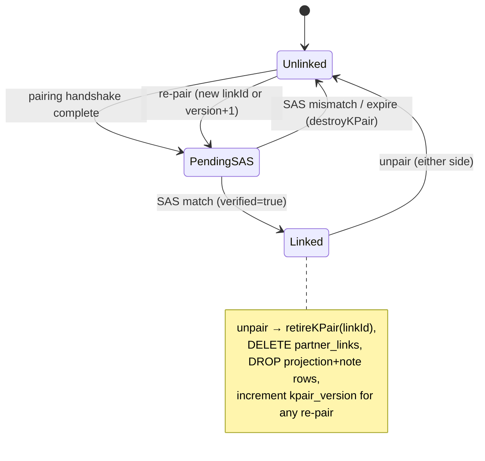

**Unpair** (replaces `unpair()` in `pairing.ts:68` and the raw-log RLS at `migration.sql:56-62`, both dropped): owner calls `retireKPair(linkId)`, deletes the `partner_links` row (RLS: owner may delete own link), and the SyncEngine writes tombstones for all `scope in ('projection','note')` records under that link. The partner's next sync sees the vanished ACL + tombstones and calls `destroyKPair`. **Re-pair** always mints a fresh `linkId` (or bumps `kpair_version`) → new `K_pair`; old ciphertext is cryptographically dead. Forward secrecy across relationships is thereby guaranteed at link granularity.

---

## 7. Device enrollment (multi-device owner)

**Goal:** a second owner device obtains the *existing* DEK without the server ever seeing it. Uses the same X25519 + SAS handshake as pairing, but the shipped secret is the wrapped DEK, not a derived link key.

```mermaid
sequenceDiagram
  participant D1 as Existing device (has DEK)
  participant SB as Supabase
  participant D2 as New device

  Note over D2: sign in (same Supabase account); initDevice() → new device keys
  D2->>SB: INSERT device_keys{device_id, user_id, x25519_pub, ed25519_pub, sig}
  D2->>D2: create enrollmentId, show QR: {proto:'rhea-enroll-v1', enrollmentId, d2X25519Pub, d2Ed25519Pub, sig}
  D1-->>D2: scan QR (out-of-band) — D1 verifies D2 bundle sig
  D1->>D1: kx_server_session(d1X25519, d2X25519Pub) → session{rx,tx}
  D1->>D1: wrapDekForPeer(d2X25519Pub, session) → WrappedKey (AEAD under session.tx, AAD=enrollmentId)
  D1->>SB: INSERT enrollment_grants{enrollmentId, from_device, to_device, wrapped_dek, expires_at}
  par SAS
    D1->>D1: sas = safetyNumber({context:'rhea-enroll-v1', a:d1X25519, b:d2X25519, bindId:enrollmentId})
    D2->>D2: sas = same
    D1-->>D2: humans compare number
  end
  Note over D1,D2: SAS match required before D2 imports
  SB-->>D2: realtime: enrollment_grants row
  D2->>D2: kx_client_session(d2X25519, d1X25519Pub) → session{rx,tx}
  D2->>D2: importWrappedDek(wrapped_dek, session) → DEK installed (same epoch)
  D2->>SB: DELETE enrollment_grants row (one-shot); both memzero session keys
```

Notes: the grant is single-use, short-TTL (default 10 min), and stores only ciphertext. `session.tx` on D1 equals `session.rx` on D2 (crypto_kx guarantee), so the wrap opens exactly once for exactly this device pair. If SAS mismatches, D2 aborts and D1 revokes the grant. The DEK epoch is unchanged — all devices share one DEK per §2.

---

## 8. Recovery (phrase → KEK → wrapped DEK)

Because a Supabase **password reset does not touch keys**, the recovery phrase is the *only* way to recover the DEK on a fresh install when no existing device is available to enroll from. This is mandatory, not optional.

### 8.1 Backup flow (at account setup / first cloud opt-in)

```mermaid
sequenceDiagram
  participant U as User
  participant App as Rhea (recovery.ts)
  participant SB as Supabase

  App->>App: generateMnemonic() → 24 words (256-bit entropy)
  App-->>U: show phrase ONCE, require re-entry of 3 random words to confirm saved
  App->>App: salt=randombytes(16); kek=deriveKek(entropy, salt, 'recovery')  // Argon2id v1
  App->>App: wrapped = wrapDekWithKek(kek); memzero(kek, entropy)
  App->>SB: UPSERT recovery_blob{user_id, salt, wrapped_dek, argon_profile:'recovery-argon2id-v1', wrap_v:1}
  Note over U: user stores phrase offline (password manager / paper)
```

### 8.2 Restore flow (fresh install, no other device)

```mermaid
sequenceDiagram
  participant U as User
  participant App as Rhea
  participant SB as Supabase
  U->>App: sign in (Supabase) — recovers identity + mailbox, NOT keys
  App->>SB: SELECT recovery_blob for user_id
  U->>App: enter 24-word phrase
  App->>App: entropy=mnemonicToEntropy(phrase) [checksum-checked]
  App->>App: kek=deriveKek(entropy, salt, 'recovery'); DEK=unwrapDekWithKek(wrapped_dek, kek)
  alt unwrap ok
    App->>App: install DEK; initDevice() (new device keys); pull+decrypt owner SyncRecords
    App-->>U: "Recovered N days of history."
  else unwrap fails (wrong phrase / tampered blob)
    App-->>U: "That phrase didn't unlock your data." (retry; no lockout, offline-limited by Argon2id cost)
  end
```

### 8.3 The honest contract & onboarding UX

- **Key loss = data loss.** If the user loses the phrase *and* has no logged-in device holding the DEK, the encrypted owner records on the server are unrecoverable — by design, since the server cannot read them. This must be stated in plain language at three points: (1) at cloud opt-in, (2) on the recovery-phrase screen, (3) in the privacy policy.
- **Save-the-phrase UX:** show the 24 words once on a screen that blocks screenshots where the platform allows (`FLAG_SECURE` on Android via Capacitor), offer "copy to password manager," then require the user to re-enter 3 randomly-chosen words to confirm they saved it before continuing. Offer "remind me to back up" if skipped, and surface a persistent "Recovery not set up" banner until done.
- **Regenerate:** user may generate a new phrase; this re-wraps the current DEK under a new KEK and overwrites `recovery_blob`, invalidating the old phrase.

---

## 9. Two-way shared notes under `K_pair`

Shared notes (`sharing.ts:89-123`, currently plaintext `content` in a `shared_notes` table) become E2EE `SyncRecord`s with `scope='note'`, sealed under `K_pair`. Both owner and partner hold `K_pair`, so either may write and both may read — this is the single two-way dataset in the system.

```ts
interface SharedNotePayload {   // plaintext BEFORE sealing; never leaves the device unsealed
  v: 1;
  noteId: string;               // uuid — the SyncRecord.key is a hash of (linkId, noteId) per §10
  authorDeviceId: string;
  authorRole: 'owner' | 'partner';
  body: string;                 // markdown-limited text
  createdAt: string;            // HLC
}
```

- Sealed with `keyId = kpair.<linkId>.<version>`, AAD per §4 (binds note to link + HLC).
- Conflict model is LWW-per-`SyncRecord.key` (the same HLC merge as everything else); notes are append-mostly, edits overwrite by key. There is no server-side ordering trust — clients sort by the HLC in `updatedAt`.
- On unpair, note records are tombstoned and `K_pair` retired → notes become undecryptable server-side.
- **Server sees:** that *a* note record exists under a link and its size/timing — never the text or author identity beyond the row's `auth.uid()` owner. Padding (§10) applies.

---

## 10. Server-visible plaintext metadata & minimization

The server is a zero-knowledge mailbox, but transport over Postgres rows + Realtime unavoidably leaks *some* plaintext. Enumerated, with mitigations:

| Leaked to server | Why unavoidable | Minimization |
|---|---|---|
| Account identities (`auth.uid()`, email) | Supabase Auth requires them for routing + login | Emails already required for the product; no additional health linkage stored |
| Pairing graph (which uid is linked to which) | RLS needs `partner_links` rows to enforce the envelope ACL | Store only uid pairs + pubkeys; no names, no relationship metadata; owner can unpair to sever |
| Timing / frequency of writes (Realtime + `updatedAt` HLC) | Realtime is the wake-up channel; edit-time HLC is needed for LWW merge | Do not batch-reveal beyond need; document that write cadence is observable; future: optional jittered flush |
| `SyncRecord.key` (logical record identity, e.g. a date) | Server upserts/merges by key | **Hash the key**: `key = base64(BLAKE2b_keyed(recordKeyHashKey, plainKey))` where `recordKeyHashKey = crypto_kdf_derive_from_key(DEK, "reckeyhs")`. The server sees opaque, per-account-unlinkable 128-bit tokens, not `2026-07-15`. Partner-projection keys use a K_pair-derived hash key. |
| `scope` enum (`owner`/`projection`/`note`/`meta`) | Needed for routing + ACL | Coarse only; reveals category-of-data existence, not content. Acceptable. |
| Share-category *existence* (that a projection is shared at all) | The projection row must exist to sync | Ciphertext hides *which* gates are on (all gates live inside the sealed `PartnerProjection`); server sees "a projection exists," not "mood sharing is on" |
| Ciphertext length | AEAD ct length ≈ plaintext length | **Pad plaintext to fixed buckets** before sealing (e.g. `padmé` or round up to 256-byte multiples via `sodium.pad`/`sodium.unpad`) so a `DailyLog` with long notes is indistinguishable from a short one within a bucket |

`recordKeyHashKey` is derived, never stored separately; it dies with the DEK. This means the server cannot even tell that two accounts logged the same date, nor correlate a user's records to a calendar.

---

## Threat Model — Cryptographic Portions (crypto)

> This subsection covers only the crypto-facing assets, adversaries, and the mandatory error handling. It refines the informal model in `Docs/Rhea-spec.md:108-113` and `Docs/Rhea-technical-spec.md:176-188` for the v2 E2EE design.

## T-1. Assets & adversaries

**Assets:** owner DailyLog history (highest sensitivity — reproductive-health data subject to subpoena, `Rhea-technical-spec.md:178`); shared notes; the DEK, K_pair, recovery phrase, and device keys.

| Adversary | Capability | Outcome under this design |
|---|---|---|
| **The server / us / a subpoena** | Full read of all Postgres rows + Realtime + auth DB | Sees only ciphertext + the §10 metadata. Cannot produce plaintext health data; a lawful-access request genuinely cannot be satisfied (`Rhea-technical-spec.md:185`). Can see the pairing graph and write timing. |
| **Server-side tamper/rollback** | Can modify, replay, delete, or reorder ciphertext rows | Modification/transplant → AEAD+AAD auth failure (T-3). Replay of an *old* valid row → detected by HLC monotonicity check (T-3 replay). Deletion → availability loss only (no confidentiality break); mitigated by local-first source of truth + recovery. |
| **Nosy partner** | Holds a valid `K_pair`, sees projection + notes | Sees exactly the enabled gates inside `PartnerProjection` and shared notes — never the DEK, never raw logs (raw-log RLS dropped, `migration.sql:56-62`). Cannot escalate: K_pair is cryptographically independent of the DEK. |
| **Pairing MITM** | Controls the server channel during pairing/enrollment | Defeated by the SAS: a MITM who swaps public keys produces a different safety number on the two screens; human comparison aborts (T-3 SAS mismatch). Without SAS confirmation, projections are queued but not trusted. |
| **Invite hijacker** | Tries to redeem someone's invite (the old `migration.sql:84-86` hole) | Must present `inviteSecret` from the QR; server stores only its hash and compares constant-time in a `SECURITY DEFINER` RPC. Enumeration yields nothing. |
| **Stolen/lost device** | Physical access to an unlocked or locked device | Capacitor: keys sealed in Keystore/Keychain, biometric-gated → protected at rest. Web: keys wrapped by non-extractable MWK → a raw IndexedDB dump is useless, but an unlocked live browser session can be driven. Mitigation: `Keyring.wipe()` panic path + OS device lock. |
| **XSS / malicious dependency (web)** | Runs JS in the app origin | Can coerce an unwrap and exfiltrate plaintext while the app is open — the honest limit of the web target (documented in §2/§3.3). Mitigations: strict CSP, SRI, minimal dependencies, libsodium pinned + audited. Capacitor's hardware sealing + biometric gate raises this bar but does not eliminate in-use exposure. |

## T-2. Trust boundaries

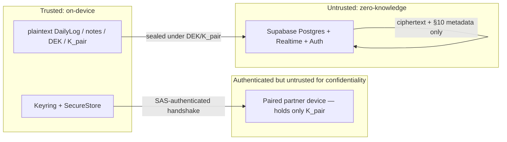

## T-3. Cryptographic error cases (mandatory handling)

Every case below is a defined error class thrown by `aead`/`keyring`/`pairing`; the SyncEngine and UI MUST handle them explicitly — never silently drop or, worse, treat undecryptable data as empty.

| # | Error | Raised by | Detection | Required handling |
|---|---|---|---|---|
| 1 | **Decrypt/auth failure** (`AeadOpenError`) | `aead.open` | Poly1305 tag mismatch | Do NOT delete the local record. Quarantine the offending `SyncRecord` in a `crypto-quarantine` store, increment a metric, surface a non-alarming "1 item couldn't be read" diagnostic. Never overwrite good local data with a failed remote (fixes the pull-then-push data-loss at `sync.ts:142-150`). |
| 2 | **Key not found** (`KeyNotFoundError`) | `keyring.open` when `env.keyId` unresolvable | keyId prefix/epoch/version not in keyring | If `dek.<epoch>` newer than local → prompt enrollment/recovery ("this data was written by another device; enroll or recover"). If `kpair.<linkId>.<v>` retired → treat as post-unpair, tombstone locally. |
| 3 | **Tampered AAD** (`AadMismatchError`) | `aead.open` | recomputed AAD ≠ `env.aad`, or AAD auth fails | Same as #1 (quarantine); additionally flag as *potential server tampering* in the audit log (`Rhea-technical-spec.md:186`). |
| 4 | **SAS mismatch** (`SasMismatchError`) | pairing/enrollment UI | humans report numbers differ | Abort handshake; `destroyKPair`/revoke grant; delete the pending `partner_links`/`enrollment_grants` row; show "Couldn't verify — try again in person." Treat as an active-attack signal. |
| 5 | **Replay / rollback** | SyncEngine reconcile | incoming `updatedAt` (HLC) ≤ last-applied for that key, or a resurrected tombstoned key | Reject the write (LWW already discards older HLC). For a resurrected tombstone within the GC horizon, keep the tombstone. Log as anomaly. |
| 6 | **Nonce/RNG failure** | `aead.seal`/`generateKey` | `randombytes_buf` unavailable (no secure RNG) | Hard-fail the operation; refuse to write plaintext or a zero nonce. Surface "secure storage unavailable on this device." |
| 7 | **Invalid mnemonic** (`MnemonicError`) | `kdf.mnemonicToEntropy` | BIP39 checksum fail | Reject before running Argon2id; "That doesn't look like a valid recovery phrase." |
| 8 | **Wrong phrase on restore** | `unwrapDekWithKek` → `AeadOpenError` | KEK derived from wrong phrase → tag fail | "That phrase didn't unlock your data." Retry allowed; Argon2id cost (§5) is the brute-force throttle — no server lockout needed since the attack is offline against the blob. |
| 9 | **Expired/consumed invite or grant** | redeem/import RPC | `expires_at` past or `consumed_at` set | "This invite expired — ask for a new one." No key material was exchanged; safe to discard. |
| 10 | **Device-key signature invalid** | `verifyDeviceSig` during pairing/enrollment | Ed25519 verify fails on peer bundle | Abort handshake before deriving any session key; treat as MITM/corruption (same handling as #4). |

## T-4. Residual crypto risks (accepted, documented)

- **Web in-use key exposure** (XSS coercing an unwrap) is not eliminated on the web target; mitigated, not solved. Capacitor is the hardened path.
- **Metadata leakage** (pairing graph, write timing, per-account record-count) is inherent to using Supabase as the relay; §10 minimizes but cannot erase it.
- **No forward secrecy within a single key epoch**: if a live DEK is exfiltrated, all history under that epoch is exposed until `rotateDEK`. Per-link forward secrecy across relationships *is* provided by re-pair (§6.4). Field-level and ratcheting schemes are a documented future option, not v2.
- **Availability under a hostile server**: the server can delete or withhold ciphertext (denial of service), but this is a confidentiality-preserving failure — the local-first store remains the source of truth and recovery restores it.


---


# 6. Local Storage & Database Design


> Scope: the account-scoped, envelope-aware persistence layer that sits **below** `SyncEngine`/`PrivacyEngine` and **above** the raw platform stores (IndexedDB on web, SQLCipher on Capacitor). This layer never sees plaintext health fields on the wire to the server — but on-device it holds **plaintext `DailyLog` payloads** (the local store is the source of truth per the vision; ciphertext is a transport concern, produced by `src/crypto` + `src/sync` on the way out). The store persists both the plaintext domain rows *and* the envelope-shaped sync bookkeeping (outbox, tombstones, projection cache) needed to reconcile.

### Design goals recap (traceable to current-code defects)

| Current defect (file:line) | Fix owned by this layer |
| --- | --- |
| IndexedDB DB name is a global constant `"rhea"` — every account shares one DB (`src/lib/db.ts:4`) | Account-scope by **DB name** (`rhea-<uid>` / `rhea-local`) + `dbPromise` invalidation on account switch |
| `dbPromise` is a module-level singleton never reset (`src/lib/db.ts:18`) | `StorageDriver` instances are created per account; a `StorageManager` owns the lifecycle and invalidates on switch |
| `saveLog` writes only the domain row; no `updatedAt`, no outbox, DELETE never propagates (`src/lib/db.ts:49-67`) | Every mutation stamps an HLC `updatedAt`, enqueues an outbox item, and deletes write tombstones |
| `downloadJSON` uses `<a download>` which silently no-ops in WKWebView/Capacitor (`src/lib/db.ts:131-141`) | Export routed through a `platform` filesystem/share adapter |
| `eraseAllData` clears stores but sign-out does not (`useAuth.ts:133-141`) — cross-account bleed | Role-aware sign-out clearing policy |

### 1. `StorageDriver` — the persistence contract

One interface, two implementations: `IdbStorageDriver` (`src/data/drivers/idb.ts`) and `SqliteStorageDriver` (`src/data/drivers/sqlite.ts`). Repositories in `src/data/repositories/*` are the **only** callers; app hooks (`useLogger`, `useCycleData`) talk to repositories, never to the driver directly. Everything is `Promise`-based and transaction-scoped.

```ts
// src/data/driver.ts

/** Object-store / table names, shared by both drivers. */
export type StoreName =
  | 'logs'         // plaintext DailyLog rows (owner's own data)
  | 'meta'         // settings + sync state (key→value)
  | 'outbox'       // pending encrypt+push operations
  | 'keyring'      // wrapped key material references (NOT raw private keys on web)
  | 'projections'  // partner-side decrypted PartnerProjection cache
  | 'tombstones';  // deletion records pending GC

/** Uniquely identifies the physical store this driver is bound to. */
export interface StorageIdentity {
  /** 'rhea-<uid>' for a signed-in account, 'rhea-local' for no-account mode. */
  dbName: string;
  /** auth.uid() or null in local-only mode. */
  accountId: string | null;
  role: 'owner' | 'partner' | 'local';
}

export interface TxOptions {
  mode: 'readonly' | 'readwrite';
  /** Stores participating in the transaction (IDB requires this up front). */
  stores: StoreName[];
}

/** A cursor page for bounded reads over an index (used by reconcile). */
export interface Page<T> {
  items: T[];
  /** Opaque continuation token; undefined when exhausted. */
  cursor?: string;
}

export interface StorageDriver {
  readonly identity: StorageIdentity;

  /** Resolves once the DB is open and at the target schema version. */
  ready(): Promise<void>;

  // ── Primitive KV ops (single-store, auto-transaction) ───────────────
  get<T>(store: StoreName, key: IDBValidKey): Promise<T | undefined>;
  getAll<T>(store: StoreName): Promise<T[]>;
  put<T>(store: StoreName, value: T, key?: IDBValidKey): Promise<void>;
  delete(store: StoreName, key: IDBValidKey): Promise<void>;
  clear(store: StoreName): Promise<void>;
  count(store: StoreName): Promise<number>;

  // ── Indexed reads (reconcile depends on the updatedAt index) ─────────
  /** Rows with index value in [since, +inf), HLC-ordered, paged. */
  getByIndexSince<T>(
    store: StoreName,
    index: 'by_updatedAt',
    since: string,          // HLC string; '' = from epoch-0
    limit: number,
    cursor?: string,
  ): Promise<Page<T>>;

  // ── Multi-store atomic transactions ─────────────────────────────────
  /**
   * Runs `work` inside one transaction. All puts/deletes commit atomically
   * or roll back together. `tx` exposes the same primitive ops bound to the tx.
   */
  transaction<R>(opts: TxOptions, work: (tx: StorageTx) => Promise<R>): Promise<R>;

  // ── Lifecycle ───────────────────────────────────────────────────────
  /** Closes the underlying connection so a versionchange/delete can proceed. */
  close(): Promise<void>;
  /** Deletes the entire physical DB (used by erase + partner sign-out wipe). */
  destroy(): Promise<void>;

  // ── Observability for error handling (see §Errors) ──────────────────
  onBlocked(handler: () => void): void;    // upgrade blocked by another tab
  onBlocking(handler: () => void): void;   // this tab is blocking another's upgrade
  onVersionChange(handler: () => void): void; // DB deleted/upgraded elsewhere
}

/** Transaction-bound handle passed to StorageDriver.transaction(). */
export interface StorageTx {
  get<T>(store: StoreName, key: IDBValidKey): Promise<T | undefined>;
  put<T>(store: StoreName, value: T, key?: IDBValidKey): Promise<void>;
  delete(store: StoreName, key: IDBValidKey): Promise<void>;
  getByIndexSince<T>(
    store: StoreName, index: 'by_updatedAt', since: string, limit: number, cursor?: string,
  ): Promise<Page<T>>;
}
```

#### `StorageManager` — account scoping + `dbPromise` invalidation

Replaces the module-level `dbPromise` singleton in `src/lib/db.ts:18`. Exactly one live driver at a time; switching accounts closes the old one before opening the new.

```ts
// src/data/storageManager.ts

export interface StorageManager {
  /** Returns the driver for the given identity, opening/reusing as needed. */
  acquire(identity: StorageIdentity): Promise<StorageDriver>;
  /** Current driver, or null before first acquire. */
  current(): StorageDriver | null;
  /**
   * Called on auth state change. If the incoming accountId differs from the
   * live driver's, close() the old driver, null the cached promise, and open
   * the new DB. Emits 'switch' so repositories can drop in-memory caches.
   */
  switchAccount(next: StorageIdentity): Promise<StorageDriver>;
  on(event: 'switch' | 'blocked' | 'evicted', handler: () => void): void;
}
```

Account resolution rule (fixes `db.ts:4`):

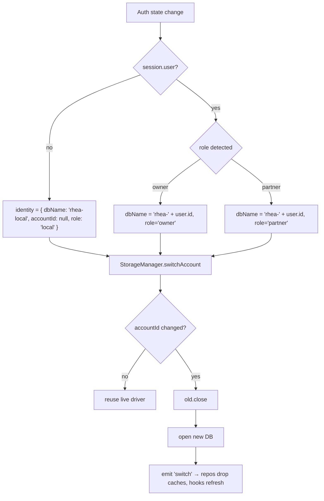

> **`rhea-local` sentinel:** no-account mode writes to a DB named `rhea-local`. On first sign-in as an **owner**, a one-time *adoption* migration offers to copy `rhea-local` logs into `rhea-<uid>` (idempotent keyed-by-date upsert), then leaves `rhea-local` intact until the user confirms (never destructive on sign-in). Partners never adopt local data (they are read-only projections).

---

### 2. Local IndexedDB schema — `DB_VERSION = 2`

Eight object stores — the six diagrammed below plus `sync_cursors` and `audit` (first-class per §0.8/§0.10.I; implemented in `src/data/schema.ts`). All keyPaths and indexes below are additive over the v1 (`logs`, `meta`) layout.

```mermaid
erDiagram
  LOGS {
    string date PK "YYYY-MM-DD"
    string flow
    string[] symptoms
    string mood
    string energy
    string notes
    string[] medication "NEW v2"
    json intimacy "NEW v2, optional"
    string updatedAt "HLC, indexed"
    string deviceId
    boolean deleted "always false in logs; deletes go to tombstones"
  }
  META {
    string key PK "out-of-line key"
    json value
  }
  OUTBOX {
    number seq PK "autoIncrement"
    string key "logical record key (e.g. log date)"
    string scope "owner|projection|note|meta"
    json record "SyncRecord (payload already enveloped OR pending)"
    string enqueuedAt "HLC"
    number attempts
    string nextAttemptAt "backoff, indexed"
    string status "pending|inflight|failed"
  }
  KEYRING {
    string keyId PK "e.g. 'dek', 'kpair:<linkId>', 'device'"
    string alg
    json wrapped "wrapped/non-extractable material ref, never raw priv key"
    string createdAt
    string rotatedAt
  }
  PROJECTIONS {
    string ownerLinkId PK "partner side only"
    json anchors "currentCycleStart, avgCycleLength, avgPeriodLength, moodFlag?"
    json gates "phase, headsup, mood, tips, notes"
    number version "PartnerProjection.version"
    string computedAt
    string asOfDate
    string updatedAt "HLC, indexed"
  }
  TOMBSTONES {
    string key PK "logical key of deleted record"
    string scope
    string deletedAt "HLC, indexed for GC"
    string deviceId
    boolean acked "all-devices-acked flag for GC"
  }
```

Store/index declarations (implemented in the `upgrade` callback):

| Store | keyPath | Indexes | Notes |
| --- | --- | --- | --- |
| `logs` | `date` | `by_updatedAt` (unique:false, on `updatedAt`) | `by_updatedAt` is the reconcile cursor. Plaintext domain rows. |
| `meta` | *(out-of-line)* | — | Preserves v1 semantics (`setMeta(key,value)`); holds `syncState` (`lastPulledHlc`, `deviceId`, `hlc`), `dbSchemaVersion`, `persistGranted`. |
| `outbox` | `seq` (autoIncrement) | `by_nextAttemptAt`, `by_status` | Drained by `SyncEngine`; exponential backoff via `nextAttemptAt`. |
| `keyring` | `keyId` | — | Wrapped material only; raw private keys live in `platform.secureStore` on Capacitor. |
| `projections` | `ownerLinkId` | `by_updatedAt` | Only populated on the **partner** device. Owner devices leave this empty. |
| `tombstones` | `key` | `by_deletedAt` | GC horizon ≥ 1 yr or all-devices-acked. |
| `sync_cursors` | `scope` | — | Chapter 8's `SyncCursor` per scope (§0.10.I); not folded into `meta`. |
| `audit` | `id` | — | Append-only local `AuditEvent[]` (§0.10.I); never uploaded. |

#### v1 → v2 upgrade & backfill plan

v1 rows have no `updatedAt`, no `deviceId`. The upgrade transaction must make them mergeable without falsely winning LWW against future edits.

```mermaid
stateDiagram-v2
  [*] --> Open_v1: existing user, DB_VERSION 1
  Open_v1 --> Upgrade: openDB(name, 2) fires upgrade(old=1)
  Upgrade --> CreateStores: create outbox, keyring, projections, tombstones, sync_cursors, audit + indexes
  CreateStores --> AddIndex: add by_updatedAt on logs
  AddIndex --> Backfill: cursor every existing log
  Backfill --> Stamp: set updatedAt = EPOCH0_HLC, deviceId = newDeviceId, deleted=false
  Stamp --> InitMeta: meta.deviceId = new X25519/Ed25519 device id; meta.hlc = 0
  InitMeta --> FirstSyncFlag: meta.needsInitialSeed = true
  FirstSyncFlag --> [*]
```

- **Epoch-0 stamp:** every backfilled log gets `updatedAt = "1970-01-01T00:00:00.000Z-0000-<deviceId>"` (lowest possible HLC). Rationale: on first sync, *any* server row or any future edit strictly dominates epoch-0, so backfilled rows never clobber real data. But they still sync **up** (they exist in the outbox seed).
- **First-sync rule (replaces the pull-then-push data-loss flow at `sync.ts:142-150`):** on first authenticated sync after upgrade, the engine performs a **merge**, not overwrite — for each key it compares local-`updatedAt` vs server-`updatedAt` (HLC) and keeps the max; epoch-0 local rows lose to any real server row but are pushed for keys the server lacks. `needsInitialSeed` gates a one-time full outbox enqueue of all local logs.
- `deviceId` is generated once during upgrade and stored in `meta`; it is the LWW tiebreak and the `SyncRecord.deviceId`.

---

### 3. Capacitor SQLite mirror (SQLCipher-encrypted)

Native builds use `@capacitor-community/sqlite` with SQLCipher. The DB file is `rhea-<uid>.db` (or `rhea-local.db`), encryption key held in `platform.secureStore` (Android Keystore / iOS Keychain), biometric-gated. Column set mirrors the IDB stores 1:1 so repositories are storage-agnostic; JSON-typed IDB fields become `TEXT` holding JSON.

| Table | Columns (type) | PK / Index |
| --- | --- | --- |
| `logs` | `date TEXT`, `flow TEXT`, `symptoms TEXT` (JSON array), `mood TEXT NULL`, `energy TEXT NULL`, `notes TEXT`, `medication TEXT` (JSON array), `intimacy TEXT NULL` (JSON), `updated_at TEXT`, `device_id TEXT`, `deleted INTEGER DEFAULT 0` | PK `date`; `INDEX ix_logs_updated ON logs(updated_at)` |
| `meta` | `key TEXT`, `value TEXT` (JSON) | PK `key` |
| `outbox` | `seq INTEGER PRIMARY KEY AUTOINCREMENT`, `key TEXT`, `scope TEXT`, `record TEXT` (JSON), `enqueued_at TEXT`, `attempts INTEGER`, `next_attempt_at TEXT`, `status TEXT` | `INDEX ix_outbox_next ON outbox(next_attempt_at)`, `ix_outbox_status ON outbox(status)` |
| `keyring` | `key_id TEXT`, `alg TEXT`, `wrapped TEXT` (JSON), `created_at TEXT`, `rotated_at TEXT NULL` | PK `key_id` |
| `projections` | `owner_link_id TEXT`, `anchors TEXT` (JSON), `gates TEXT` (JSON), `version INTEGER`, `computed_at TEXT`, `as_of_date TEXT`, `updated_at TEXT` | PK `owner_link_id`; `INDEX ix_proj_updated ON projections(updated_at)` |
| `tombstones` | `key TEXT`, `scope TEXT`, `deleted_at TEXT`, `device_id TEXT`, `acked INTEGER DEFAULT 0` | PK `key`; `INDEX ix_tomb_deleted ON tombstones(deleted_at)` |
| `schema_meta` | `k TEXT PRIMARY KEY`, `v TEXT` | holds `schema_version` (see §Versioning) |

`SqliteStorageDriver.getByIndexSince` becomes `SELECT ... WHERE updated_at >= ? ORDER BY updated_at LIMIT ? OFFSET/keyset`. `transaction()` maps to `BEGIN … COMMIT`/`ROLLBACK`.

#### Idempotent IndexedDB → SQLite migration on first native launch

A hybrid PWA that installs as a Capacitor app changes web origin from `https://<domain>` to `capacitor://localhost` (Android) / `ionic://localhost` (iOS). **IndexedDB is partitioned by origin, so the web DB is invisible to the native webview** — the data appears orphaned.

Migration story:

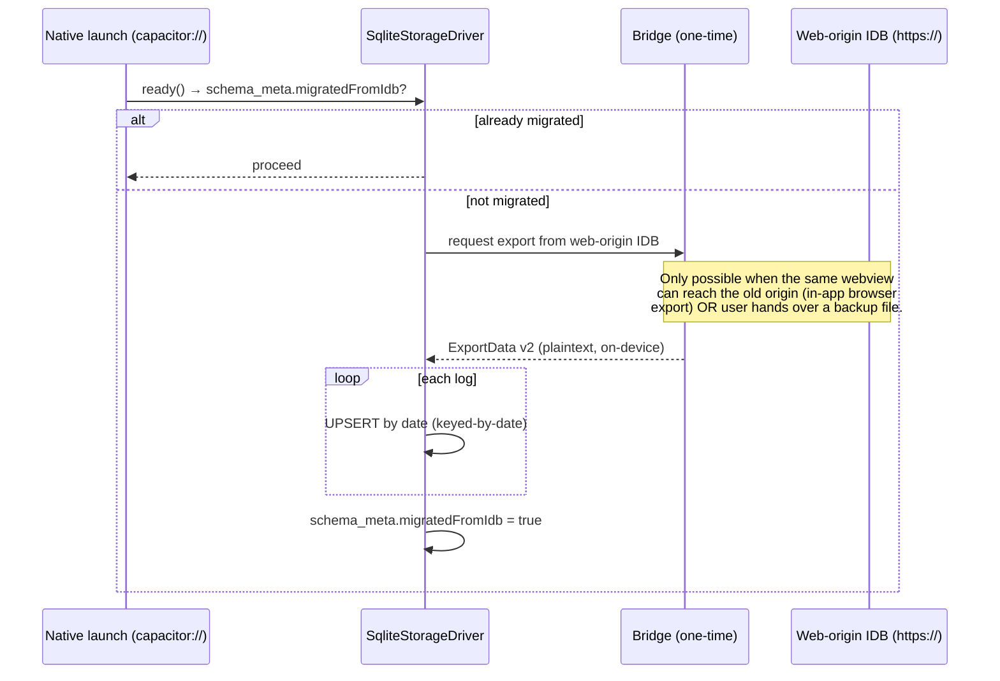

- **Keyed-by-date upsert makes it safe/idempotent:** re-running the migration re-`UPSERT`s the same `date` PKs, so it can be retried or run after partial failure with no duplication. LWW on `updated_at` protects any edits already made natively.
- **Orphaning mitigation (documented):** because cross-origin IDB is not directly readable, the supported path is (a) if the user was signed in, native simply **re-syncs from Supabase** into the fresh SQLite DB (no bridge needed — the cloud ciphertext is authoritative-enough after merge); (b) for **local-only** users with no cloud copy, the app surfaces a one-time "Import your previous data" prompt that consumes an `ExportData v2` JSON the user exports from the web app. This is called out in release notes as a known one-way seam.

---

### 4. Database design — Supabase Postgres v2 (E2EE)

Under Option A the server is a **zero-knowledge mailbox**: it stores `CipherEnvelope` blobs + minimal plaintext routing metadata (owner id, logical key, HLC `updated_at`, `deleted`). RLS is a coarse *envelope ACL* (who may fetch a blob), never a confidentiality boundary. Every table below stores ciphertext for anything health-bearing.

#### Table-by-table DDL description

**`daily_logs`** — as shipped by `0003_owner_sync_metadata.sql` (additive over the legacy plaintext columns; ciphertext comes at M2.4).
- Shipped sync-metadata columns: `updated_hlc text` (edit-time HLC string — **not** `updated_at`, which was already a legacy `timestamptz` and remains), `device_id text`, `deleted boolean default false`, `server_updated_at timestamptz` (trigger-set on every write; there is **no** `server_seq` — per §0.10.C the pull cursor is the keyset `(server_updated_at, key)`), plus the v2 payload fields `medication jsonb` and `intimacy jsonb`.
- Keyset index `(owner_id, server_updated_at, date)` for delta pulls.
- **Stale-write guard:** the `daily_logs_reject_stale_write()` trigger **silently skips** (`RETURN NULL`) any write whose `updated_hlc` is `<=` the stored value — server-side LWW enforcement, no error surfaced to the client.
- **Planned at M2.4 (`0004`):** add `env`/`key`/`scope` ciphertext columns (`env jsonb NULL`, **NULL = tombstone**) and move the PK/`onConflict` to `(owner_id, scope, key)` per §0.10.D.
- **RLS:** `owner rw own daily_logs` — `for all using (owner_id = auth.uid()) with check (owner_id = auth.uid())`. **The partner SELECT policy `"partner read linked logs"` (`migration.sql:56-62`) is dropped at M2.13 (`0010`)** — partners never touch raw logs anymore.

**`partner_projections`** — NEW. The owner→partner derived view, encrypted with `K_pair`. This is the *only* derived data persisted server-side.
- Columns: `owner_id uuid`, `link_id uuid` (FK `partner_links.id`), `env jsonb NULL` (CipherEnvelope wrapping `{anchors, gates, version, computedAt, asOfDate}` — the *anchors*, not baked strings), `key_id text` (`'kpair:<linkId>'` so the partner knows which key decrypts), `updated_at text` (HLC), `deleted boolean default false`, `server_seq bigint`.
- PK `(link_id)`. Index `(link_id, updated_at)`.
- **RLS:** owner may `insert/update/delete` rows where `owner_id = auth.uid()`; partner may `select` rows where `exists (link where link.partner_id = auth.uid() and link.id = partner_projections.link_id)`. This is the single-writer model — owner writes, partner reads.
- Added to `supabase_realtime` publication for sub-second fan-out (replaces realtime on `daily_logs` at `migration.sql:130`; partners subscribe here, not to logs).

**`partner_links`** — hardened. Keeps `id uuid pk default gen_random_uuid()` (NEW — needed as FK target), `owner_id`, `partner_id`, `created_at`, plus `kpair_epoch int default 0` (bumped on unpair/re-pair to force `K_pair` rotation). RLS unchanged in spirit (`see own links`, `owner delete links` from `migration.sql:65-72`) but SELECT must not leak the *other* party's health — it only exposes ids, which is acceptable routing metadata.

**`invites`** — re-design **SHIPPED** via `0002_secure_invite_redemption.sql`, closing the pairing-hijack hole (`migration.sql:28-33, 84-86`).
- Columns (as shipped): `code_hash text not null` (sha256-hex, via pgcrypto `digest`, of a ~120-bit URL-safe server-minted secret; **plaintext secret never stored**, no salt column), `owner_id uuid`, `used boolean not null default false`, `expires_at timestamptz not null default (now() + interval '30 minutes')`.
- **RLS:** a single `"owner manage own invites"` policy (`for all using/with check owner_id = auth.uid()`). **The `"anyone read unused invites"` policy (`migration.sql:84-86`) is DROPPED** — invites are no longer world-readable, killing the enumeration/hijack vector. Invite creation and redemption happen entirely inside the two `SECURITY DEFINER` RPCs below; redemption never exposes invite rows to the redeemer via SELECT.
- **`create_invite()`**: `security definer`; mints the ~120-bit secret server-side, stores only its sha256-hex `code_hash`, and returns the secret to the owner **once**.
- **`redeem_invite(p_secret text)`**: `security definer`; recomputes the sha256-hex hash, locks the matching row, and atomically checks `used = false AND expires_at > now()`. On success it sets `used = true` and inserts the `partner_links` row. On failure raises a generic `'Invalid, expired, or already-used invite'` (no oracle distinguishing not-found / used / expired).

**`device_keys`** — NEW. Public keys for device enrollment + SAS/pairing. Public keys are not secret; RLS is still scoped to reduce metadata leakage.
- Columns: `device_id text pk`, `account_id uuid` (FK `auth.users`), `x25519_pub bytea`, `ed25519_pub bytea`, `label text NULL`, `enrolled_at timestamptz`, `revoked boolean default false`.
- **RLS:** account owner may `select/insert/update` where `account_id = auth.uid()`; a partner may `select` the *other* account's device public keys **only** for accounts they share a `partner_links` row with (needed to run `crypto_kx` key agreement during pairing).

**`pairing_sessions`** — NEW. Ephemeral rendezvous for the out-of-band QR + X25519 + SAS handshake.
- Columns: `id uuid pk`, `initiator_device text`, `responder_device text NULL`, `initiator_ephemeral_pub bytea`, `responder_ephemeral_pub bytea NULL`, `state text` (`pending|agreed|confirmed|expired`), `expires_at timestamptz`, `created_at timestamptz`. No health data, short TTL, RLS restricts rows to the two devices' accounts.

**`shared_notes`** — now ciphertext (replaces plaintext `content` at `migration-phase-c.sql:47-53`).
- Columns: `id uuid pk`, `link_id uuid`, `author_id uuid`, `env jsonb` (CipherEnvelope under `K_pair`), `updated_at text` (HLC), `deleted boolean default false`, `server_seq bigint`. RLS: both sides of the link may `select`; either side may `insert` with `author_id = auth.uid()` and membership in the link (two-way, per crypto spec). In `supabase_realtime`.

**`quiet_windows`** — dates are low-sensitivity but still moved behind ciphertext for consistency: `id uuid pk`, `owner_id`, `env jsonb` (encrypted `{startDate,endDate}` under `K_pair`), `updated_at text`, `deleted boolean`. Owner rw, partner read (mirrors `migration-phase-c.sql:98-113`).

**`share_settings` → `share_gates`** — the *gate booleans* are not health data and drive server-side filtering decisions the owner already controls locally; keep as-is from `migration-phase-c.sql:6-28` (owner rw, partner read). The **content** governed by gates lives encrypted in `partner_projections`; the gates just tell the owner's `projectionBuilder` what to include before encrypting.

**`profiles`** — unchanged (`migration.sql:36-40, 89-92`); display name is user-chosen routing metadata.

**`audit_log`** — **removed from the server** (was `migration-phase-e.sql`). A server-side audit log is itself a metadata leak (who paired with whom, when). Auditing moves **local**: an append-only `audit` view over `meta`/a local store, never uploaded. The Postgres table and its RLS are dropped.

#### Server ER diagram (v2)

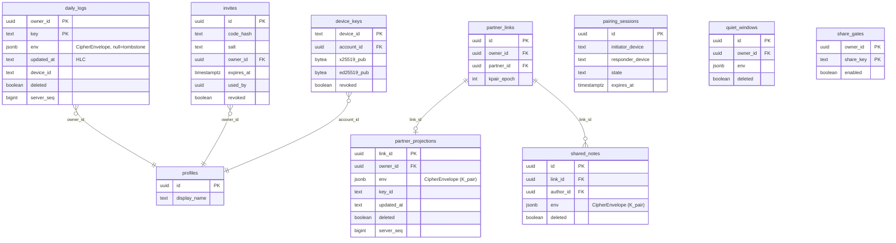

---

### 5. Export / Import — `ExportData v2`

Replaces `src/lib/db.ts:83-121`. Must (a) round-trip the new `medication[]`/`intimacy?` fields, (b) accept legacy `version: 1` files, (c) optionally passphrase-encrypt, (d) work in native webviews.

```ts
// src/data/export.ts
export interface ExportDataV2 {
  version: 2;
  exportedAt: string;              // ISO
  appVersion: string;              // e.g. "0.2.0"
  deviceId: string;
  /** Present when the file body is encrypted (see EncryptedExport). */
  encryption?: {
    kdf: 'argon2id';
    salt: string;                  // b64
    ops: number; mem: number;      // Argon2id params
    alg: 'xchacha20poly1305';
    nonce: string;                 // b64
  };
  /** Plaintext form: logs+meta inline. Encrypted form: omitted (see ct). */
  logs?: DailyLogV2[];
  meta?: Record<string, unknown>;
  /** Encrypted form only: base64 ciphertext of {logs, meta}. */
  ct?: string;
}

export interface DailyLogV2 extends DailyLog {
  medication?: string[];
  intimacy?: { occurred: boolean; protected?: boolean } | null;
}

export interface Exporter {
  build(opts: { encrypt?: { passphrase: string } }): Promise<ExportDataV2>;
  /** Writes the file via the platform adapter and shares it. */
  save(data: ExportDataV2): Promise<void>;
}

export interface Importer {
  /** Detects version, runs the v1 shim if needed, decrypts if needed. */
  parse(text: string, opts?: { passphrase?: string }): Promise<ExportDataV2>;
  /** Idempotent keyed-by-date upsert into the current account's store. */
  apply(data: ExportDataV2): Promise<{ imported: number; skipped: number }>;
}
```

- **`version: 1` acceptance shim:** `parse` branches on `version`. For `1`, it maps each old `DailyLog` straight through (new fields absent → `medication` defaults `[]`, `intimacy` `null`) and lifts `meta` as-is. The current importer at `SettingsView.tsx:66-71` (`data.version !== 1` reject) is replaced by "accept 1 or 2". Unknown/higher versions are rejected with a clear "exported by a newer version" message.
- **Passphrase-encrypted export (opt-in):** body `{logs, meta}` is JSON-serialized, encrypted with `XChaCha20-Poly1305` under a key from `Argon2id(passphrase, salt)`, and the file carries `encryption{}` + `ct`. Import prompts for the passphrase. This lets privacy-conscious users move data between devices without a plaintext file at rest.
- **Why plaintext export of an encrypted store is a *documented escape hatch*:** the local store holds plaintext and the server holds ciphertext; a plaintext JSON export is deliberately supported (default) so users retain **data sovereignty** and can migrate to any other app or keep an offline backup independent of Rhea's keys. It is labeled in the UI as "unencrypted — store it safely," and the encrypted option is offered alongside. Losing the recovery phrase must never mean losing your own data, so a key-independent plaintext export is a feature, not a leak.
- **Native export (fixes `db.ts:131-141`):** `<a download>` + `URL.createObjectURL` is a no-op in WKWebView/Android WebView. `Exporter.save` delegates to `platform.filesystem.write(fileName, blob)` + `platform.share.shareFile(uri)` (Capacitor `Filesystem` + `Share`). On web the same adapter falls back to the `<a download>` path. `downloadJSON` is deleted from `db.ts`.

---

### 6. Account scoping + sign-out clearing policy (closes cross-account bleed)

Root cause: single global DB (`db.ts:4`) + `signOut` clears only in-memory auth state, never the local store (`useAuth.ts:133-141`). With per-account DBs (§1) the *steady state* is already isolated; the clearing policy governs what happens to the on-device DB at sign-out, and it splits by role because the privacy expectations differ.

```mermaid
flowchart TD
  SO[Sign out requested] --> R{role}
  R -- partner --> PW[Unconditional wipe: driver.destroy of rhea-uid<br/>partner data is a cache of owner's projection; nothing to lose]
  R -- owner --> OC{outbox drained AND lastPulledHlc >= local max updatedAt?}
  OC -- yes --> OW[Safe: close driver, keep or destroy per user choice]
  OC -- no --> WARN["Block/confirm: 'You have N unsynced changes.<br/>Sign out anyway and keep local data?'"]
  WARN -- keep --> KEEP[close only, do NOT destroy → data survives for next sign-in]
  WARN -- discard --> OW
  R -- local --> EX[Exempt: no sign-out concept; rhea-local untouched]
```

Rules:
- **Partner → wipe unconditionally.** Partner-side data is a decrypted *cache* of the owner's `PartnerProjection`; it carries no owner-original writes. Destroying `rhea-<uid>` on partner sign-out guarantees a device that changes hands leaks nothing, and re-sign-in re-pulls from `partner_projections`.
- **Owner → confirm-synced-first.** Owners hold the source of truth. Sign-out checks `outbox.count() === 0` **and** `syncState.lastPulledHlc >= max(logs.updatedAt)`; if not satisfied, the UI warns with the unsynced count and offers keep-local vs discard. Never silently destroys owner data.
- **Local-only → exempt.** `rhea-local` has no auth lifecycle; it is never touched by sign-out (there is none). It is only ever *adopted* (copy, not move) on first owner sign-in.
- On every auth change the `StorageManager` still switches DB name, so even without an explicit wipe, account B can never read account A's rows.

---

### 7. Versioning axes (one table)

| Axis | Where stored | Current | v2 target | Migration / compat rule |
| --- | --- | --- | --- | --- |
| **IndexedDB `DB_VERSION`** | `src/data/drivers/idb.ts` const | `1` (`db.ts:5`) | `2` | `openDB(name, 2)` runs additive `upgrade`; v1→v2 creates 6 new stores (`outbox`, `keyring`, `projections`, `tombstones`, `sync_cursors`, `audit`) + `by_updatedAt` index + epoch-0 backfill (§2). Never destructive. |
| **SQLite `schema_version`** | `schema_meta.k='schema_version'` | none | `2` (aligned to IDB) | On open, compare stored vs code; run ordered idempotent `CREATE TABLE IF NOT EXISTS` + `ALTER` steps; bump. |
| **`ExportData.version`** | file body | `1` (`db.ts:84`) | `2` | Importer accepts `{1,2}` via shim (§5); rejects `> 2` as "newer version" — never guesses. |
| **`CipherEnvelope.v`** | each envelope | n/a | `1` | Decrypt path switches on `v`; unknown `v` → `EnvelopeVersionError`, surfaced as "update the app to read this data." Bump only on AEAD/format change. |
| **`PartnerProjection.version`** | projection payload | n/a | `2` (`PROJECTION_MIN_SUPPORTED = 2`; see §0.10.F) | Partner re-derives via `cycle.ts`; if projection `version` > partner's supported, partner shows "ask owner/partner to update" and falls back to last-good cache. Anchors are forward-compatible (unknown gate keys ignored). |
| **Pairing/protocol version** | `pairing_sessions.state` handshake + QR payload | n/a | `1` | QR carries `proto:1`; mismatched proto aborts pairing with a clear message before any key agreement. Server tables carry no proto assumption (opaque blobs). |

Compatibility invariant: all six axes bump **independently**; a bump in one must not force a bump in another. The server schema itself is versioned only through additive migrations (new columns default-nullable, new tables `IF NOT EXISTS`) — old clients ignore unknown columns.

---

### 8. Storage durability, eviction, and error cases

#### `navigator.storage.persist()`

- On first successful account setup (and on first local-only log), request persistence: `if (navigator.storage?.persist) { granted = await navigator.storage.persist(); }`. Cache the boolean in `meta.persistGranted`.
- Also probe `navigator.storage.estimate()` to show remaining quota and to gate large imports.
- **Eviction risk handling:** if `persist()` returns `false` (browser may evict under storage pressure), the app shows a one-time non-blocking banner: "Your data may be cleared by the browser if storage runs low — enable a cloud account or keep a backup." For signed-in users this is low-risk (server holds ciphertext, re-syncs on next load); for **local-only** users it is the real danger, so the banner nudges toward Export or account creation. Capacitor/SQLite is not subject to browser eviction — `persistGranted` is treated as always-true there.

#### Enumerated storage error cases

| Case | Detection | Handling |
| --- | --- | --- |
| **Quota exceeded** | `QuotaExceededError` / `DOMException` on `put`; or `estimate()` shows near-full pre-import | Fail the write atomically (transaction aborts, no partial log); surface "Storage full — free space or export & remove old data." Outbox writes retried after user frees space. Large imports pre-checked against `estimate()`. |
| **Upgrade blocked / multi-tab** | IDB `blocked` event (another tab holds an old-version connection) | `StorageDriver.onBlocked` → show "Rhea is open in another tab; close it to finish updating." The blocking tab's `onVersionChange`/`onBlocking` handler proactively `close()`s its connection so the upgrade can proceed, then reloads. |
| **Corrupt record** | JSON parse throws, or a row fails schema validation on read | Skip the single bad row (don't crash the query), log to local audit, and mark it in `meta.corruptKeys[]`. Reconcile can request a fresh copy from the server (owner) or re-derive (partner projection). Never let one bad row hang `getAllLogs` (contrast `useCycleData.ts:33` which currently swallows *all* errors into empty state). |
| **Decrypt-on-read failure** | AEAD tag mismatch / wrong `keyId` when opening a `CipherEnvelope` | Do **not** treat as data loss. Classify: (a) wrong/rotated key → attempt other `keyId`s in keyring; (b) unknown `CipherEnvelope.v` → `EnvelopeVersionError` "update app"; (c) genuine tamper/corruption → quarantine the blob, surface "Couldn't decrypt one item," and for partners re-pull from server. AAD (`key` + `updatedAt`) mismatch is a hard integrity failure and is quarantined, never silently accepted. |
| **DB open failure / SQLCipher wrong key** | `openDB` rejects; SQLCipher `PRAGMA key` fails | Native: re-prompt biometric to unlock secure-store key; if key truly lost, offer recovery-phrase re-derivation (owner) or re-pair (partner). Web: if the DB is unopenable, offer Export-attempt then re-create; never auto-`destroy`. |
| **Account switch mid-flight** | `switchAccount` called while a transaction is open | Manager awaits in-flight tx completion (or a short timeout) before `close()`; queued repository calls are rejected with `AccountSwitchedError` and retried against the new driver. Prevents writing account A's row into account B's DB. |

---


---


# 7. Versioning

> Six version axes evolve **independently** — a bump in one must never force a
> bump in another. This chapter is the index; the detailed migration/compat rules
> live in Chapter 6 §7 (storage axes) and Chapter 8 §11 (wire axes).

## 7.1 The six axes

| # | Axis | Where stored | v2 value | Owner | Compatibility rule |
|---|---|---|---|---|---|
| 1 | **IndexedDB `DB_VERSION`** | `data/drivers/IndexedDbDriver.ts` | `2` | Chapter 6 §2, §7 | Additive `upgrade(old=1→2)`: create `outbox`/`keyring`/`projections`/`tombstones`/`sync_cursors`/`audit`, add the `by_updatedAt` index on `logs`, backfill epoch-0 (§0.5). Never destructive; a failed upgrade must leave v1 readable. |
| 2 | **SQLite `schema_version`** | `schema_meta.schema_version` (Capacitor) | `2` (aligned to axis 1) | Chapter 6 §3, §7 | Ordered idempotent `CREATE TABLE IF NOT EXISTS` / `ALTER` steps; compare on open, then bump. |
| 3 | **`ExportData.version`** | export file body | `2` | Chapter 6 §5 | Importer accepts `{1, 2}` via a v1 shim (new fields default `medication:[]`, `intimacy:null`); rejects `> 2` with "exported by a newer version" — never guesses. |
| 4 | **`CipherEnvelope.v`** | every envelope (§0.2) | `1` | Chapter 5 | Decrypt switches on `v`; unknown `v` ⇒ quarantine + "update the app to read this data." Bump only on an AEAD/format change. |
| 5 | **`PartnerProjection.version`** | inside the decrypted projection payload | `2` (`PROJECTION_MIN_SUPPORTED = 2`) | Chapter 4 §4 | Partner re-derives via `domain/cycle.ts`; a `version` above what the partner supports shows "ask them to update" and falls back to the last-good cache; below `MIN_SUPPORTED` renders the empty state. Unknown gate keys are ignored (anchors are forward-compatible). |
| 6 | **Pairing / protocol version** | QR payload (`proto`) + `pairing_sessions` | `1` (`rhea-pair-v1`, `rhea-enroll-v1`) | Chapter 5 §6–7 | Carried out-of-band; a mismatch aborts pairing **before** any key agreement with a clear message. Server tables carry no protocol assumption (opaque blobs). |

## 7.2 Server schema versioning

The Supabase schema is versioned only through **additive** migrations
(`supabase/migrations/000N_*.sql`, Chapter 6 §folder): new columns are
default-nullable, new tables are `CREATE TABLE IF NOT EXISTS`, and old clients
ignore unknown columns. Destructive changes (dropping the `daily_logs`
partner-read policy, dropping `audit_log`) are performed only after their
replacement path has shipped and stale caches are purged (the sequencing
invariant, Chapter 15).

## 7.3 Protocol-skew handling

The one cross-client skew that can occur in normal operation is **owner-v2 ↔
partner-v1** during a service-worker cache window (a partner running an older
bundle). It surfaces as the `PROTOCOL_SKEW` error (Chapter 9 §4.3) → a
non-dismissable "Update the app to keep syncing" banner, resolved by a forced SW
update / reload. The projection `version` guard (axis 5) is the backstop: an
old partner client never mis-renders new-shaped data, it falls back to its
last-good cache.

---


# 8. Sync Engine, Transport, Conflict Resolution & Offline Behavior


> Scope: this section specifies the **`src/sync`** layer (`SyncEngine`, `Outbox`, `reconcile`, `transports/`) and its contracts with `src/data` (repositories, envelope), `src/crypto` (keyring), and `src/privacy` (PrivacyEngine). It designs **within** the fixed architecture: E2EE `CipherEnvelope` rows in Supabase, fanned out over Supabase Realtime `postgres_changes`; single-writer-per-dataset LWW merge over a Hybrid Logical Clock. **No plaintext leaves the device.** Design-only — signatures, state machines, and diagrams; no function bodies.

---

## 0. Where this replaces current code

| Current behavior (verified) | Problem | Replaced by |
|---|---|---|
| `initialSync()` pulls **then** pushes raw logs (`sync.ts:142-150`, called at `App.tsx:70`) | Data-loss: a remote row with a stale `updated_at:new Date()` (`sync.ts:22,51`) clobbers newer local edits; server treated as source of truth (`sync.ts:145`) | `SyncEngine.start()` → `reconcile()` LWW over HLC (§4) |
| `pushAllLogs`/`pushLog` upsert **plaintext** columns `flow, symptoms, mood, energy, notes` (`sync.ts:14-27, 42-54`) | Server reads health data | Push `CipherEnvelope` ciphertext rows only (§2) |
| `subscribeToLogs` writes remote row straight into IndexedDB via `saveLog` (`sync.ts:112-125`) | No merge, no echo-suppression, no decrypt, partner pulls owner raw logs | Realtime = **wake-up only**; body flows through `reconcile()` (§4, §8) |
| Partner path reuses the same owner pull (`App.tsx:69` `linkedOwnerId ?? user.id`) | Partner ingests raw owner logs into its own store | Two distinct pipelines (§5): owner-replica vs partner-projection |
| `saveLog` writes bare `DailyLog` keyed by `date` (`db.ts:25,49-52`); `useLogger.save` (`useLogger.ts:35-38`) then App pushes (`App.tsx:54-61`) | No HLC, no outbox, no tombstone, push is fire-and-forget with no retry | Repository stamps HLC + enqueues Outbox (§1, §3, §7) |
| `deleteLog` (`db.ts:64-67`) hard-deletes locally, never propagates | Deletes silently resurrect from other devices | Tombstone records (§6) |
| IndexedDB name is global `"rhea"`, `DB_VERSION=1` (`db.ts:4-5`) | Unscoped by account → cross-account bleed | Account-scoped stores are assumed provided by `src/data` (coherence note) |

`cycle.ts` (pure derivation) is reused **as-is** on both owner and partner sides; the sync layer never persists derived cycle state.

---

## 1. SyncEngine & Outbox

### 1.1 Responsibilities

The `SyncEngine` is the **only** component that talks to a `Transport`. It:

1. Accepts locally-produced `SyncRecord`s from repositories via `enqueue()` (durable Outbox).
2. `flush()`es the Outbox to the transport with exponential backoff.
3. `pull()`s remote changes since a per-scope cursor and runs `reconcile()` (§4).
4. `subscribe()`s to Realtime as a **wake-up** signal that triggers an incremental pull.
5. Exposes an observable `status` for the UI (§7.4).

It is **transport-agnostic** and **crypto-agnostic**: it moves opaque `CipherEnvelope`s. Encryption/decryption happen at the repository boundary (owner) or projection boundary (partner) — see coherence notes.

### 1.2 Minimal type declarations

```ts
// src/sync/types.ts

/** Hybrid Logical Clock timestamp; see §3. Lexicographically sortable. */
export type HLC = string; // "<physicalMillis48hex>:<counter4hex>:<deviceId>"

export type SyncScope = 'owner' | 'projection' | 'note' | 'meta';

/** The canonical row that crosses the wire (fixed by architecture). */
export interface SyncRecord {
  key: string;                       // logical id, e.g. "log:2026-07-15"
  scope: SyncScope;
  payload: CipherEnvelope | null;    // null === tombstone body
  updatedAt: HLC;                    // edit-time HLC (NOT server receive time)
  deviceId: string;                  // authoring device (echo-suppression)
  deleted: boolean;                  // true === tombstone
}

/** Canonical envelope (fixed by architecture; produced/consumed by src/crypto). */
export interface CipherEnvelope {
  v: number;
  alg: 'xchacha20poly1305';
  keyId: string;                     // 'dek:<uuid>' | 'kpair:<linkId>'
  nonce: string;                     // b64, 24 bytes
  ct: string;                        // b64 ciphertext+tag
  aad?: string;                      // b64(canonical(key + '|' + updatedAt))
}

/** Durable outbox entry. Stored in the `outbox` object store, keyed by `id`. */
export interface OutboxEntry {
  id: string;                        // ULID, monotonic insertion order
  record: SyncRecord;                // exactly what will be pushed
  destination: SyncScope;            // routes to a transport table (§2.4)
  attempts: number;                  // retry count
  nextAttemptAt: number;             // epoch ms; backoff gate (§7.3)
  lastError?: string;                // last transport error message
  enqueuedAt: number;                // epoch ms
  leaseUntil?: number;               // epoch ms; in-flight lock (§1.5)
}

/** Per-scope pull cursor. Stored in `sync_cursors` object store, keyed by scope. */
export interface SyncCursor {
  scope: SyncScope;
  peerId: string;                    // ownerId (own uid) or linkId for projection
  highWater: HLC;                    // last successfully-applied remote HLC
  serverTimeSkewMs?: number;         // observed clock delta for diagnostics
  updatedAt: number;                 // epoch ms of last successful pull
}

export type SyncPhase =
  | 'idle' | 'syncing' | 'offline' | 'error' | 'paused' | 'conflict-blocked';

export interface SyncStatus {
  phase: SyncPhase;
  online: boolean;
  outboxDepth: number;               // pending entries
  lastSyncedAt: number | null;       // epoch ms
  lastError: string | null;
  scopes: Partial<Record<SyncScope, { cursor: HLC; pending: number }>>;
}
```

### 1.3 `SyncEngine` interface

```ts
// src/sync/SyncEngine.ts

export interface SyncEngineConfig {
  deviceId: string;                          // stable per-device id (§3.1)
  selfPeerId: string;                        // auth.uid() of this account
  scopes: SyncScope[];                        // which pipelines this role runs
  transport: Transport;
  clock: HybridLogicalClock;                  // §3
  outbox: Outbox;                             // §1.4
  cursors: CursorStore;                       // §2.5
  reconciler: Reconciler;                     // §4
  backoff?: BackoffPolicy;                    // §7.3 (defaults provided)
}

export interface SyncEngine {
  /** Idempotent. Loads cursors, drains outbox, opens realtime subscriptions. */
  start(): Promise<void>;

  /** Closes subscriptions, cancels in-flight pushes, persists cursors. Outbox survives. */
  stop(): Promise<void>;

  /**
   * Durable local-first write. Persists to Outbox synchronously (single IDB tx
   * with the domain write — see coherence note), then schedules a flush.
   * Returns after the entry is durable, NOT after network success.
   */
  enqueue(record: SyncRecord, destination?: SyncScope): Promise<void>;

  /** Push all due outbox entries (respecting leases + backoff). Coalesced/serialized. */
  flush(reason?: FlushReason): Promise<FlushResult>;

  /** Pull remote changes since cursor for the given scopes and reconcile. */
  pull(scopes?: SyncScope[]): Promise<PullResult>;

  /** Force a full re-pull from epoch-0 for a scope (long-offline recovery, §6.3). */
  resync(scope: SyncScope): Promise<void>;

  /** Current snapshot. */
  status(): SyncStatus;

  /** Subscribe to status changes for the UI. Returns an unsubscribe fn. */
  onStatus(cb: (s: SyncStatus) => void): () => void;
}

export type FlushReason =
  | 'enqueue' | 'online' | 'visibility' | 'resume' | 'realtime' | 'timer' | 'manual';

export interface FlushResult { pushed: number; failed: number; remaining: number; }
export interface PullResult  { applied: number; skipped: number; conflicts: number; }
```

### 1.4 `Outbox` interface

```ts
// src/sync/outbox.ts
export interface Outbox {
  put(entry: OutboxEntry): Promise<void>;                 // upsert by id
  /** Coalesce: if an undelivered entry for (key,scope) exists, replace it
   *  when the new record's updatedAt is >= existing (LWW at rest, §4.6). */
  enqueueCoalesced(record: SyncRecord, dest: SyncScope): Promise<void>;
  /** Entries with nextAttemptAt <= now AND (leaseUntil undefined | expired). */
  claimDue(now: number, limit: number, leaseMs: number): Promise<OutboxEntry[]>;
  ack(id: string): Promise<void>;                          // delete on success
  fail(id: string, err: string, nextAttemptAt: number): Promise<void>;
  releaseLease(id: string): Promise<void>;
  depth(): Promise<number>;
  peekOldest(): Promise<OutboxEntry | undefined>;
}
```

Coalescing (`enqueueCoalesced`) means rapid re-saves of `log:2026-07-15` collapse to a single push carrying the newest HLC — bounded outbox growth while offline.

### 1.5 Concurrency & durability rules

- **Single-flight flush.** `flush()` is serialized behind an in-engine mutex; concurrent callers await the running promise.
- **Leases.** `claimDue` stamps `leaseUntil = now + leaseMs`; a crash mid-push leaves the entry, and the lease expires so the next `claimDue` re-claims it. Push is **idempotent** (upsert-by-key, §2.3), so at-least-once delivery is safe.
- **Atomic enqueue.** The domain write (IndexedDB `logs`) and the `OutboxEntry` write occur in **one IDB transaction** spanning both stores, so a record is never persisted without its outbox intent, and vice-versa (coherence note to `src/data`).

---

## 2. Transport abstraction

### 2.1 `Transport` interface

```ts
// src/sync/transports/Transport.ts
export interface Transport {
  /** Upsert ciphertext rows keyed by (peerId, scope, key). At-least-once/idempotent. */
  push(rows: SyncRecord[], ctx: PushCtx): Promise<PushOutcome>;

  /** Fetch remote rows with server_updated_at strictly after cursor.highWater
   *  (see cursor semantics §2.5), ascending, page-limited. */
  pull(req: PullRequest): Promise<PullResponse>;

  /** Wake-up channel. Fires on any remote row change for (peerId, scope).
   *  Payload is a hint only; the engine responds by calling pull(). */
  subscribe(sub: SubscribeRequest, onWake: (hint: WakeHint) => void): Subscription;

  /** Liveness / auth probe used by status + reconnect logic. */
  health(): Promise<TransportHealth>;
}

export interface PushCtx { peerId: string; deviceId: string; }
export interface PushOutcome {
  accepted: string[];                 // keys upserted
  rejected: RejectedRow[];            // per-row failures (RLS, conflict, malformed)
  serverTime: string;                 // ISO; feeds skew estimate
}
export interface RejectedRow { key: string; reason: PushRejectReason; }
export type PushRejectReason =
  | 'rls-denied' | 'stale-write' | 'payload-too-large' | 'malformed' | 'unknown';

export interface PullRequest {
  peerId: string;
  scope: SyncScope;
  sinceServerCursor: string;          // opaque server-order cursor (§2.5)
  limit: number;                      // page size
}
export interface PullResponse {
  rows: RemoteRow[];                  // ascending by server order
  nextServerCursor: string;          // pass back to continue paging
  hasMore: boolean;
  serverTime: string;
}
/** Wire row = SyncRecord fields + server-assigned ordering token. */
export interface RemoteRow extends SyncRecord { serverCursor: string; }

export interface SubscribeRequest { peerId: string; scope: SyncScope; }
export interface WakeHint { scope: SyncScope; key?: string; }
export interface Subscription { close(): void; readonly state: 'joined'|'joining'|'closed'|'errored'; }

export interface TransportHealth { reachable: boolean; authed: boolean; serverTime?: string; }
```

**Two cursor spaces.** `SyncRecord.updatedAt` is the **edit-time HLC** used for *merge* (§4). Paging/`pull` uses a separate **server-order cursor** (`server_updated_at`), because HLC is client-authored and cannot be trusted to be monotonic in *arrival* order. The engine keeps the HLC high-water for merge decisions and the server cursor for fetch continuation (§2.5).

### 2.2 SupabaseTransport contract

`SupabaseTransport implements Transport` — the **only** Phase-2 implementation. Bluetooth/LAN/WebRTC/Nearby are explicitly out of scope; they would be alternate `Transport` implementations later.

### 2.3 `push` = upsert-by-key

```mermaid
flowchart LR
  A[SyncRecord rows] --> B[map to ciphertext row]
  B --> C["supabase.from(table).upsert(rows,<br/>{ onConflict: 'owner_id,scope,key' })"]
  C --> D{error?}
  D -- no --> E[accepted = keys, serverTime]
  D -- rls/constraint --> F[classify → RejectedRow]
```

- Conflict target is the **composite unique key** `(owner_id, scope, key)` (replaces `owner_id,date` at `sync.ts:27,53`).
- The DB sets `server_updated_at = now()` via trigger on every insert/update (client never writes it — defeats the `new Date()` bug at `sync.ts:22,51`).
- A **guard trigger** rejects an upsert whose incoming `updated_at` HLC is `<=` the stored HLC → `stale-write` (server-side LWW backstop; the client already filters, this prevents a laggy device from overwriting newer ciphertext). Rejected rows are dropped from the outbox only if the stored HLC is newer (the local write lost the race); otherwise re-queued.

### 2.4 Table topology (ciphertext rows)

```mermaid
erDiagram
  owner_records {
    uuid owner_id PK "auth.uid(); RLS: owner rw"
    text scope PK "'owner'|'note'|'meta'"
    text key PK "log:YYYY-MM-DD | meta:excludedCycles"
    jsonb payload "CipherEnvelope | null"
    text updated_at "HLC (edit-time)"
    text device_id
    bool deleted
    timestamptz server_updated_at "trigger-set; pull ordering"
  }
  partner_projections {
    uuid link_id PK "pairing link; RLS: owner w / partner r"
    text scope PK "'projection'"
    text key PK "projection:current"
    jsonb payload "CipherEnvelope(K_pair) | null"
    text updated_at "HLC"
    text device_id
    bool deleted
    timestamptz server_updated_at
  }
  shared_notes {
    uuid link_id PK "RLS: both link members rw"
    text scope PK "'note'"
    text key PK "note:<ulid>"
    jsonb payload "CipherEnvelope(K_pair) | null"
    text updated_at
    text device_id
    bool deleted
    timestamptz server_updated_at
  }
```

- `owner_records`: owner's own multi-device replica. RLS: `owner_id = auth.uid()` for both read and write.
- `partner_projections`: owner→partner. RLS: **write** where `auth.uid()` is the link's owner; **read** where `auth.uid()` is the link's partner or owner. This **replaces** the dropped `daily_logs` partner-read grant (`migration.sql:56-62`) — partner can read only the projection ciphertext, never `owner_records`.
- `shared_notes`: two-way, both link members rw.
- Realtime is enabled per table with the same RLS applied to the replication stream (partner's channel only ever carries rows it may read).

### 2.5 `pull` = select where server-order > cursor; cursor semantics

```
pull(peerId, scope, sinceServerCursor, limit):
  SELECT key, scope, payload, updated_at, device_id, deleted, server_updated_at
  FROM <table-for-scope>
  WHERE <peer-col> = :peerId
    AND (server_updated_at, key) > decode(:sinceServerCursor)   -- keyset paging
  ORDER BY server_updated_at ASC, key ASC
  LIMIT :limit
```

- **Cursor = `(server_updated_at, key)` keyset**, base64-encoded → stable paging even when many rows share a timestamp. Stored in `SyncCursor` as `nextServerCursor`; **advanced only after `reconcile()` durably applies the page** (crash-safe: a crash re-pulls the last page; reconcile is idempotent by §4).
- Merge decisions never use the server cursor — they use each row's `updated_at` HLC (§4).
- Initial sync / `resync()` uses `sinceServerCursor = ''` (epoch-0) and pages to `hasMore=false`.

### 2.6 `subscribe` = Realtime wake-up

- One channel per active scope, filtered server-side: `postgres_changes` `event:'*'`, `filter: '<peer-col>=eq.<peerId>'` (mirrors `sync.ts:104-111`).
- On **any** event the transport calls `onWake({scope, key})`. It **does not** apply the payload (unlike `sync.ts:112-125`). The engine debounces wakes (250 ms) and calls `pull(scope)`. This makes Realtime a pure notification: even a dropped/duplicated event is harmless because the cursor-based pull is authoritative.
- Rationale: Realtime payloads can be missed (reconnect gaps) and are unordered w.r.t. merge; treating them as hints keeps correctness in `pull`.

---

## 3. Hybrid Logical Clock (HLC)

### 3.1 Format

```
HLC = "<pt>:<c>:<deviceId>"
  pt       = physical time, ms since epoch, 48-bit, zero-padded lowercase hex (12 chars)
  c        = logical counter, 16-bit, zero-padded lowercase hex (4 chars)
  deviceId = stable device id (ULID) assigned on first run, tiebreak only
```

Lexicographic string order == causal order for `(pt, c)`, with `deviceId` as a deterministic total-order tiebreak. Fits directly in `SyncRecord.updatedAt`.

```ts
// src/sync/hlc.ts
export interface HybridLogicalClock {
  /** Called at EDIT time to stamp a new local mutation. Advances local state. */
  now(): HLC;
  /** Fold a remote HLC seen on pull so future local stamps dominate it. */
  observe(remote: HLC): void;
  /** Compare for LWW: <0, 0, >0 by (pt, c, deviceId). */
  compare(a: HLC, b: HLC): number;
  /** Persisted state for restart continuity. */
  snapshot(): { pt: number; c: number };
  restore(s: { pt: number; c: number }): void;
}
```

### 3.2 Stamping (`now`) — skew defeat

```
now():
  localPt = Date.now()
  lastPt, lastC = state
  newPt = max(localPt, lastPt)                 // never go backwards
  if newPt === lastPt: newC = lastC + 1        // same ms → bump counter
  else:                newC = 0
  if newC > 0xffff: newPt = newPt + 1; newC = 0   // counter spill within a ms (guards 16-bit overflow)
  state = (newPt, newC); persist(state)
  return encode(newPt, newC, deviceId)
```

### 3.3 Merging remote (`observe`)

```
observe(remote):
  rPt, rC = decode(remote)
  localPt = Date.now()
  newPt = max(localPt, lastPt, rPt)                       // dominate remote
  if newPt === lastPt === rPt: newC = max(lastC, rC) + 1
  elif newPt === lastPt:       newC = lastC + 1
  elif newPt === rPt:          newC = rC + 1
  else:                        newC = 0
  state = (newPt, newC); persist(state)
```

`observe()` is invoked for **every** remote HLC during `pull` **before** reconcile decisions. Effect: `max(localNow, maxSeenRemote + 1)`. If device B's clock is ahead by an hour, device A folds B's `pt` and its next local edit stamps a strictly greater HLC — so a genuinely-later edit on the slow-clock device still wins, and clock skew across the owner's own devices cannot cause a newer edit to lose to an older one.

- HLC state is persisted in the `meta`/`sync_cursors` store every stamp (bounded write). On restart, `restore()` seeds `lastPt`.
- **Clamp:** if a remote `rPt` exceeds `localPt` by more than `MAX_DRIFT` (e.g. 24 h), the row is still applied but a `clock-drift` warning surfaces in diagnostics (guards against a corrupt/malicious future timestamp poisoning the clock forever). `pt` is never advanced beyond `localPt + MAX_DRIFT`.

---

## 4. Merge / reconcile algorithm

`Reconciler.apply(page: RemoteRow[])` runs per pulled page. It is **idempotent** (safe to replay a page after a crash) because the decision is a pure function of stored vs incoming `(updatedAt, deviceId, deleted)`.

```ts
// src/sync/reconcile.ts
export interface Reconciler {
  apply(rows: RemoteRow[], scope: SyncScope): Promise<PullResult>;
}
```

```mermaid
flowchart TD
  START([remote row r]) --> OBS["clock.observe(r.updatedAt)"]
  OBS --> LOAD["load local L for r.key in scope<br/>(self-authored rows enter the compare too — never pre-dropped)"]
  LOAD --> EXIST{L exists?}

  EXIST -- no --> ZERO{"r backfilled epoch-0?<br/>(server cursor == '' pull)"}
  ZERO -- "yes & r.deleted" --> DROP2[["skip: tombstone for<br/>never-seen key"]]
  ZERO -- otherwise --> INS

  EXIST -- yes --> CMP{"cmp = clock.compare(r.updatedAt, L.updatedAt)"}
  CMP -- "cmp < 0" --> DROP3[["skip: local is newer (LWW loser)<br/>reason='echo' when r.deviceId === self"]]
  CMP -- "cmp == 0" --> TIE{"r.deviceId > L.deviceId ?"}
  TIE -- no --> DROP4[["skip: tie/tiebreak loser<br/>reason='echo' when r.deviceId === self"]]
  TIE -- yes --> WIN
  CMP -- "cmp > 0" --> WIN

  WIN --> DEL{r.deleted?}
  DEL -- yes --> TOMB["write tombstone locally<br/>(payload=null, keep HLC+deviceId)<br/>remove derived row"]
  DEL -- no --> DEC["decrypt r.payload with keyId<br/>(DEK for owner / K_pair for projection)"]
  DEC --> DECOK{decrypt ok?}
  DECOK -- no --> QUAR[["quarantine: keep ciphertext,<br/>mark decrypt-failed,<br/>do NOT advance merge for key,<br/>surface key-error"]]
  DECOK -- yes --> APPLY

  INS --> DEC
  APPLY[write plaintext to local store<br/>set L.updatedAt = r.updatedAt<br/>set L.deviceId = r.deviceId] --> DONE
  TOMB --> DONE
  DONE([advance server cursor after page committed])
```

### 4.1 LWW rule
Winner = higher `updatedAt` HLC; on exact HLC tie, higher `deviceId` string wins (deterministic on all devices → convergence). Single-writer-per-dataset (only the owner writes `owner`/`projection`; partner writes only `note`) makes true concurrent edits rare; the tiebreak still guarantees convergence if they occur.

### 4.2 Echo suppression
*(Semantics fixed 2026-07-15 — critique H2 / risk R-OFF-1.)* Every pushed row carries the authoring `deviceId`. Rows are **never dropped before the LWW compare**: a self-authored row goes through the same `(updatedAt, deviceId)` comparison as any other. `"echo"` is only the *skip-reason label* when a self-authored row **ties or loses** that compare (the round-trip of our own push — no re-apply, no UI churn). A self-authored row that is **strictly newer than local, or missing locally, APPLIES** — this is the restore/rollback path (e.g. a single-device owner re-syncing their own server rows). This still prevents the Realtime-wake → pull → see-own-write → re-render loop that the current `saveLog`-on-event code (`sync.ts:112-125`) would create, because an echo of our own push always ties the stored HLC. Implemented in `src/domain/merge.ts` (`decideMerge`).

### 4.3 Tombstone application
A winning `deleted:true` row writes a **local tombstone** (payload cleared, HLC/deviceId retained) rather than a hard delete, so a later out-of-order older insert for the same key still loses the LWW compare and does not resurrect. Derived UI rows are dropped; `cycle.ts` re-derives from surviving logs.

### 4.4 Backfilled-epoch-0 rule
During a full pull (`sinceServerCursor=''`, i.e. `start()`/`resync()`), a tombstone for a key that **does not exist locally** is skipped (nothing to delete; no need to materialize a tombstone we'd only GC later). During incremental pulls, an unknown-key tombstone **is** materialized (it may delete a row this device is about to receive out of order).

### 4.5 Decrypt failure (pull-side)
AEAD/`keyId` mismatch ⇒ **quarantine**, not crash: retain ciphertext, flag `decrypt-failed`, do **not** advance the per-key merge state, surface a `key-error` status. Typical cause: partner hasn't received a rotated `K_pair`, or an owner device is missing the DEK. Resolves automatically once the correct key arrives (re-pull re-attempts). See §9.

### 4.6 At-rest LWW (outbox coalescing)
`enqueueCoalesced` (§1.4) applies the same `(updatedAt)` comparison before merging a pending outbox entry, so offline bursts converge before they ever hit the wire.

---

## 5. The two pipelines

```mermaid
flowchart TB
  subgraph OWNER["Owner device(s) — bidirectional replica"]
    OL[DailyLog edit] --> OR["LogRepository:<br/>stamp HLC, encrypt(DEK)"]
    OR --> OQ["SyncEngine.enqueue<br/>scope='owner'"]
    OQ --> OB[(Outbox)]
    OB --> OP["push → owner_records"]
    OW["Realtime wake (owner_records)"] --> OPull["pull(owner) → reconcile → decrypt(DEK)"]
    OPull --> OStore[(local logs)]
    OStore --> ODeriv["cycle.ts derive (in-memory)"]
  end

  subgraph SRV["Supabase (ciphertext only)"]
    T1[(owner_records<br/>RLS owner rw)]
    T2[(partner_projections<br/>RLS owner w / partner r)]
    T3[(shared_notes<br/>RLS link members rw)]
  end

  subgraph PRIV["PrivacyEngine (owner side)"]
    PB["on log/share change:<br/>projectionBuilder(anchors, gates)"]
    PB --> PE["encrypt(K_pair) → SyncRecord scope='projection'"]
    PE --> PQ["SyncEngine.enqueue scope='projection'"]
  end

  subgraph PARTNER["Partner device — read-only projection"]
    PW["Realtime wake (partner_projections)"] --> PPull["pull(projection) → reconcile → decrypt(K_pair)"]
    PPull --> PProj[(local PartnerProjection)]
    PProj --> PDeriv["cycle.ts re-derive phase/predictions<br/>from anchors"]
    PDeriv --> PRender[PartnerView render]
  end

  OP --> T1
  T1 -->|fanout| OW
  OStore -.triggers.-> PB
  PQ --> OB
  OB --> PP["push → partner_projections"] --> T2
  T2 -->|fanout| PW
  T3 <-->|two-way notes| OB
  T3 -->|two-way notes| PARTNER
```

| | Owner replica | Partner projection |
|---|---|---|
| Direction | bidirectional (all owner devices) | owner writes, partner reads (single-writer, RLS-enforced) |
| Scope / table | `owner` / `owner_records` | `projection` / `partner_projections` |
| Key | DEK (per account) | `K_pair` (per link) |
| Payload | full `DailyLog` | `PartnerProjection` **anchors** (`currentCycleStart, avgCycleLength, avgPeriodLength, moodFlag?` + `{version, computedAt, asOfDate, gates}`) — never baked strings |
| Derivation | `cycle.ts` in memory, not persisted | `cycle.ts` re-derived locally from anchors; projection **is** persisted (only persisted derived data) |
| Writer of projection | PrivacyEngine → SyncEngine | n/a |

The partner **never** subscribes to `owner_records` (RLS forbids). This replaces the current partner path that pulls owner raw logs via `initialSync(linkedOwnerId)` (`App.tsx:69`, `sync.ts:79-89`).

Shared notes (`scope:'note'`, `shared_notes`) are the one two-way channel; both members write, LWW resolves, `K_pair` encrypts. Same SyncEngine, `destination:'note'`.

---

## 6. Delete propagation & GC

### 6.1 Tombstone lifecycle

```mermaid
stateDiagram-v2
  [*] --> Live: create/edit log
  Live --> Tombstoned: user deletes (deleteLog)
  Tombstoned --> Tombstoned: older insert arrives → LWW keeps tombstone
  Tombstoned --> Reborn: newer edit (HLC > tombstone) → new Live record
  Tombstoned --> GC: all devices acked OR age > horizon
  GC --> [*]: physical delete (local + server)
```

- Delete = write `SyncRecord{ deleted:true, payload:null, updatedAt: hlc.now() }` and enqueue (replaces the propagation-less `db.ts:64-67`). The tombstone wins LWW over any older live copy on peers.
- **Rebirth** is allowed: a later edit (strictly greater HLC) supersedes a tombstone.

### 6.2 GC horizon policy
A tombstone is physically removable (local + a server-side scheduled purge) when **either**:
1. **Age** `> GC_HORIZON` (default **365 days**) after its `updatedAt`, **or**
2. **All-devices-acked**: every currently-enrolled owner device's `SyncCursor.highWater >= tombstone.updatedAt` (owner tracks the enrolled-device set + last-acked HLC per device in `meta`).

The longer of the two conditions governs when devices may be long-offline; whichever is satisfied allows GC. Server purge only removes rows where `deleted = true AND server_updated_at < now() - GC_HORIZON`.

### 6.3 Long-offline device rule
If a device reconnects and its `SyncCursor.highWater` is **older than the server's oldest retained tombstone** (i.e. tombstones it needed were already GC'd), it **cannot** safely do an incremental pull (it might resurrect deleted rows). Detection: server exposes a per-table `min_tombstone_hlc` (or the pull returns a `cursor-gap` signal when `sinceServerCursor` predates the purge watermark). Handling: engine triggers **`resync(scope)`** — clear local store for that scope, pull from epoch-0, rebuild (§2.5, §9 `cursor-gap`).

---

## 7. Offline behavior end-to-end

### 7.1 Local-first write
Every mutation persists to IndexedDB **and** the Outbox in one transaction (§1.5) and returns immediately; the UI (`useLogger.save` → `refresh`, `useLogger.ts:35-38`, `useCycleData.refresh`) reflects it without waiting on network. Network is a background concern. This removes the current fire-and-forget push in the save callback (`App.tsx:54-61`).

### 7.2 Persistence across restarts
Outbox and cursors live in IndexedDB object stores (`outbox`, `sync_cursors`) and HLC state in `meta`. On `start()`, the engine `restore()`s the clock, loads cursors, and immediately `flush()`es any surviving outbox entries — offline writes made before a crash/kill are delivered on next launch.

### 7.3 Triggers & reconnect/backoff

```mermaid
stateDiagram-v2
  [*] --> Offline
  Offline --> Syncing: online / visibilitychange(visible) / resume / realtime-wake / manual
  Syncing --> Idle: outbox empty & pull caught up
  Idle --> Syncing: enqueue / realtime-wake / timer(30s heartbeat)
  Syncing --> Error: push/pull failure
  Error --> Syncing: backoff timer elapsed & online
  Syncing --> Offline: transport unreachable
  Idle --> Offline: connectivity lost
```

- **Trigger sources** wired by `src/platform` adapters (coherence note): `window 'online'`, `document 'visibilitychange'` (→visible), Capacitor `App 'resume'`, Realtime `onWake` (debounced 250 ms), a 30 s heartbeat timer, and `enqueue`. All funnel into `flush(reason)` / `pull`.
- **Backoff** (`BackoffPolicy`): exponential with jitter on `OutboxEntry.nextAttemptAt` — `min(base * 2^attempts, cap) * (0.5..1.5)`, base 1 s, cap 60 s. Reset on any success. A hard `online` event bypasses the timer (immediate flush). Realtime rejoin uses Supabase's own reconnect; on rejoin the engine does a catch-up `pull` (covers events missed while the socket was down — §2.6).

### 7.4 What the user sees (`SyncPhase`)

| Phase | Meaning | UI hint |
|---|---|---|
| `idle` | Everything synced | "Synced ·  \<time\>" |
| `syncing` | Flush/pull in progress | spinner / "Syncing…" |
| `offline` | No connectivity; writes queued | "Offline — N changes queued" |
| `error` | Transport error, will retry (backoff) | "Retrying… (attempt k)" |
| `paused` | `stop()`/backgrounded | dimmed indicator |
| `conflict-blocked` | Decrypt/key-error quarantine present | "Action needed: re-pair / restore key" |

Status is pushed via `onStatus`; a `useSyncStatus()` hook (in `src/app/hooks`) subscribes for the header indicator.

---

## 8. Event-flow sequence diagrams

### 8.1 (a) Owner logs a day → 2nd device applies

```mermaid
sequenceDiagram
  autonumber
  actor U as Owner (Device A)
  participant UI as DailyLogSheet/useLogger
  participant Repo as LogRepository (src/data)
  participant Cr as Keyring (DEK)
  participant SE as SyncEngine A
  participant SB as Supabase (owner_records + Realtime)
  participant SEB as SyncEngine B (Device B)
  participant RB as Repo/UI B

  U->>UI: save log 2026-07-15
  UI->>Repo: put(DailyLog)
  Repo->>Repo: hlc.now() → updatedAt
  Repo->>Cr: encrypt(DEK, payload, aad=key|updatedAt)
  Cr-->>Repo: CipherEnvelope
  Repo->>SE: enqueue(SyncRecord scope='owner', deviceId=A)
  Note over UI,Repo: UI refresh NOW (local-first); network is async
  SE->>SB: push upsert (owner_id,scope,key)
  SB-->>SE: accepted, serverTime
  SE->>SE: ack outbox entry
  SB-->>SEB: postgres_changes wake (owner_records)
  SEB->>SB: pull(owner, since=cursorB)
  SB-->>SEB: [RemoteRow deviceId=A]
  SEB->>SEB: hlc.observe(A.updatedAt); echo? A≠B → keep
  SEB->>SEB: reconcile LWW (A newer) → decrypt(DEK)
  SEB->>RB: write local DailyLog; advance cursorB
  RB->>RB: cycle.ts re-derive → render
```

If A pulls back its own pushed row, the row ties A's stored HLC and is skipped with reason `echo` (§4.2) — no loop. (It is compared, not pre-dropped: a strictly-newer self-authored server row would apply — the restore path.)

### 8.2 (b) Owner toggles a share / edits a log → partner re-renders

```mermaid
sequenceDiagram
  autonumber
  actor O as Owner
  participant UI as PrivacyToggle / useLogger
  participant PE as PrivacyEngine + projectionBuilder
  participant Cr as Keyring (K_pair)
  participant SE as SyncEngine (owner)
  participant SB as Supabase (partner_projections + Realtime)
  participant SEP as SyncEngine (partner)
  participant PV as PartnerView

  O->>UI: edit log OR toggle gate (phase/headsup/mood/tips/notes)
  UI->>PE: notify(changed logs / gates)
  PE->>PE: derive anchors via cycle.ts (in-memory)
  PE->>PE: build PartnerProjection{version,computedAt,asOfDate,anchors,gates}
  PE->>PE: hlc.now() → updatedAt
  PE->>Cr: encrypt(K_pair, projection)
  Cr-->>PE: CipherEnvelope(keyId='kpair:<linkId>')
  PE->>SE: enqueue(SyncRecord scope='projection', key='projection:current')
  SE->>SB: push upsert (link_id,scope,key)
  SB-->>SEP: postgres_changes wake (partner_projections)
  SEP->>SB: pull(projection, since=cursorP)
  SB-->>SEP: [RemoteRow deviceId=ownerDevice]
  SEP->>SEP: observe; reconcile LWW → decrypt(K_pair)
  alt decrypt fails (stale/rotated K_pair)
    SEP->>PV: status conflict-blocked → "re-pair needed" (§9)
  else ok
    SEP->>PV: store projection; cycle.ts re-derive phase/predictions from anchors
    PV->>PV: render (respect gates: hide masked sections)
  end
```

Turning a share **off** re-publishes a projection whose `gates` disable that section (and, for sensitive gates, drops the anchor) — the partner re-derives with the section masked. Unpairing rotates `K_pair` and writes a `deleted:true` projection tombstone (§6), so the partner can no longer decrypt future rows.

---

## 9. Sync error cases & handling

| # | Error | Detection | Handling | User-visible |
|---|---|---|---|---|
| 1 | **Push conflict / stale-write** | `PushOutcome.rejected[reason='stale-write']` (server guard trigger §2.3) | Compare stored vs local HLC: if server newer, our write **lost** LWW → drop outbox entry, pull to adopt winner; if equal-key race, keep newer by tiebreak | none (silent convergence) |
| 2 | **Transport offline** | `push`/`pull` reject; `health().reachable=false`; `navigator.onLine=false` | Keep outbox; set `offline`; schedule backoff; resume on `online`/`resume`/`visibility` (§7.3) | "Offline — N queued" |
| 3 | **RLS denied on push** | `rejected[reason='rls-denied']` | Not retryable as-is: pause scope, emit `conflict-blocked`; likely unpaired/expired link or wrong `peerId` → prompt re-pair | "Sharing paused — re-pair" |
| 4 | **Decrypt failure on pull** | AEAD verify / `keyId` unknown in reconcile (§4.5) | Quarantine row (retain ct, flag `decrypt-failed`), do **not** advance per-key merge, keep cursor from passing the key until resolved; auto-retry on next pull once key present | `conflict-blocked`: "restore key / re-pair" |
| 5 | **Cursor gap (tombstones GC'd)** | Server `min_tombstone_hlc` > `cursor.highWater`, or pull signals purge-watermark passed (§6.3) | Trigger `resync(scope)`: clear local scope store, pull epoch-0, rebuild derived state | "Re-syncing…" |
| 6 | **Realtime echo loop** | own `deviceId` on pulled row that ties/loses LWW | Skip with reason `echo` after the compare (§4.2 — never pre-dropped; a strictly-newer self row applies = restore path); wakes are hints only, `pull` is idempotent → no loop | none |
| 7 | **Realtime missed events** | reconnect gap; no event delivered | Heartbeat timer + rejoin catch-up `pull` (§2.6, §7.3) reconcile from cursor | none |
| 8 | **HLC clock drift / poisoned future ts** | remote `pt` > local + `MAX_DRIFT` (§3.3) | Apply row (still LWW-correct) but clamp local clock advance; emit `clock-drift` diagnostic | none (diagnostic only) |
| 9 | **Payload too large** | `rejected[reason='payload-too-large']` | Non-retryable; log, drop entry, emit `error` with key; keep local copy | "One item couldn't sync" |
| 10 | **Partial page crash** | crash between apply and cursor advance | Cursor advances only post-commit; idempotent reconcile re-applies page safely (§2.5, §4) | none |

---

## 10. Module inventory (`src/sync`)

| File | Exports |
|---|---|
| `src/sync/types.ts` | `HLC, SyncScope, SyncRecord, CipherEnvelope(re-export), OutboxEntry, SyncCursor, SyncStatus, SyncPhase` |
| `src/sync/hlc.ts` | `HybridLogicalClock`, `createHLC(deviceId, store)` |
| `src/sync/outbox.ts` | `Outbox`, `createIdbOutbox(db)` |
| `src/sync/cursors.ts` | `CursorStore`, `createIdbCursorStore(db)` |
| `src/sync/reconcile.ts` | `Reconciler`, `createReconciler(deps)` |
| `src/sync/SyncEngine.ts` | `SyncEngine, SyncEngineConfig, FlushReason, FlushResult, PullResult, createSyncEngine(cfg)` |
| `src/sync/backoff.ts` | `BackoffPolicy`, `defaultBackoff()` |
| `src/sync/transports/Transport.ts` | `Transport` + request/response types |
| `src/sync/transports/SupabaseTransport.ts` | `createSupabaseTransport(client)` |

`CursorStore` mirrors `Outbox`:

```ts
export interface CursorStore {
  get(scope: SyncScope): Promise<SyncCursor | undefined>;
  set(cursor: SyncCursor): Promise<void>;
  reset(scope: SyncScope): Promise<void>;   // resync (§6.3)
}
```

---

## 11. Versioning touchpoints owned/consumed here

| Axis | Value / rule |
|---|---|
| `CipherEnvelope.v` | consumed on pull; unknown `v` ⇒ quarantine (treat like decrypt-fail, §4.5) |
| `SyncRecord` shape | wire contract; additive-only; new fields must default-safe on old clients |
| pairing/protocol version | carried out-of-band at pairing (crypto section); mismatch ⇒ `rls`/decrypt handling (#3/#4) |
| `PartnerProjection.version` | inside decrypted payload; partner's `cycle.ts` re-derive keys off it |
| IndexedDB `DB_VERSION` | new stores `outbox`, `sync_cursors`, account-scoping ⇒ bump from `1` (`db.ts:5`); migration owned by `src/data` |
| server-order cursor | opaque; format change ⇒ treat as `cursor-gap` (#5) → resync |


---


# 9. Error Handling


### 4.1 Convention: Result at boundaries, throw for bugs

- **Expected, recoverable outcomes cross module boundaries as `Result<T, RheaError>`** (network down, RLS denied, bad recovery phrase, decrypt failure, quota exceeded). Callers must handle both arms; ESLint bans ignoring a `Result`.
- **Programmer errors / broken invariants `throw`** (`assert.invariant`, `assertNever`). These are caught only by the React `ErrorBoundary` and are bugs, never user-recoverable states.
- **Never `console.error` and swallow.** The current code's silent `console.error` returns (`sync.ts:30`, `pairing.ts:15`, `useAuth.ts:59`) are removed; every catch either returns an `err(...)` or rethrows.

```ts
// kernel/errors.ts
export enum ErrorCode {
  // domain
  INVALID_DATE = 'INVALID_DATE', INVARIANT = 'INVARIANT', PROJECTION_BUILD_FAILED = 'PROJECTION_BUILD_FAILED',
  // storage
  STORAGE_UNAVAILABLE = 'STORAGE_UNAVAILABLE', STORAGE_QUOTA = 'STORAGE_QUOTA',
  DB_BLOCKED = 'DB_BLOCKED', MIGRATION_FAILED = 'MIGRATION_FAILED', DECODE_FAILED = 'DECODE_FAILED',
  // crypto
  KEY_NOT_FOUND = 'KEY_NOT_FOUND', KEY_LOCKED = 'KEY_LOCKED', DECRYPT_FAILED = 'DECRYPT_FAILED',
  KDF_FAILED = 'KDF_FAILED', SAS_MISMATCH = 'SAS_MISMATCH', RECOVERY_INVALID = 'RECOVERY_INVALID',
  // sync / transport
  TRANSPORT_OFFLINE = 'TRANSPORT_OFFLINE', TRANSPORT_HTTP = 'TRANSPORT_HTTP',
  REALTIME_DROPPED = 'REALTIME_DROPPED', OUTBOX_DRAIN_FAILED = 'OUTBOX_DRAIN_FAILED',
  PROTOCOL_SKEW = 'PROTOCOL_SKEW',
  // auth
  AUTH_INVALID = 'AUTH_INVALID', AUTH_SESSION_EXPIRED = 'AUTH_SESSION_EXPIRED',
  AUTH_NOT_CONFIGURED = 'AUTH_NOT_CONFIGURED', AUTH_RATE_LIMITED = 'AUTH_RATE_LIMITED', RLS_DENIED = 'RLS_DENIED',
}

export abstract class RheaError extends Error {
  abstract readonly category: 'domain' | 'storage' | 'crypto' | 'sync' | 'auth';
  abstract readonly code: ErrorCode;
  abstract readonly retryable: boolean;          // drives outbox retry vs surface
  abstract readonly userMessage: string;         // safe copy; NEVER contains health data
  readonly context?: Record<string, string | number>;  // redacted metadata only
  readonly cause?: unknown;
}
export const isRetryable = (e: unknown): boolean => e instanceof RheaError && e.retryable;
```

Concrete subclasses live in each layer (`data/StorageError`, `crypto/CryptoError`, `sync/TransportError`, `app/AuthError`) extending `RheaError` — allowed because they import `kernel` only.

### 4.2 Surface: boundary + status bar + toasts

```mermaid
flowchart LR
  op["any operation"] -->|"Result.err"| classify{"category / retryable?"}
  classify -->|"retryable sync"| outbox["outbox backoff (silent)"]
  classify -->|"transient surfaceable"| toast["useToast (transient)"]
  classify -->|"blocking state"| status["StatusBar banner"]
  classify -->|"thrown invariant"| eb["ErrorBoundary (reset screen)"]
  outbox -->|"gives up after N"| status
  toast --> logger["kernel/logger (redacted event)"]
  status --> logger
  eb --> logger
```

- `ErrorBoundary` (enhanced) renders `RheaError.userMessage` when available, offers **Reload** and **Export my data** (so a render crash never traps unsynced local data), and logs a redacted event.
- `StatusBar` subscribes to `useSyncStatus` and shows persistent states: `Offline — changes saved locally`, `Sync error — retrying`, `Projection N days stale`, `Locked — unlock to sync`.
- `useToast` shows transient, dismissible failures that do not block work.

### 4.3 Policy per category (retry / surface / swallow)

| Category | Example codes | Retry? | User-facing behavior | Recovery path |
|---|---|---|---|---|
| **Domain** | `INVALID_DATE`, `PROJECTION_BUILD_FAILED` | No | Inline validation message; projection publish skipped, last-good projection retained | Fix input; engineer alerted via logged `INVARIANT` if unexpected |
| **Storage (transient)** | `DB_BLOCKED` (multi-tab upgrade) | Yes (auto, w/ "close other tabs" banner) | Blocking banner in `StatusBar` | Close other tabs → auto-resume |
| **Storage (hard)** | `STORAGE_QUOTA`, `MIGRATION_FAILED`, `STORAGE_UNAVAILABLE` | No | Blocking banner + Export offer | Free space / export-then-reset; migration failure keeps v1 data intact (no destructive upgrade) |
| **Crypto (locked)** | `KEY_LOCKED` | On unlock | `Locked` state; prompt biometric/passphrase | Unlock re-tries queued ops |
| **Crypto (fatal)** | `DECRYPT_FAILED`, `KEY_NOT_FOUND`, `RECOVERY_INVALID` | No | Toast + guidance | Re-pair (K_pair rotation) or recovery-phrase restore; see threat model residual key-loss |
| **Pairing** | `SAS_MISMATCH` | No | Abort ceremony, red state | Restart pairing (possible MITM warning) |
| **Sync/Transport (transient)** | `TRANSPORT_OFFLINE`, `TRANSPORT_HTTP`, `REALTIME_DROPPED`, `OUTBOX_DRAIN_FAILED` | Yes (exponential backoff + jitter, capped) | Silent while retrying; `Offline`/`Sync error` banner if persistent | Auto on reconnect / `visibilitychange` / `online` |
| **Sync (protocol skew)** | `PROTOCOL_SKEW` (owner-v2 ↔ partner-v1 during SW cache window) | No | Banner: `Update the app to keep syncing` | Force SW update / reload |
| **Auth** | `AUTH_INVALID`, `AUTH_RATE_LIMITED` | No (`RATE_LIMITED` = backoff) | Inline auth-form error | Re-enter / wait |
| **Auth (session)** | `AUTH_SESSION_EXPIRED` | Yes (silent refresh) | Transparent; re-auth prompt if refresh fails | Re-login (keys stay local; no data loss) |
| **RLS denied** | `RLS_DENIED` | No | Should be unreachable in normal flow → logged as anomaly | Indicates client/RLS drift → engineer alert |

### 4.4 Structured logging (no health data, ever)

`kernel/logger.ts` defines a `Logger` with `debug/info/warn/error(event: LogEvent)`. A `LogEvent` carries **only** `{ code, category, module, retryable, latencyMs?, deviceId, keyId?, scope?, protocolVersion? }`. A compile-time redaction rule (and a unit test in `tests/unit/kernel`) forbids the fields `flow, symptoms, mood, energy, notes, medication, intimacy, date, content, email` from ever reaching a log call. The web build ships a no-op logger for `debug`; there is **no remote telemetry sink** in v2 (a privacy-first product does not exfiltrate error context). Crash logs stay local (a ring buffer in `meta`, exportable with the user's data).

---


---


# 10. Testing Strategy


The repo today has **zero tests, no CI, and a build that never runs `tsc`** (`package.json` scripts are `dev/build/preview` only). Per the sequencing invariant, the test harness is a **Phase-0 prerequisite** for any crypto or merge code.

```mermaid
flowchart TD
  e2e["E2E (Playwright) — few, slow<br/>pairing · sharing · unpair · offline · recovery · multidevice"]
  integ["Integration — moderate<br/>RLS (owner/partner/unlinked/hijack) · IndexedDB migration"]
  unit["Unit — many, fast<br/>domain property tests · crypto KAT · envelope round-trip · merge determinism · projection gating"]
  e2e --> integ --> unit
```

### 5.1 Unit (Vitest)

| Suite | What it proves | Technique |
|---|---|---|
| `domain/cycle.spec` | Prediction engine correctness at boundaries (empty logs, 1 cycle, gap tolerance, luteal anchor, override, leap/DST dates) | Golden fixtures + **property tests** (fast-check): `detectPeriods` idempotent under log reordering; `deriveCycleState` deterministic; averages monotone under adding a longer cycle |
| `domain/hlc.spec` | HLC monotonicity: `now()` strictly increases; `receive(remote)` never goes backward; `compare` is a total order with `deviceId` tiebreak | Property tests over random event interleavings |
| `domain/merge.spec` | **Merge determinism**: same record set in any pull order yields identical state; tombstone beats older write; epoch-0 backfill never beats a stamped record; echo (`deviceId===self`) skipped on tie/older but applied when strictly newer (§8 4.2) | Property tests (permutation invariance) |
| `domain/projectionBuilder.spec` | **Projection gating**: disabled gate omits its anchor; `notes` gate never emits raw notes; `mood_signal` emits only a flag; `computedAt/asOfDate/version` always set | Table-driven over all 32 gate combinations |
| `domain/privacyPolicy.spec` | Shareable-field allowlist rejects `notes/symptoms/medication/intimacy` unconditionally; quiet-window eval inclusive of endpoints | Table-driven |
| `data/envelope.spec` | **Envelope round-trip**: `serialize∘deserialize = id`; version guard rejects unknown `v`; AAD (`key`+`updatedAt`) mismatch fails open | Round-trip + negative |
| `crypto/aead.vectors.spec` | XChaCha20-Poly1305 **known-answer tests** against libsodium published vectors; nonce uniqueness; AAD tampering rejected | KAT JSON in `fixtures/vectors/` |
| `crypto/kdf.vectors.spec` | Argon2id KAT; `crypto_kx` produces matching pair keys both directions | KAT |
| `crypto/negative.partner-cannot-decrypt.spec` | **Negative security test**: a projection sealed under `K_pair(A)` fails `open()` with `DECRYPT_FAILED` under any other key (wrong pair, DEK, random) | Assert `Result.err(DECRYPT_FAILED)` |
| `crypto/recovery.spec` | phrase→KEK→unwrap(DEK) reproduces the exact DEK; wrong phrase ⇒ `RECOVERY_INVALID` | Round-trip + negative |
| `sync/reconcile.spec`, `outbox.spec`, `syncEngine.spec` | Outbox drains in order with backoff; reconcile applies remote without re-enqueuing; offline→online flush; DELETE propagates as tombstone | `MemoryDriver` + `fakeTransport` + `fakeClock` |
| `privacy/privacyEngine.spec` | All four recompute triggers publish exactly one projection; disabled sharing publishes a tombstone | `MemoryDriver` + `fakeTransport` |

### 5.2 Integration

- **RLS tests** (`tests/integration/rls/` + `supabase/tests/*.sql` pgTAP) run against a **local Supabase** (`supabase start`) in CI, asserting three identities:
  - *owner*: can `select/insert/update` own ciphertext rows; can read/write own projection.
  - *partner*: can `select` only `partner_projections`/`shared_notes` for a linked owner; **cannot** `select` `daily_logs` (the dropped policy); cannot write owner rows.
  - *unlinked*: sees nothing; **`pairing-hijack.spec` asserts the dropped `"anyone read unused invites"` policy is gone** — an unlinked user cannot enumerate or redeem invites.
- **IndexedDB migration tests** (`fake-indexeddb`): seed a v1 DB (unscoped, plaintext logs), run `v1_to_v2`, assert account-scoped DB, envelope fields present, epoch-0 `updatedAt` backfill (so a stale device never clobbers), and **idempotency** (re-run is a no-op). A failed migration must leave v1 readable.

### 5.3 E2E (Playwright)

Two browser contexts (owner + partner) against a seeded local Supabase:
- **pairing**: QR/code → SAS match → linked; SAS mismatch → aborts.
- **sharing**: owner toggles gates → partner view updates within realtime latency; disabled gate disappears; `notes` never appears.
- **unpair**: owner unpairs → K_pair rotates → partner projection cache purged (best-effort assertion) and future updates denied.
- **offline**: owner logs offline → StatusBar shows Offline → reconnect flushes → partner sees update. Delete offline → tombstone propagates.
- **recovery**: set up recovery phrase → simulate "clear site data" → restore DEK on same/other device → owner history decrypts.
- **multidevice**: owner enrolls 2nd device via QR → both decrypt owner history; concurrent edits resolve by LWW deterministically.

### 5.4 Coverage bar & CI gate

- **Must-cover (fail CI < 95% line + branch):** `domain/**`, `crypto/**`, `data/envelope.ts`, `data/migrations/**`, `sync/merge`-path (`reconcile`,`outbox`), `privacy/projectionBuilder`+`PrivacyEngine`. These are the correctness- and privacy-critical modules.
- **Global bar:** ≥ 80% line coverage; `app/views/**` presentational components excluded from the hard gate (covered by E2E).
- **CI (`.github/workflows/ci.yml`) ordered gate — every PR:** `typecheck` (`tsc --noEmit`, also wired into `build`) → `lint` (eslint incl. boundary rule) → `test` (vitest + coverage thresholds) → `supabase start` + RLS/pgTAP → `build` → (nightly/`main`) Playwright E2E. **A human security-review gate is required on any PR touching `crypto/**`, `sync/reconcile`, `supabase/migrations/**`, or `pairing`.**

---


---


# 11. Threat Model — Product & Remediation


> The crypto section owns key-hierarchy attack analysis and the AEAD/pairing formal guarantees. This half owns **assets, adversaries, trust boundaries, residual exposure, and the remediation of already-deployed plaintext.**

### 6.1 Assets (ranked by sensitivity)

| # | Asset | Where it lives | Guardian |
|---|---|---|---|
| A1 | Raw `DailyLog` (flow, symptoms, mood, energy, notes, + new medication[], intimacy?) | Owner device only (plaintext); Supabase as owner-scope ciphertext | DEK + StorageDriver + RLS |
| A2 | Derived `CycleState` (phase, predictions, fertile window) | In-memory only, both devices | Never persisted (owner store) |
| A3 | `PartnerProjection` anchors + gates | Partner device (plaintext cache, encrypted at rest); Supabase ciphertext | K_pair |
| A4 | Shared notes (two-way free text) | Both devices; Supabase ciphertext | K_pair |
| A5 | Pairing graph (`partner_links`), identities (`auth.users`, email) | Supabase plaintext (routing) | RLS; unavoidable metadata |
| A6 | Behavioral metadata (sync timing/frequency, IP, blob sizes, gate on/off pattern, quiet-window existence) | Supabase + network | **Not** protected by E2EE (residual) |
| A7 | Cryptographic keys (device identity, DEK, K_pair, recovery-KEK) | SecureStore (per platform) | crypto section |

### 6.2 Adversaries and what the architecture does / does not stop

| Adversary | Capability | Stopped by | Residual exposure |
|---|---|---|---|
| **Lost/stolen device (owner)** | Physical access to unlocked/locked device | Capacitor: biometric-gated SecureStore + SQLCipher-at-rest. Web: OS disk encryption + origin sandbox (weaker) | If device is unlocked and app open, plaintext is visible. Web has **no** hardware key seal (best-effort only). |
| **Lost/stolen device (partner)** | Same, but device holds only A3/A4 | Same custody controls | Partner projection anchors + shared notes exposed — by design the partner already sees these. |
| **Nosy / abusive partner (in-scope threat for this product)** | Runs the real app; may run a **modified client** ignoring UI gates | RLS ensures partner can fetch only `partner_projections`/`shared_notes` (never `daily_logs`); gates applied **owner-side before encryption**, so a modified client cannot un-gate what was never sent | Partner sees whatever the owner *chose* to share; a partner can screenshot/retain it. Post-unpair the partner keeps a copy of everything already received (forward-revocation only). |
| **Relay breach (Supabase compromise / rogue admin)** | Full read of all tables, backups, WAL | E2EE: all health payloads are `CipherEnvelope` ciphertext; server holds no keys | A5/A6 metadata fully exposed: who is paired with whom, when they sync, IPs, blob sizes, gate patterns. For reproductive health this metadata **is** sensitive — disclosed honestly in-app. |
| **Subpoena / legal compulsion** | Compels Supabase to hand over stored data | Server can only produce ciphertext + metadata; cannot produce plaintext health data | Metadata (A5/A6) is producible. Given 2026 US reproductive-health legal climate, this is called out explicitly in the privacy policy. Owner device data is only reachable by compelling the *user*. |
| **Malicious client (owner-side tamper)** | Owner runs a patched app | N/A — owner already has plaintext | Only affects the owner's own data; no cross-user impact (single-writer + RLS). |
| **Network attacker (MITM / hostile Wi-Fi)** | Intercept/alter traffic | TLS (Supabase) + AEAD on payloads + AAD binding `key`+`updatedAt` (blocks record swap/replay tampering) | Traffic-analysis metadata (timing, size) still observable. |

### 6.3 Trust-boundary diagram

```mermaid
flowchart LR
  subgraph T1["TRUSTED — Owner device"]
    O["plaintext DailyLog · keys · derived state"]
  end
  subgraph T2["SEMI-TRUSTED — Partner device"]
    P["projection anchors · shared notes (plaintext at use)"]
  end
  subgraph T3["UNTRUSTED — Supabase relay"]
    S["ciphertext blobs + routing metadata<br/>(identities, pairing graph, timing, IP)"]
  end
  subgraph T4["UNTRUSTED — Push providers (Phase 3)"]
    N["FCM / APNs"]
  end
  O ==>|"ciphertext + metadata"| S
  S ==>|"ciphertext (K_pair)"| P
  P ==>|"ciphertext note (K_pair)"| S
  S -. "wake-up only, NO health content" .-> N
  N -. "content-free ping" .-> P
  linkStyle 0,1,2 stroke:#39c,stroke-width:2px;
  linkStyle 3,4 stroke:#c93,stroke-dasharray:4;
```

Boundary crossings carry **only ciphertext + minimal plaintext routing metadata**. Push notifications (Phase 3) cross into Google/Apple infrastructure and therefore carry **no** health content — they are content-free wake-ups; the actual "Period likely Thursday" text is composed **on-device** by a local-only scheduler (`NotificationScheduler`).

### 6.4 Honest residual-exposure statement (must appear in-app)

1. **Metadata is not encrypted.** The server always learns identities, the pairing graph, and the timing/size/IP of every sync. "Zero-knowledge" is scoped to *payload content*, not existence-of-activity.
2. **Revocation is forward-only.** Unpairing rotates `K_pair` and best-effort purges the partner's projection cache, but cannot claw back data the partner already saw, screenshotted, or whose device retained a copy. The in-app copy must say "stops future sharing," not "wipes their copy" (correcting the current false `PrivacyPolicy.tsx` claim).
3. **Key loss is data loss.** If both the device key material *and* the recovery phrase are lost, server ciphertext is permanently undecryptable — by design, because the server cannot help. Onboarding must state this and enforce recovery-phrase capture.
4. **Web custody is best-effort.** On web, keys are non-extractable/wrapped IndexedDB material protected only by the origin sandbox + OS disk encryption — not hardware. Full hardware backing arrives only under Capacitor (Phase 3), which forces a re-key.

### 6.5 Migration remediation of existing plaintext (threat-model line item)

The deployed system already stores every user's raw logs in plaintext `daily_logs`, partners' IndexedDB already holds pulled raw logs, and Supabase PITR/WAL/backups retain deleted rows. Shipping E2EE for *new* writes does not remediate history. Required remediation (sequenced in §8):

- **TM-R1 (Phase 0):** Drop `"anyone read unused invites"` and the partner `daily_logs` SELECT policy (`migration.sql:56-62,84-86`); stop syncing `notes`; wipe partner IndexedDB on unpair; scope local DB by account with a "partner never pushes" guard. Closes the live hijack + the ongoing leak.
- **TM-R2 (Phase 2):** One-time server-side pass to **re-encrypt or purge** existing plaintext `daily_logs` rows into owner-scope ciphertext; one-time partner-local **cache purge** on upgrade before removing partner read access.
- **TM-R3 (Phase 2):** Document PITR/backup **retention limits** — historical plaintext in WAL/backups persists until the retention horizon expires; disclose this rather than claim instantaneous erasure.

---


---


# 12. Performance Considerations


### Decrypt-all-on-boot cost

The owner store holds one encrypted `DailyLog` per logged day. Over years this is O(1000s) of records. Two AEAD layouts trade off:

| Layout | Boot decrypt | Single-day write | Sync granularity | Verdict |
|---|---|---|---|---|
| **Per-record AEAD** (one `CipherEnvelope` per `DailyLog`) | N decrypts on boot | 1 encrypt | per-day rows → clean LWW + realtime diffs | **Chosen** — required by the SyncRecord model |
| Single-blob AEAD (all logs in one envelope) | 1 decrypt | rewrite whole blob | whole-store churn, no per-key merge | Rejected — breaks per-key HLC LWW + realtime fan-out |

Per-record is mandated by `SyncRecord { key, ... }`. To keep boot fast:

- **Lazy windowed decryption.** Boot decrypts only the records the first view needs (current cycle + prediction lookback window that `cycle.ts` requires — bounded, not all history). The rest decrypt on demand (history/analytics views) via `StoragePlatform.iterate`.
- **Decrypt off the main thread.** Run libsodium decryption in a **Web Worker** (both web and Capacitor WebView) so boot decryption of the working set does not block first paint. The worker holds the DEK in-memory; the main thread never sees raw key bytes after unwrap.
- **In-memory derived cache.** `deriveCycleState` output is memoized against the decrypted log set + settings; recompute only on change.

```mermaid
flowchart TD
  boot[app boot] --> unlock[unwrap DEK via SecureStore<br/>(biometric on native)]
  unlock --> worker[Crypto Worker]
  worker --> win[decrypt working-set window only]
  win --> derive[cycle.ts derive in memory]
  derive --> paint[first meaningful paint]
  paint -. on demand .-> rest[decrypt older records for history/analytics]
```

### `useCycleData` read-all-derive-all on every save/realtime event

Today `useCycleData.refresh()` (useCycleData.ts:22-39) does `getAllLogs()` + full `deriveCycleState()` on every refresh, and `App.tsx:70` calls `refresh()` after `initialSync`, and the realtime subscription (sync.ts) calls an `onUpdate` that triggers a full refresh per event. At scale this is O(N) reads + O(N) derive per keystroke-save and per realtime message.

Redesign:

- **Incremental store update.** A single save updates one record in the decrypted in-memory map; `refresh` no longer re-reads the entire store — it patches the map and re-derives.
- **Debounce/coalesce realtime.** Realtime events are coalesced (e.g. 250 ms window) so a burst of `postgres_changes` triggers one re-derive, not one per row.
- **Bounded derive.** `deriveCycleState` operates on the in-memory decrypted set; keep it pure and O(N) but call it far less often. If N grows large, an optional future field-level/windowed derive is the documented escape hatch (matches the "field-level merge is future" note).

### Projection recompute cost

`PartnerProjection` is rebuilt (by `projectionBuilder` in `src/domain`) only when the owner's anchors change (currentCycleStart, avgCycleLength, avgPeriodLength, gates, mood flag) — not on every keystroke. The builder diffs the new anchor set against the last-sent projection (`version`, `computedAt`, `asOfDate`) and only encrypts + enqueues an outbox record when anchors actually change, avoiding needless K_pair encryptions and realtime writes. The partner re-derives phase/predictions locally from anchors via the same `cycle.ts`, so projection payloads stay tiny (anchors only, not baked strings).

### Bundle / code-split — the hardcoded `@supabase` manualChunk

`vite.config.ts:19` hardcodes `manualChunks: { supabase: ['@supabase/supabase-js'] }`. This forces Supabase into a named chunk. Under the local-first design, Supabase (and Realtime) must be **lazy-loaded only when the user opts into cloud/partner sync** — but a static `manualChunks` entry that names a package Rollup no longer sees as statically imported (once imports become dynamic) produces an **empty/misconfigured chunk warning and can break the split**. Fix:

- Convert `src/lib/supabase.ts` and `src/sync/transports/SupabaseTransport` to **dynamic `import()`** loaded behind a cloud-enabled check (mirrors the existing `isSupabaseConfigured()` gate at supabase.ts:13).
- Replace the object-form `manualChunks` with the **function form** so it splits by dependency graph without breaking when Supabase is dynamic:

```ts
build: {
  rollupOptions: {
    output: {
      manualChunks(id) {
        if (id.includes('@supabase')) return 'supabase';       // only emitted if referenced
        if (id.includes('recharts')) return 'recharts';        // charts are analytics-view lazy
        if (id.includes('libsodium')) return 'crypto';         // isolate the wasm/crypto bundle
      },
    },
  },
},
```

Also lazy-load `recharts` (analytics views) and the libsodium wasm (only after unlock) so cold start ships a minimal core. libsodium's wasm init is a measurable cost — initialize it once in the crypto worker, not on the main thread.

### Concrete budgets

| Metric | Budget | Notes |
|---|---|---|
| Cold start to first meaningful paint (native, warm SQLite) | **< 1.5 s** | excludes biometric prompt time |
| Cold start (web PWA, cached shell) | **< 2.0 s** | precached HTML via Workbox |
| DEK unwrap + working-set decrypt (2 yrs logs) | **< 300 ms** | in worker, windowed |
| Single log save → UI reflected | **< 100 ms** | incremental in-memory patch + 1 encrypt |
| Save → outbox enqueue → server write | **< 500 ms** online | async, does not block UI |
| Partner realtime apply → projection re-derive → UI | **< 1 s** | sub-second partner updates preserved |
| Full history decrypt (10 yrs, analytics view open) | **< 1 s** | on-demand, off main thread |
| Initial JS payload (core, no supabase/recharts/crypto) | **< 200 KB gzip** | via the split above |

---


---


# 13. Mobile Considerations & Capacitor Integration


> This subsection specifies the **platform-adapter half** of the Module boundaries chapter. It defines the seam between platform-agnostic code (`src/domain`, `src/data`, `src/crypto`, `src/sync`, `src/privacy`, `src/app`) and the two concrete runtimes (browser PWA, Capacitor native shell). Nothing above `src/platform` may import a browser global (`window.crypto`, `localStorage`, `navigator.serviceWorker`, `document`) or a Capacitor plugin directly. All such access is funneled through the adapter interfaces below.

### The dependency rule

```mermaid
flowchart TD
  subgraph agnostic["Platform-agnostic (no window / no Capacitor imports)"]
    domain[src/domain<br/>cycle · phases · projectionBuilder · privacyPolicy]
    crypto[src/crypto<br/>keyring · kdf · aead · pairing · recovery]
    data[src/data<br/>repositories · envelope · migrations]
    sync[src/sync<br/>SyncEngine · outbox · reconcile · transports]
    privacy[src/privacy]
    app[src/app<br/>hooks · views · components]
  end
  subgraph platform["src/platform (the ONLY runtime seam)"]
    caps[Capabilities<br/>runtime detection]
    iface[Adapter interfaces<br/>StoragePlatform · SecureStore · Notifications · Filesystem · Biometric]
  end
  subgraph impls["Concrete implementations"]
    web[web/*<br/>IDB · WebCrypto-wrapped · Web Notifications · Blob download]
    cap[capacitor/*<br/>SQLite · Keystore/Keychain · LocalNotifications · Filesystem+Share]
  end

  app --> iface
  data --> iface
  crypto --> iface
  sync --> iface
  domain -. pure, no platform .- iface
  iface --> web
  iface --> cap
  caps --> web
  caps --> cap
```

**Rule:** dependencies point *inward*. `src/platform` exports interfaces + a factory; the concrete `web/` and `capacitor/` folders are the only files allowed to `import { Preferences } from '@capacitor/preferences'` etc. Everything else consumes the interface. This lets the domain and sync engines run unchanged in unit tests against an in-memory fake.

### Adapter registry & injection

A single composition root wires the runtime once, at boot, before React mounts.

```ts
// src/platform/index.ts
export interface PlatformAdapters {
  storage: StoragePlatform;      // key-value + blob store abstraction over IDB / SQLite
  secureStore: SecureStore;      // hardware-backed secret material
  notifications: NotificationsAdapter;
  filesystem: FilesystemAdapter; // export / import / share
  biometric: BiometricAdapter;   // app-lock gate
  capabilities: Capabilities;    // detected feature matrix (frozen)
}

// Resolved exactly once. Throws if called before initPlatform().
export function getPlatform(): PlatformAdapters;

// Detects runtime, constructs the correct concrete adapters, runs
// capability probes, and freezes the result. Idempotent.
export async function initPlatform(): Promise<PlatformAdapters>;
```

`initPlatform()` is `await`-ed in `src/main.tsx` (see §Service-worker gating) and the resolved object is provided to React via a `PlatformContext`. Hooks read it with `usePlatform()`. No module reaches for a platform primitive except through this context or `getPlatform()`.

### Runtime capability detection

Detection is **explicit and probe-based**, never inferred from `userAgent` alone.

```ts
// src/platform/capabilities.ts
export type Runtime = 'web-browser' | 'web-standalone-pwa' | 'capacitor-android' | 'capacitor-ios';

export interface Capabilities {
  runtime: Runtime;
  isNative: boolean;                 // Capacitor.isNativePlatform()
  // Storage
  hasSqlite: boolean;                // @capacitor-community/sqlite present + jeep/native available
  hasIndexedDb: boolean;             // window.indexedDB reachable AND writable (probe)
  storagePersisted: boolean;         // navigator.storage.persist() granted (web only)
  // Secrets
  hasHardwareKeystore: boolean;      // Keystore/Keychain plugin available
  secretsAreHardwareBacked: boolean; // false on web (best-effort wrapped only)
  // Notifications
  canScheduleLocalNotifications: boolean;
  canRequestExactAlarms: boolean;    // Android 12+ SCHEDULE_EXACT_ALARM
  // Biometric
  hasBiometric: boolean;
  biometricStrength: 'none' | 'weak' | 'strong';
  // Web platform floor (see §Device/OS floors)
  meetsWebViewFloor: boolean;        // Chromium >= 111 / iOS >= 16.4
}

export function detectRuntime(): Runtime;
export async function probeCapabilities(runtime: Runtime): Promise<Capabilities>;
```

Detection order:

```mermaid
flowchart TD
  A[boot] --> B{Capacitor.isNativePlatform}
  B -- yes --> C{getPlatform === 'ios'}
  C -- yes --> D[capacitor-ios]
  C -- no --> E[capacitor-android]
  B -- no --> F{display-mode: standalone matchMedia}
  F -- yes --> G[web-standalone-pwa]
  F -- no --> H[web-browser]
  D --> P[probe SQLite / Keychain / LocalNotifications / biometric]
  E --> P
  G --> Q[probe IDB writable / storage.persist / WebView floor]
  H --> Q
```

Each `has*` flag is set by **actually invoking** the primitive in a try/catch during `probeCapabilities` (e.g. open a throwaway IDB, call `CapacitorSQLite.isAvailable()`, call `BiometricAuth.checkBiometry()`), because presence of an API surface does not guarantee it works (private browsing IDB, WebView-too-old, Keystore locked). Results are frozen; consumers branch on capability flags, never on `runtime` strings directly (except the storage factory).

---

### 1. `StoragePlatform`

Abstracts the physical store beneath `src/data` repositories. Repositories speak `SyncRecord`/`CipherEnvelope`; `StoragePlatform` speaks opaque rows. **All values written here are already ciphertext** (`CipherEnvelope` serialized) except the `meta` namespace which holds non-secret routing/config.

```ts
// src/platform/StoragePlatform.ts
export type StoreName = 'records' | 'outbox' | 'meta' | 'keys_wrapped';

export interface StorageRow {
  key: string;             // logical key (e.g. daily-log date, or 'dek/wrapped')
  scope: string;           // SyncRecord.scope for 'records'; free for others
  value: Uint8Array | string;
  updatedAt: string;       // HLC string
  deleted: boolean;        // tombstone marker (records)
  deviceId?: string;
}

export interface StoragePlatform {
  readonly backend: 'indexeddb' | 'sqlite';
  readonly dbVersion: number;                    // IndexedDB DB_VERSION | SQLite schema version

  open(accountId: string): Promise<void>;        // scopes the DB per account (fixes db.ts:4 unscoped bug)
  close(): Promise<void>;

  get(store: StoreName, key: string): Promise<StorageRow | undefined>;
  getAll(store: StoreName, opts?: { scope?: string; includeDeleted?: boolean }): Promise<StorageRow[]>;
  getAllKeys(store: StoreName): Promise<string[]>;

  put(store: StoreName, row: StorageRow): Promise<void>;
  putMany(store: StoreName, rows: StorageRow[]): Promise<void>;   // single tx
  delete(store: StoreName, key: string): Promise<void>;           // hard delete (GC only)

  // Bulk read used by decrypt-on-boot; MUST stream/cursor for large sets (see §Performance)
  iterate(store: StoreName, onRow: (row: StorageRow) => void, opts?: { scope?: string }): Promise<void>;

  transaction<T>(stores: StoreName[], fn: (tx: StorageTx) => Promise<T>): Promise<T>;

  // Migrations (versioned, see Versioning axes)
  runMigrations(from: number, to: number): Promise<void>;

  // Durability signal for the UI (web: storage.persist(); native: always true)
  estimatePersistence(): Promise<{ persisted: boolean; usageBytes?: number; quotaBytes?: number }>;

  wipe(): Promise<void>;                          // eraseAllData equivalent
}

export interface StorageTx {
  get(store: StoreName, key: string): Promise<StorageRow | undefined>;
  put(store: StoreName, row: StorageRow): Promise<void>;
  delete(store: StoreName, key: string): Promise<void>;
}
```

**Web impl — `src/platform/web/idbStorage.ts`:** wraps `idb` (already a dependency, package.json:28). Object stores `records`, `outbox`, `meta`, `keys_wrapped`, each keyed by `key`, with an index on `scope`. Replaces the current unscoped `rhea` DB (db.ts:4) with a name derived from `accountId` (e.g. `rhea:{accountId}`), plus a shared `rhea:anon` DB for logged-out local-only use, migrated into the account DB on first sign-in. `estimatePersistence()` calls `navigator.storage.persisted()`/`persist()` and `navigator.storage.estimate()`.

**Capacitor impl — `src/platform/capacitor/sqliteStorage.ts`:** wraps `@capacitor-community/sqlite`. One DB file per account under the app's private data dir; tables mirror the object stores. Uses a single connection, prepared statements, and `BEGIN/COMMIT` for `transaction`/`putMany`. `iterate` uses a windowed `SELECT ... LIMIT/OFFSET` or `sqlite` cursor to avoid loading all rows into JS at once. `estimatePersistence()` returns `{ persisted: true }` (native FS is durable; see §Device/OS floors for *why native SQLite* over WKWebView IDB).

The **factory** picks SQLite when `capabilities.hasSqlite`, else IndexedDB. On Capacitor with SQLite unavailable (plugin missing / not built) it fails closed with a `PlatformError('storage-unavailable')` rather than silently falling back to fragile WebView IDB.

---

### 2. `SecureStore`

Holds **key material only** (device identity private keys, wrapped DEK, wrapped `K_pair`s). Distinct from `StoragePlatform.keys_wrapped`: `SecureStore` is the *hardware-backed* tier; `keys_wrapped` in `StoragePlatform` is the *at-rest wrapped* tier that `SecureStore` unwraps into. On web there is no hardware tier, so `SecureStore` degrades to a WebCrypto-wrapped best-effort store (documented as such to the user).

```ts
// src/platform/SecureStore.ts
export type SecretId =
  | 'device.x25519.priv'
  | 'device.ed25519.priv'
  | 'dek.wrapped'                 // DEK wrapped by device key or recovery-KEK
  | `kpair.${string}.wrapped`;    // per partner link

export interface SecureStore {
  readonly hardwareBacked: boolean;   // true only on Capacitor Keystore/Keychain
  readonly requiresUnlock: boolean;   // biometric-gated retrieval

  isAvailable(): Promise<boolean>;

  // Store raw secret bytes. On native, sealed in Keystore/Keychain (biometric-gated
  // if requiresUnlock). On web, wrapped with a non-extractable WebCrypto key held in
  // IndexedDB and returned only in-memory.
  set(id: SecretId, value: Uint8Array, opts?: { biometricGated?: boolean }): Promise<void>;

  get(id: SecretId): Promise<Uint8Array | undefined>;  // may trigger biometric prompt on native
  has(id: SecretId): Promise<boolean>;
  delete(id: SecretId): Promise<void>;
  clear(): Promise<void>;                               // used on sign-out / unpair / erase

  // Generate a non-extractable wrapping key inside the secure element (native) or
  // WebCrypto (web). Returns an opaque handle; used by src/crypto/keyring.
  ensureWrappingKey(): Promise<void>;
}
```

**Web impl — `src/platform/web/webSecureStore.ts`:** `hardwareBacked=false`, `requiresUnlock=false`. Generates a non-extractable AES-GCM `CryptoKey` via `crypto.subtle.generateKey({name:'AES-GCM'}, /*extractable*/ false, ...)`, persists the `CryptoKey` object itself in IndexedDB (structured-clone of a non-extractable key is supported and keeps raw bytes out of JS). Secrets are wrapped with this key and stored in `StoragePlatform.keys_wrapped`. This is **best-effort only** — a compromised page/origin can use the key. The UI must surface `hardwareBacked=false` when prompting the user to set up a recovery phrase (the recovery phrase, not the device store, is the real backup — per the fixed decision that password reset never recovers keys).

**Capacitor impl — `src/platform/capacitor/nativeSecureStore.ts`:** `hardwareBacked=true`. Uses a secure-storage plugin backed by **Android Keystore** (`KeyGenParameterSpec`, `setUserAuthenticationRequired(true)` when `biometricGated`) and **iOS Keychain with `kSecAttrAccessibleWhenUnlockedThisDeviceOnly` + Secure Enclave** access control (`SecAccessControl` with `.biometryCurrentSet`). Private keys never leave the secure element for signing where the plugin supports in-enclave ops; where libsodium must operate on raw bytes (X25519 agreement, XChaCha20), the enclave releases the key only after a biometric gate and it is zeroized after use. `delete`/`clear` remove the Keychain/Keystore entries.

**Recommended plugin:** `@aparajita/capacitor-secure-storage` (Keychain/Keystore KV) for wrapped secrets, paired with `@aparajita/capacitor-biometric-auth` for the gate (see Biometric). If a single plugin providing both (e.g. `capacitor-native-biometric`) is chosen, it must expose per-item biometric binding; document the exact plugin + version in `capacitor.config` notes.

---

### 3. `NotificationsAdapter`

Local notifications only. **No push, no FCM/APNs, no health content ever leaves the device** (see §5). Web degrades to no-op or best-effort Notification API; the product does not depend on web notifications firing reliably.

```ts
// src/platform/Notifications.ts
export interface ScheduledNotification {
  id: number;                 // stable per logical reminder (see reschedule model)
  channel: 'cycle-reminder' | 'log-reminder' | 'partner-headsup';
  title: string;              // GENERIC copy only, never symptom/flow content
  body: string;               // e.g. "Time for today's check-in" — no health data
  fireAt: string;             // ISO local time
  repeat?: 'daily' | 'none';
  allowWhileIdle: boolean;    // Android: use exact-alarm path when true
}

export interface NotificationsAdapter {
  isSupported(): boolean;
  getPermission(): Promise<'granted' | 'denied' | 'prompt'>;
  requestPermission(): Promise<'granted' | 'denied'>;      // POST_NOTIFICATIONS on Android 13+

  // Android 12+: SCHEDULE_EXACT_ALARM / USE_EXACT_ALARM
  canScheduleExact(): Promise<boolean>;
  requestExactAlarm(): Promise<boolean>;                   // opens system setting on Android 12+

  schedule(n: ScheduledNotification): Promise<void>;
  scheduleMany(ns: ScheduledNotification[]): Promise<void>;
  cancel(id: number): Promise<void>;
  cancelAll(): Promise<void>;
  listPending(): Promise<ScheduledNotification[]>;

  // Reconcile the OS-scheduled set with the freshly derived prediction set.
  // Called after EVERY log write / realtime apply (see §5 reschedule-on-write).
  reconcile(desired: ScheduledNotification[]): Promise<void>;
}
```

**Web impl — `src/platform/web/webNotifications.ts`:** `isSupported()` reflects `'Notification' in window`. There is no reliable OS scheduler in a killed browser tab, so `schedule` degrades: if a service worker with `showTrigger`/Notification Triggers is available it is used best-effort; otherwise scheduling is a no-op and the UI shows in-app reminders only. `reconcile` is a no-op that records intent in `meta` so a native build can pick it up. Never blocks the product.

**Capacitor impl — `src/platform/capacitor/nativeNotifications.ts`:** wraps `@capacitor/local-notifications`. Real OS-scheduled alarms. Implements the reschedule-on-write model and exact-alarm handling from §5.

---

### 4. `FilesystemAdapter`

Backs export/import/share. Replaces the web-only `downloadJSON` Blob+anchor trick (db.ts:131-141), which does not work in a native WebView.

```ts
// src/platform/Filesystem.ts
export interface FilesystemAdapter {
  // Write export payload (ExportData JSON, versioned) to a shareable location.
  writeExport(filename: string, data: string, mime: string): Promise<{ uri: string }>;

  // Present the OS share sheet (native) or trigger download (web).
  share(opts: { uri?: string; text?: string; title: string }): Promise<void>;

  // Import: open a file picker and return its text contents.
  pickAndReadText(accept: string[]): Promise<{ name: string; text: string } | null>;

  // Housekeeping for temp export files (native).
  cleanupExports(): Promise<void>;
}
```

**Web impl — `src/platform/web/webFilesystem.ts`:** `writeExport` builds a Blob + object URL; `share` uses `navigator.share` when available (`meetsWebViewFloor` runtimes have it) else falls back to the anchor-download path; `pickAndReadText` uses a hidden `<input type=file>`.

**Capacitor impl — `src/platform/capacitor/nativeFilesystem.ts`:** `writeExport` uses `@capacitor/filesystem` to write to `Directory.Cache`; `share` uses `@capacitor/share` with the file `uri`; `pickAndReadText` uses a file-picker plugin (`@capawesome/capacitor-file-picker`) + `@capacitor/filesystem` read. Export files are ciphertext-free by default (JSON of decrypted `DailyLog`s is the user's own plaintext backup) but the export flow warns and offers an encrypted-export option using the recovery-KEK.

---

### 5. `BiometricAdapter` (app-lock gate)

Gates *app entry* and *SecureStore secret release*. Independent of the OS notification permission.

```ts
// src/platform/Biometric.ts
export interface BiometricAdapter {
  isAvailable(): Promise<{ available: boolean; strength: 'none' | 'weak' | 'strong'; reason?: string }>;

  // Prompt for a lock/unlock. Resolves on success, rejects with a typed reason on
  // cancel / lockout / no-enrolment.
  authenticate(opts: { reason: string; allowDeviceCredentialFallback: boolean }): Promise<void>;

  isAppLockEnabled(): Promise<boolean>;
  setAppLockEnabled(enabled: boolean): Promise<void>;   // persists preference in meta
}
```

**Web impl — `src/platform/web/webBiometric.ts`:** `available:false` in most browsers; where WebAuthn platform authenticator exists it may be offered as an *optional* soft lock, but the web build treats app-lock as best-effort UI gating only (it cannot protect at-rest IDB). Documented honestly.

**Capacitor impl — `src/platform/capacitor/nativeBiometric.ts`:** wraps the biometric plugin (BiometricPrompt / Face ID / Touch ID). On lock, blurs sensitive views and requires `authenticate` before rendering data or releasing secrets from `SecureStore`. `allowDeviceCredentialFallback` maps to device PIN/passcode.

**Error taxonomy** (shared `PlatformError`): `'user-cancel' | 'lockout' | 'not-enrolled' | 'no-hardware' | 'unknown'`. App-lock failures never brick the app: after N lockouts the user can fall back to the recovery phrase to re-derive/unwrap the DEK.

---

## Capacitor integration

### Project setup contract

Capacitor is added as an **overlay** on the existing Vite build; the web app remains the source of truth and ships from `dist`.

```
package.json new devDeps:
  @capacitor/cli, @capacitor/core
  @capacitor/android, @capacitor/ios
plugins:
  @capacitor/app                     (deep links, back button, state changes)
  @capacitor-community/sqlite        (StoragePlatform native backend)
  @capacitor/filesystem              (export write)
  @capacitor/share                   (share sheet)
  @capacitor/local-notifications     (reminders)
  @capacitor/preferences             (Supabase session storage — see Auth)
  @aparajita/capacitor-secure-storage + @aparajita/capacitor-biometric-auth
                                     (SecureStore + Biometric; pin exact versions)
  @capawesome/capacitor-file-picker  (import)
```

```ts
// capacitor.config.ts
import type { CapacitorConfig } from '@capacitor/cli';

const config: CapacitorConfig = {
  appId: 'com.rhea.app',
  appName: 'Rhea',
  webDir: 'dist',                       // <-- ships the Vite production build
  bundledWebRuntime: false,
  android: {
    // https://localhost origin; SW must be disabled (see §Service-worker gating)
    allowMixedContent: false,
  },
  ios: {
    contentInset: 'always',
    // capacitor:// scheme; SW never registers
  },
  plugins: {
    CapacitorSQLite: {
      iosDatabaseLocation: 'Library/NoCloud',   // excluded from iCloud backup (privacy)
      androidIsEncryption: true,                // SQLCipher; key from SecureStore
    },
    LocalNotifications: {
      smallIcon: 'ic_stat_rhea',
      iconColor: '#C4776A',
    },
    App: {
      // deep-link scheme registered natively (see Auth deep-links)
    },
  },
};
export default config;
```

### What changes vs the web build

```mermaid
flowchart LR
  src[src/*] --> build[vite build → dist/]
  build --> web[Web: served over HTTPS + SW]
  build --> sync[npx cap sync]
  sync --> and[android/ Gradle project]
  sync --> ios[ios/ Xcode project]
```

| Concern | Web build | Capacitor build |
|---|---|---|
| Entry | `index.html` served by host | same `dist/index.html` loaded from `https://localhost` (Android) / `capacitor://localhost` (iOS) |
| Service worker | registered (see replacement SW) | **NOT registered** — gated off (main.tsx) |
| Storage backend | IndexedDB | SQLite (encrypted) |
| Secrets | WebCrypto-wrapped IDB (best-effort) | Keystore / Keychain + Secure Enclave |
| Session store | `@capacitor/preferences` (also used on web via adapter for parity) | `@capacitor/preferences` |
| Supabase env | Vite `import.meta.env` at build time | baked into the bundled `dist` at `cap sync` time (same mechanism) |
| Notifications | best-effort / none | OS local notifications |
| Export | Blob download | Filesystem + Share sheet |
| Manifest/PWA meta | used | inert (ignored by native shell) |

**Build scripts to add:** `"cap:sync": "vite build && cap sync"`, `"cap:android": "npm run cap:sync && cap open android"`, `"cap:ios": "npm run cap:sync && cap open ios"`. Note: `cap sync` must run **after** `vite build` because `webDir=dist` and the native project embeds the built assets.

**A single build-time flag** `import.meta.env.VITE_TARGET = 'web' | 'capacitor'` (or runtime `Capacitor.isNativePlatform()`) selects adapter wiring; the same `dist` can technically run in both, so wiring is chosen at runtime by `detectRuntime()` — no separate bundle required.

---

## Service-worker gating

### Problem with the current registration

`src/main.tsx:28-32` unconditionally registers `/sw.js` whenever `serviceWorker` exists in `navigator`. In a Capacitor WebView this is **harmful on Android** (the app runs on `https://localhost`, so the SW *can* register and will intercept `fetch`, shadowing the native asset loader and caching stale copies of the bundled build) and **dead weight on iOS** (`capacitor://` — SW registration is unsupported/no-ops). Additionally, the current `public/sw.js` never precaches HTML (sw.js:24-30 always network-first for navigations with only a `caches.match` fallback that was never populated for navigations), so an **offline cold start fails** — the shell HTML is not in cache.

### The gate (replaces main.tsx:28-32)

```ts
// src/main.tsx (new SW block)
import { Capacitor } from '@capacitor/core';

// Register the PWA service worker ONLY in a real browser context.
// - Never in a Capacitor native WebView (harmful on Android https://localhost,
//   inert on iOS capacitor://).
// - Only when the runtime meets the WebView floor (see §Device/OS floors).
const isNative = Capacitor.isNativePlatform();
if (!isNative && 'serviceWorker' in navigator && import.meta.env.PROD) {
  // registration handled by vite-plugin-pwa's virtual module (see below)
  const { registerSW } = await import('virtual:pwa-register');
  registerSW({ immediate: true });
}
```

`initPlatform()` runs **before** this block so `Capacitor.isNativePlatform()` and capability probes are available. In dev (`import.meta.env.PROD` false) the SW stays off to avoid caching confusion.

### Replacement web service worker (build-integrated)

Replace the hand-written `public/sw.js` with **`vite-plugin-pwa`** (Workbox under the hood). This gives a build-time **precache manifest** that includes the hashed JS/CSS **and the HTML shell**, fixing the offline-cold-start gap.

```ts
// vite.config.ts additions
import { VitePWA } from 'vite-plugin-pwa';

VitePWA({
  registerType: 'prompt',            // show an in-app "update available" toast, no silent reload
  injectRegister: null,              // we register manually in main.tsx behind the native gate
  workbox: {
    globPatterns: ['**/*.{js,css,html,svg,woff2}'],   // precache the shell + fonts
    navigateFallback: '/index.html',                  // SPA offline cold start works
    navigateFallbackDenylist: [/^\/auth\//],          // don't shadow auth deep-link routes
    runtimeCaching: [
      // Supabase REST/Realtime: NETWORK-ONLY. Never cache ciphertext responses or
      // auth tokens in the SW cache.
      { urlPattern: ({ url }) => url.host.endsWith('.supabase.co'),
        handler: 'NetworkOnly' },
      // Static assets: StaleWhileRevalidate
      { urlPattern: ({ request }) => ['style','script','font','image'].includes(request.destination),
        handler: 'StaleWhileRevalidate', options: { cacheName: 'rhea-assets' } },
    ],
    cleanupOutdatedCaches: true,
  },
  manifest: false,                    // keep existing public/manifest.json
});
```

Key differences vs current `sw.js`:

- **HTML precached** → offline cold start works (fixes sw.js:24-30).
- **Never caches Supabase traffic** → no ciphertext or tokens linger in Cache Storage.
- Versioned & self-cleaning caches (Workbox revisioning) instead of the manual `rhea-v3` string (sw.js:1).
- Update flow is explicit (`registerType:'prompt'`) so a stale crypto/sync bundle is never silently kept.

The old `public/sw.js` file is deleted so a previously-installed copy is superseded (Workbox claims clients and cleans outdated caches on activate).

---

## Auth in the webview

Supabase Auth is kept purely as identity + zero-knowledge mailbox (Account Model = Option A). Three webview-specific issues must be handled.

### 1. Session storage adapter (`@capacitor/preferences`, not `localStorage`)

In a native WebView `localStorage` is subject to WebView data purges (see error cases) and, on iOS WKWebView, is not reliably durable. Supabase must be given a custom storage adapter backed by `@capacitor/preferences` (which persists to Android SharedPreferences / iOS `UserDefaults`).

```ts
// src/lib/supabase.ts (revised)
import { Preferences } from '@capacitor/preferences';

const capacitorAuthStorage /*: SupportedStorage */ = {
  getItem: (k: string) => Preferences.get({ key: k }).then(r => r.value),
  setItem: (k: string, v: string) => Preferences.set({ key: k, value: v }).then(() => {}),
  removeItem: (k: string) => Preferences.remove({ key: k }).then(() => {}),
};

export const supabase = (supabaseUrl && supabaseKey)
  ? createClient(supabaseUrl, supabaseKey, {
      auth: {
        storage: Capacitor.isNativePlatform() ? capacitorAuthStorage : window.localStorage,
        persistSession: true,
        autoRefreshToken: true,
        detectSessionInUrl: !Capacitor.isNativePlatform(), // handle deep-link manually on native
        flowType: 'pkce',                                   // required for deep-link auth code exchange
      },
    })
  : null;
```

The Supabase session token grants access only to **envelope ACLs** (who may fetch a ciphertext blob), never to plaintext health data — so token durability affects *sync availability*, not confidentiality. If the session is lost, the DEK (in `SecureStore`) and local SQLite remain intact; the app keeps working offline and re-auth restores sync.

### 2. Email confirmation deep-link

Two supported strategies; pick per environment:

- **Preferred for v2:** disable email confirmation for the identity-only account (Supabase project setting) since the account carries no readable data — confirmation adds friction with little security value in a zero-knowledge model. Document this as an explicit product decision.
- **If confirmation kept:** register a deep link. Supabase `redirectTo` is set to a custom scheme `rhea://auth/callback`. `@capacitor/app`'s `appUrlOpen` listener catches the URL, extracts the `code`, and calls `supabase.auth.exchangeCodeForSession(code)` (PKCE). Native URL scheme + Android App Links / iOS Universal Links are registered in the native projects.

```ts
// src/app/auth/deepLinks.ts
import { App } from '@capacitor/app';
export function registerAuthDeepLinks(): void; // sets up App.addListener('appUrlOpen', ...)
```

```mermaid
sequenceDiagram
  participant U as User
  participant Mail as Email
  participant OS
  participant WV as WebView (Rhea)
  participant SB as Supabase Auth
  U->>Mail: taps confirm/reset link (rhea://auth/callback?code=...)
  Mail->>OS: open URL
  OS->>WV: appUrlOpen event (@capacitor/app)
  WV->>WV: parse code
  WV->>SB: exchangeCodeForSession(code) [PKCE]
  SB-->>WV: session -> stored via Preferences adapter
```

### 3. Pairing QR deep-links

Partner pairing (out-of-band QR, SAS-verified) also rides the deep-link channel. The QR encodes a `rhea://pair?...` URL carrying the pairing offer (ephemeral X25519 public key, invite id, protocol version) — **never** key material that alone grants access. When scanned by the OS camera or in-app scanner, `appUrlOpen` routes it to the pairing flow (`src/crypto/pairing`), which performs `crypto_kx` agreement and SAS verification. The in-app scanner is preferred so the offer never leaves the app; the OS-scanner deep-link is a convenience path. This replaces the current "anyone read unused invites" hole (migration.sql:84-86) because the QR payload is a one-time, short-TTL offer bound to the initiator's ephemeral key and verified by SAS, not a server-readable open invite.

---

## Local notifications

### Reschedule-on-every-log-write model (documented carve-out)

Cycle-derived reminders (e.g. "period likely to start tomorrow", "fertile window opening") depend on predictions, and predictions are derived by `cycle.ts` and **never persisted** (fixed domain decision). But an OS-scheduled notification *is* a persisted materialization of a derived prediction — the OS alarm store holds `fireAt` computed from a prediction. This is an **explicit, documented carve-out** from "never persist derived data," justified because: (a) the OS scheduler is the only mechanism that can fire while the app is dead, and (b) the persisted artifact is a generic time + generic copy, containing **zero health content**.

Model: after **every** log write and every applied realtime/sync change, the app recomputes predictions in memory and calls `notifications.reconcile(desired)`:

```mermaid
flowchart TD
  A[log saved OR realtime apply OR settings change] --> B[deriveCycleState in memory<br/>cycle.ts]
  B --> C[projectionBuilder / reminder rules<br/>-> desired ScheduledNotification[]]
  C --> D[notifications.reconcile desired]
  D --> E{diff vs OS pending}
  E -- add --> F[schedule new ids]
  E -- remove --> G[cancel stale ids]
  E -- unchanged --> H[leave as-is]
```

`reconcile` computes a diff against `listPending()` so it does not thrash the OS scheduler. Notification `id`s are **stable per logical reminder** (e.g. hash of `channel + asOfDate`) so a recomputation that yields the same reminder is idempotent. Nothing about the OS-scheduled set is synced to the server; it is purely local device state, rebuilt on demand.

### Permissions & platform quirks

- **POST_NOTIFICATIONS (Android 13+):** request at first reminder opt-in via `requestPermission()`. If denied, reminders silently disable and the UI shows an in-app banner; never re-prompt aggressively.
- **Exact alarms (Android 12+):** cycle reminders that must fire at a precise time use `SCHEDULE_EXACT_ALARM`/`USE_EXACT_ALARM`. `canScheduleExact()`/`requestExactAlarm()` route the user to the system setting. If exact alarms are unavailable, fall back to inexact (`allowWhileIdle`) scheduling and accept minute-to-hour drift.
- **Doze / App Standby drift:** on both platforms a killed/dozing app's alarms may be delayed. Reminders are therefore designed to be **date-granular, not minute-critical**; copy avoids implying precise timing. On every app resume (`@capacitor/app` `resume` / `appStateChange`), the app re-derives and re-reconciles to self-heal drift and catch missed windows.
- **iOS:** `@capacitor/local-notifications` uses `UNUserNotificationCenter`; request authorization on opt-in. iOS caps pending notifications at 64 — the reminder rules must cap the horizon (e.g. next 2 cycles) well under this.

### No health content off-device

All notification `title`/`body` are generic ("Time for your check-in", "Heads-up for your partner today"). **No flow/symptom/mood/prediction detail** is ever placed in a notification, and **no FCM/APNs push is used at all** — scheduling is 100% local. This preserves zero-knowledge: even the notification content that transits the OS notification service reveals nothing. The partner "heads-up" notification is triggered locally on the *partner's* device from the decrypted `PartnerProjection`, not pushed from the server.

---

## Device / OS floors

### Web floor driven by Tailwind 4

Tailwind CSS 4 (package.json:39,43) emits modern CSS (`@property`, cascade layers, `color-mix()`, container queries) that requires **Chromium ≥ 111 / Safari & iOS WebView ≥ 16.4**. This is the hard web floor; older engines render broken layout. `capabilities.meetsWebViewFloor` is computed from a feature probe (e.g. `CSS.supports('color', 'color-mix(in srgb, red, blue)')` + `@property` support), not UA sniffing.

### Capacitor minimums

Set native minimums at or above the CSS floor so the bundled WebView can render Tailwind 4:

- **Android:** `minSdkVersion` per current Capacitor (Capacitor 6 → API 22+ builds, but WebView is updatable via Play Store; the System WebView, not the OS, must be ≥ Chromium 111). Guard against an old **Android System WebView** even on a new OS.
- **iOS:** deployment target ≥ **iOS 16.4** so WKWebView meets the Safari 16.4 floor (Capacitor 6 already targets iOS 14+, but Tailwind 4 pushes the effective floor to 16.4).

### WebView-too-old interstitial

When `meetsWebViewFloor` is false, the app renders a **static, dependency-free interstitial** (inline in `index.html` or a tiny pre-React check) instructing the user to update Android System WebView (Play Store) or update iOS. It must not attempt to boot React/Tailwind (which would render broken). On native, this is a real risk because a fresh-OS device can still carry a stale updatable WebView.

```mermaid
flowchart TD
  A[boot] --> B{meetsWebViewFloor?}
  B -- no --> C[render static interstitial<br/>update WebView / OS]
  B -- yes --> D[initPlatform + mount React]
```

### iOS WKWebView storage durability → why native SQLite

WKWebView IndexedDB/localStorage live in the app's WebKit data store, which iOS **may purge under storage pressure** and which historically has durability caveats; there is no `navigator.storage.persist()` guarantee inside WKWebView. Since local storage is the **source of truth** (vision), we cannot risk silent purge of health data. Therefore on Capacitor the source-of-truth store is **native SQLite** (`@capacitor-community/sqlite`, encrypted) written to `Library/NoCloud`, which is durable app-private storage under the app's control and excluded from iCloud backup — not WebView IndexedDB. Web IndexedDB remains the source of truth only in the browser build, where we call `navigator.storage.persist()` and surface `estimatePersistence()` to warn the user (see error cases).

---

## `docs/` vs `Docs/` case-collision (blocking for iOS builds)

The repo contains **both `docs/` and `Docs/`** (verified: `ls -d docs Docs` returns both). On a case-insensitive filesystem — **macOS default (APFS/HFS+), which is required to build the iOS target in Xcode** — these two paths collide: `git checkout` cannot materialize both, producing a dirty/erroring working tree and blocking `cap sync`/Xcode builds on any Mac.

**Fix (blocking, do before native work):** consolidate to a single canonical `docs/` directory. Move `Docs/*` into `docs/` (git-mv, preserving history), delete the `Docs/` path, and add a CI guard (once CI exists — repo currently has none) that fails on case-only path collisions (e.g. `git ls-files | tr 'A-Z' 'a-z' | sort | uniq -d`). This spec lives at `docs/RHEA_V2_TECHNICAL_SPEC.md` under the canonical lowercase path.

---

## Mobile-specific error cases (enumerated)

| # | Error case | Detection | Handling |
|---|---|---|---|
| 1 | **WebView storage purge** (iOS WKWebView evicts IDB/localStorage; browser clears site data) | boot integrity check: expected `keys_wrapped`/`meta` markers missing though session exists | Enter **recovery mode**: prompt for recovery phrase → Argon2id → recovery-KEK → unwrap DEK → re-pull ciphertext from Supabase and re-decrypt. On native this should not occur (SQLite in `Library/NoCloud`); if it does, same recovery path. |
| 2 | **Auth session lost** (Preferences/localStorage purged) | `supabase.auth.getSession()` null but local store present | App keeps working **offline** (local is source of truth). Sync disabled; banner prompts re-sign-in; DEK unaffected. |
| 3 | **Missing / unbuilt plugin** (SQLite/SecureStore/Notifications plugin not installed in native project) | `isAvailable()` probe fails during `probeCapabilities` | Storage: **fail closed** with `PlatformError('storage-unavailable')` and a blocking error screen (never fall back to fragile WebView IDB on native). Notifications/Biometric: degrade gracefully (feature disabled, UI reflects). |
| 4 | **Notification permission denied** (POST_NOTIFICATIONS / iOS auth denied) | `requestPermission()` → `'denied'` | Disable reminders, show one-time explainer + link to system settings; do not re-prompt aggressively; in-app reminders only. |
| 5 | **Exact-alarm permission denied** (Android 12+) | `canScheduleExact()` false after `requestExactAlarm()` | Fall back to inexact `allowWhileIdle` scheduling; accept drift; copy stays date-granular. |
| 6 | **Background socket kill / Doze** (Realtime WS dropped when app backgrounded/dozing) | `@capacitor/app` `appStateChange` → background; WS `close`; on `resume` connection stale | On `resume`: reconnect Realtime, run reconcile pull (outbox flush + tombstone catch-up), re-derive, re-reconcile notifications. Sub-second updates resume once foregrounded; missed writes caught by reconcile, not lost. |
| 7 | **Biometric lockout / not enrolled** | `authenticate()` rejects `'lockout' \| 'not-enrolled'` | Offer device-credential fallback; if unavailable, fall back to recovery-phrase unlock of DEK; never brick. |
| 8 | **Storage quota exceeded / not persisted** (web) | `estimatePersistence().persisted === false` or write `QuotaExceededError` | Prompt user to install PWA / grant persistent storage; warn that browser may evict; encourage cloud sync + recovery-phrase backup. |
| 9 | **Deep-link with malformed/expired pairing or auth payload** | parse/validation failure in `appUrlOpen` handler | Reject silently to the user with a friendly "link expired/invalid" screen; never partially apply; pairing offers are short-TTL and SAS-verified so replay is rejected. |
| 10 | **WebView too old** | `meetsWebViewFloor` false | Static interstitial, do not mount app (see §Device/OS floors). |
| 11 | **SQLite encryption key unavailable** (SecureStore locked/rotated) | SQLCipher open fails | Trigger biometric unlock; on repeated failure, recovery-phrase path re-establishes the DB key. |
| 12 | **`cap sync` stale bundle** (native shell running old `dist`) | build hash marker in `meta` mismatches embedded asset version | Show update-required prompt (native app-store update); web path handled by Workbox `registerType:'prompt'`. |


---


# 14. Future Extensions


Each is designed to slot into an existing seam so it does not perturb the core. None are in scope for web+Capacitor v2.

| Extension | Seam it plugs into | Design notes / gate |
|---|---|---|
| **Doctor export** | `domain/projectionBuilder` (new `DoctorProjection`) + `platform/Filesystem` | Owner-initiated, on-device decrypt→render→export as **PDF** (human) and **FHIR R4** `Observation`/`MenstruationFlow` bundle (interop). Explicit per-export **consent screen**; export logged to local `AuditLog`; file leaves via Share sheet / download — never uploaded. |
| **Research export** | new `privacy/consumers/ResearchExport` | Requires **k-anonymity + differential privacy** before any aggregate leaves the device. **Explicitly meaningless at today's n≈2** (a 2-person cohort cannot be anonymized) — spec'd but gated behind a documented minimum cohort size; ships only at scale. In tension with "no analytics" positioning; must be opt-in and separately consented. |
| **P2P transports (BLE / LAN / WebRTC / Nearby)** | `sync/transports/Transport` (add impls) | The `Transport` seam already isolates byte-movement, so these are additive. **Native-only** (Web Bluetooth is central-role only; web pages cannot do mDNS/listening sockets). Post-Capacitor, niche; relay remains the mandatory baseline. |
| **On-device ML prediction tier** | `domain/cycle.ts` (swap implementation behind same signature) | Replace the heuristic engine with an on-device model (e.g. HSMM/CyHMM) **running locally only** — never a server ML service (that would void zero-knowledge). Keep `deriveCycleState` signature so projection + partner re-derivation are unaffected; version the output. |
| **Wearable / Health integrations** | `platform/` (new `HealthAdapter` seam) + `data/importer` | Apple **HealthKit** / Android **Health Connect**, **import-only**, on-device, feeding `DailyLog` (BBT, HR). Requires store Health-approval workstream (weeks of review latency). |
| **Passkeys / WebAuthn PRF** | `platform/seams/SecureStore` + `useAuth` | Upgrade key custody on web from best-effort IndexedDB to **WebAuthn PRF**-derived wrapping where supported; passkey sign-in as an auth option (Account Model Option A already leaves room: "optional passkey later"). |

---


---


# 15. Implementation Order


> **Sequencing invariant (governs all phases):** (a) *never revoke a data path before its replacement ships and stale caches are purged*; (b) *no crypto or merge code ships without the Phase-0 test harness in place.*

```mermaid
flowchart LR
  P0["Phase 0<br/>Hotfix + Test harness<br/>(days)"]
  P1["Phase 1<br/>Foundations<br/>(weeks)"]
  P2["Phase 2<br/>Privacy + E2EE<br/>(months, critical path)"]
  P3["Phase 3<br/>Mobile (Capacitor)<br/>(6-9 eng-weeks)"]
  P4["Phase 4<br/>Advanced (if justified)"]
  P0 --> P1 --> P2 --> P3 --> P4
```

### Phase 0 — Stop the bleeding + stand up the safety net (days)
1. **Security hotfix (TM-R1):** Drop `"anyone read unused invites"` (`migration.sql:84-86`) and the partner `daily_logs` SELECT policy (`:56-62`); atomic `redeem_invite` (`FOR UPDATE`) with TTL. Migration `0002`.
2. Stop syncing `notes`; scope local DB by account (`db.ts:4`) with a **"partner never pushes"** guard; wipe partner IndexedDB on unpair (`pairing.ts:68-77`).
3. Correct the four false in-app privacy strings (`PrivacyPolicy`, `Onboarding`, `AuthScreen`).
4. **Test harness (prerequisite for everything after):** wire `tsc --noEmit` into `build`; add Vitest (with `@` alias), ESLint (+ boundary rule), the CI gate (§5.4), and unit tests for the existing `domain/cycle.ts`.

*Cross-refs:* §5 (harness), §6.5 (TM-R1). This delivers ~90% of the privacy outcome immediately and unblocks all crypto work.

### Phase 1 — Foundations for correctness (weeks)
5. Establish the folder skeleton (§2) and boundary lint (§3): move `lib/cycle.ts`→`domain/`, split `db.ts`→`data/drivers` + `repositories`, introduce `kernel/` (Result, RheaError, logger — §4).
6. Record envelope + tombstones: `SyncRecord` with **edit-time** `updatedAt` (HLC), `deviceId`, `deleted`; IndexedDB `v1_to_v2` migration with epoch-0 backfill (§5.2); `ExportData` v2 + acceptance shim.
7. Replace `initialSync`/`pushAll`/`pullAll` (`sync.ts:142-150`) with `SyncEngine` (outbox + cursor + `reconcile` LWW-merge + DELETE propagation) over `NullTransport` first, then `SupabaseTransport` for owner-scope only.
8. Unify the three phase engines into `domain/phases`; delete the `LegacyCycleEntry` bridge; route `QuickAdd` + Overview symptoms through the single `useLogger` write path (fixes the timezone key bug).

*Cross-refs:* §4 (error surface for outbox/StatusBar), §5.1/§5.2 (merge + migration tests).

### Phase 2 — Privacy Engine + E2EE projection (months; critical path)
9. `crypto/**` behind the seams: libsodium keyring/aead/kdf, X25519 pairing + SAS, DEK, `K_pair`, recovery phrase, multi-device enrollment. **Human security-review gate** (§5.4). Account Model = Option A (Supabase as identity + mailbox); decide custody per platform.
10. `privacy/PrivacyEngine` + `projectionBuilder` (anchors + gates); `partner_projections` + ciphertext `shared_notes` tables (migration `0003`); switch `PartnerView` to consume `PartnerProjection` and re-derive via `domain/cycle.ts`.
11. **Remediation (TM-R2/TM-R3):** one-time partner cache purge, re-encrypt/purge historical plaintext, then — and only then — remove any residual partner access. Recovery-phrase onboarding shipped before this can be relied on.

*Cross-refs:* §6 (threat model + residual disclosures), §5.3 (pairing/sharing/unpair/recovery E2E).

### Phase 3 — Mobile (Capacitor) (6–9 eng-weeks, Health excluded)
12. Capacitor config; gate SW registration off inside the webview; safe-area viewport; CI env injection.
13. `CapStorage` (SqliteDriver/SQLCipher) + idempotent IndexedDB→SQLite migration; **hardware-backed `CapSecureStore`** (Keystore/Keychain+Secure Enclave, biometric) — forces a Phase-2→Phase-3 **re-key** of software-custody keys.
14. Native export via `Filesystem`+Share; **local-only** `NotificationScheduler` (reschedule-on-write, content-free push wake-ups — §6.3); biometric app-lock; Play Data-safety + Apple privacy-label compliance.

### Phase 4 — Advanced (only if justified) (§7)
15. Doctor export (format + consent first); multi-device key distribution hardening; optional P2P transports as research; research export only with a real anonymization design; passkeys / WebAuthn PRF; on-device ML tier.

---

*This connective-tissue half assumes the crypto, sync-merge, pairing, and privacy-pipeline sections define the `CipherEnvelope`/`SyncRecord` contents, HLC/merge internals, key hierarchy, and the four recompute triggers referenced above. The interfaces and boundaries here are the frame those sections fill in.*


---

*End of specification.*
